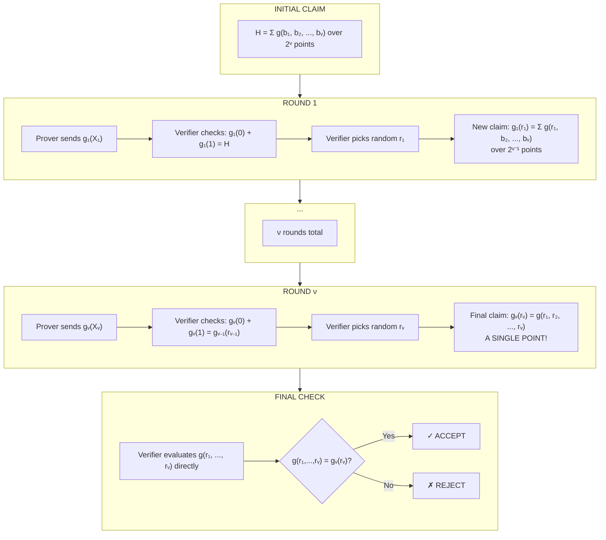

# Chapter 3: The Sum-Check Protocol

In late 1989, the field of complexity theory was stuck.

Researchers believed that Interactive Proofs were a relatively weak tool, capable of verifying only a handful of graph problems. The consensus was clear: interaction helped, but not by much.

Then came the email.

Noam Nisan, a master's student at Hebrew University, sent a draft to Lance Fortnow at the University of Chicago. It contained a protocol that used polynomials to verify something thought impossible: the permanent of a matrix. Fortnow showed it to his colleagues Howard Karloff and Carsten Lund. They realized the technique didn't just apply to matrices. It applied to *everything* in the polynomial hierarchy.

When the paper was released, it didn't just solve a problem. It caused a crisis. The result implied that "proofs" were far more powerful than anyone had imagined. Within weeks, Adi Shamir (the "S" in RSA) used the same technique to prove IP = PSPACE: interactive proofs could verify any problem solvable with polynomial memory, even if finding the solution took eons.

The engine powering this revolution was a single elegant idea: the **sum-check protocol**.

The sum-check protocol takes a claim that seems expensive to verify, the sum of a polynomial over all points of a high-dimensional domain, and reduces it to something trivial: a single evaluation at a random point. The verifier's work scales *linearly* with the number of variables, not exponentially with the size of the domain.

This chapter develops the sum-check protocol from first principles. We'll see exactly how the protocol works, why it's sound, and how any lie propagates through the protocol until it becomes a simple falsehood the verifier can catch. Along the way, we'll trace through complete worked examples with actual field values, because this protocol is too important to understand only abstractly.

The protocol requires only basic polynomial facts from Chapter 2 (Schwartz-Zippel, evaluation, degree). The next two chapters develop the polynomial representations used in practice: multilinear extensions (Chapter 4) enable linear-time provers and scale to domains of size $2^{128}$, while univariate techniques (Chapter 5) offer smaller proofs via FFT-friendly structure. Sum-check itself is agnostic to representation; it works on any multivariate polynomial.

## The Problem: Verifying Exponential Sums

Suppose a prover claims to know the value of the following sum:

$$H = \sum_{b_1 \in \{0,1\}} \sum_{b_2 \in \{0,1\}} \cdots \sum_{b_\nu \in \{0,1\}} g(b_1, b_2, \ldots, b_\nu)$$

Here $g$ is a $\nu$-variate polynomial over a finite field $\mathbb{F}$, and the sum ranges over all $2^\nu$ points of the **boolean hypercube** $\{0,1\}^\nu$: the set of all binary strings of length $\nu$. Think of it as the corners of a $\nu$-dimensional cube, where each coordinate is either 0 or 1. For $\nu = 3$, these are the eight vertices $(0,0,0), (0,0,1), \ldots, (1,1,1)$. The prover says the answer is $H$. Do you believe it?

A naive verifier would evaluate $g$ at every point of the hypercube and add up the results. But this requires $2^\nu$ evaluations, exponential in the number of variables. For $\nu = 100$, this is hopelessly infeasible.

The sum-check protocol solves this problem. It allows a verifier to check the claimed value of $H$ with high probability, in time that is only linear in $\nu$ and the time it takes to evaluate $g$ at a *single* random point. This represents an exponential speedup.

But how can you verify a sum without computing it? The answer lies in a beautiful idea: **claim reduction via deferred evaluation**. Instead of computing the sum directly, the verifier engages in a multi-round dialogue with the prover. In each round, the prover makes a smaller, more specific claim, and the verifier uses randomness to drill down on a single point. An initial lie, no matter how cleverly constructed, gets amplified at each step until it becomes a simple falsehood about a single evaluation, which the verifier catches at the end.

## The Compression Game

Think of the sum-check protocol as a game of progressive compression, or better yet, as a police interrogation.

The suspect (prover) claims to have an alibi for every minute of a 24-hour day ($2^\nu$ moments). The detective (verifier) cannot review surveillance footage for the entire day. Instead, the detective asks for a summary: "Tell me the sum of your activities."

The suspect provides a summary polynomial.

The detective picks one random second ($r_1$) and asks: "Explain this specific moment in detail." To answer, the suspect must provide a new summary for that specific timeframe. If the suspect lied about the total day, they must now lie about that specific second to make the math add up. The detective drills down again: "Okay, explain this millisecond."

The lie has to move. It has to hide in smaller and smaller gaps. Eventually, the detective asks about a single instant that can be fact-checked directly. If the suspect's story at that final instant doesn't match the evidence, the whole alibi crumbles.

More precisely: the prover holds an enormous object, a table of $2^\nu$ values. The verifier wants to know their sum but cannot afford to examine the table. In round 1, the prover compresses the table into a univariate polynomial. The verifier probes it at a random point $r_1$, and that answer becomes the new target: a compressed representation of a table half the size.

Each round, the table shrinks by half while the verifier accumulates random coordinates. After $\nu$ rounds, the "table" has size 1: a single value. The verifier can compute that value herself.

**Honest compression is consistent, but lies leave fingerprints.** If the prover's initial polynomial doesn't represent the true sum, it must differ from the honest polynomial somewhere. The random probes find these differences with overwhelming probability. A cheating prover would need to predict all $\nu$ random challenges in advance; against cryptographic randomness, that's impossible.

## The Protocol Specification

Let's make this precise. The sum-check protocol verifies a claim of the form:

$$H = \sum_{(b_1, \ldots, b_\nu) \in \{0,1\}^\nu} g(b_1, \ldots, b_\nu)$$

where $g$ is a $\nu$-variate polynomial of degree at most $d$ in each variable. (More generally, each variable $X_j$ can have its own degree bound $d_j$; we use uniform $d$ for simplicity.) The verifier must know these degree bounds before the protocol begins—they're part of the problem specification, not something the prover provides. If the prover could claim arbitrary degree bounds, soundness would collapse: a high-degree polynomial can pass through any finite set of points while matching an honest polynomial elsewhere. The sum ranges over boolean points, but $g$ is a polynomial over the field $\mathbb{F}$ and can have degree greater than 1. For example, $g(X_1, X_2) = X_1^2 + X_2^2 + X_1 X_2$ has $d = 2$; when we sum over $\{0,1\}^2$, we get $g(0,0) + g(0,1) + g(1,0) + g(1,1) = 0 + 1 + 1 + 3 = 5$. The degree bound $d$ matters because it determines how many coefficients the prover must send in each round: a degree-$d$ univariate polynomial requires $d+1$ coefficients. The protocol proceeds in $\nu$ rounds.

### Round 1

The prover computes and sends a univariate polynomial $g_1(X_1)$, claimed to equal:

$$g_1(X_1) = \sum_{(b_2, \ldots, b_\nu) \in \{0,1\}^{\nu-1}} g(X_1, b_2, \ldots, b_\nu)$$

In words: $g_1$ is the polynomial obtained by summing $g$ over all boolean values of the last $\nu-1$ variables, leaving $X_1$ as a formal variable.

The verifier performs two checks:

1. **Consistency check**: Verify that $g_1(0) + g_1(1) = H$. This ensures the prover's polynomial is consistent with the claimed total sum.

2. **Degree check**: Verify that $g_1$ has degree at most $d$ in $X_1$. This is necessary for soundness; without it, the protocol breaks completely. (We'll see why shortly.)

If either check fails, the verifier rejects. Otherwise, she samples a random field element $r_1 \leftarrow \mathbb{F}$ and sends it to the prover.

The verifier now evaluates the prover's polynomial at this random point, computing $V_1 = g_1(r_1)$. This value represents what the prover is *implicitly* asserting about a reduced sum. The verifier doesn't compute this sum herself; she simply records what the prover's polynomial claims it to be. This $V_1$ becomes the target for round 2: the prover must now justify that the sum over $2^{\nu-1}$ points, with the first variable fixed to $r_1$, actually equals $V_1$.

The verifier has now *reduced* the original claim about a sum over $2^\nu$ points to a new claim about a sum over $2^{\nu-1}$ points. Specifically, the prover is now implicitly claiming that:

$$g_1(r_1) = \sum_{(b_2, \ldots, b_\nu) \in \{0,1\}^{\nu-1}} g(r_1, b_2, \ldots, b_\nu)$$

**Why the degree check matters**: The soundness argument relies on Schwartz-Zippel: two *distinct* degree-$d$ polynomials agree on at most $d$ points, so a random evaluation catches the difference with probability $\geq 1 - d/|\mathbb{F}|$. But what if the prover sends a high-degree polynomial instead?

Suppose the true sum is $H^* = 6$ but the prover claims $H = 100$. The honest polynomial is $s_1(X) = 2X + 2$, with $s_1(0) + s_1(1) = 6$. The prover needs a polynomial passing through $(0, a)$ and $(1, b)$ where $a + b = 100$.

Without a degree bound, the cheating prover can construct a degree-$(|\mathbb{F}| - 1)$ polynomial $g_1$ with two properties:

1. $g_1(0) + g_1(1) = 100$ (passes the consistency check with the false claim $H = 100$)
2. $g_1(r) = s_1(r)$ for every $r \notin \{0, 1\}$ (agrees with the honest polynomial everywhere the verifier might query)

A degree-$(|\mathbb{F}| - 1)$ polynomial has $|\mathbb{F}|$ coefficients, enough freedom to prescribe its value at every point in $\mathbb{F}$ independently. So the prover sets $g_1(0) = a$, $g_1(1) = b$ (with $a + b = 100$), and $g_1(r) = s_1(r)$ for all other $r$.

Here is why this is devastating. The verifier samples some $r_1 \notin \{0, 1\}$ and computes the reduced claim $V_1 = g_1(r_1)$. Since $g_1(r_1) = s_1(r_1)$, this reduced claim is *correct*: it equals the true partial sum $\sum_{b_2, \ldots, b_\nu} g(r_1, b_2, \ldots, b_\nu)$. From this point on, the prover can follow the honest protocol for rounds 2 through $\nu$, and the final oracle check will pass. The false sum $H = 100$ was injected in round 1, but the cheat left no trace in any subsequent round.

The degree bound is the handcuffs. It forces the polynomial to be *stiff*. If it must pass through the wrong sum, its stiffness forces it to miss the honest polynomial almost everywhere else.

**Formal argument**: Suppose the prover sends $g_1 \neq s_1$ with $\deg(g_1) \leq d$. The difference $g_1 - s_1$ is a non-zero polynomial of degree at most $d$, so it has at most $d$ roots. Therefore $g_1$ and $s_1$ agree on at most $d$ points. When the verifier samples $r_1$ uniformly from $\mathbb{F}$, the probability that $g_1(r_1) = s_1(r_1)$ is at most $d/|\mathbb{F}|$. If $g_1(r_1) \neq s_1(r_1)$, the cheating prover is now committed to a false claim that propagates through subsequent rounds.

### Round $j$ (for $j = 2, \ldots, \nu$)

At the start of round $j$, the verifier holds a value $V_{j-1} = g_{j-1}(r_{j-1})$ from the previous round. This represents the prover's implicit claim about a sum over $2^{\nu-j+1}$ points.

The prover sends the next univariate polynomial $g_j(X_j)$, claimed to equal:

$$g_j(X_j) = \sum_{(b_{j+1}, \ldots, b_\nu) \in \{0,1\}^{\nu-j}} g(r_1, \ldots, r_{j-1}, X_j, b_{j+1}, \ldots, b_\nu)$$

The verifier checks:

1. **Consistency check**: $g_j(0) + g_j(1) = V_{j-1}$

2. **Degree check**: $\deg(g_j) \leq d$

If checks pass, she samples $r_j \leftarrow \mathbb{F}$ and computes $V_j = g_j(r_j)$.

### Final Check (After Round $\nu$)

After $\nu$ rounds, the verifier has received $g_\nu(X_\nu)$ and chosen $r_\nu$. The prover's final claim is that $g_\nu(r_\nu) = g(r_1, \ldots, r_\nu)$.

The verifier now evaluates $g$ at the single point $(r_1, \ldots, r_\nu)$, using her "oracle access" to $g$, and checks whether this equals $g_\nu(r_\nu)$.

If the values match, she accepts. Otherwise, she rejects.

### A Note on Oracle Access

In complexity theory, we say the verifier has "oracle access" to $g$. Sometimes this is trivial: if $g$ encodes a multiplication gate, the verifier knows that $g(a, b) = a \cdot b$ and just plugs in the random values $r_1, \ldots, r_\nu$. No magic needed.

But in many SNARK constructions, $g$ depends on the prover's *private data*. The verifier cannot evaluate $g$ on her own, because she doesn't know the inputs that define it. Sum-check has done its job, reducing an exponential sum to one evaluation, but the verifier is stuck at the last step. How this gap is closed (using polynomial commitment schemes) is a central question we return to in Chapter 9.

## Why Does This Work?

### Completeness

If the prover is honest, all checks pass trivially. The polynomials $g_j$ are computed exactly as specified, so the consistency checks hold by construction. The verifier accepts.

### Soundness

The soundness argument is more subtle and relies on the **polynomial rigidity** we developed in Chapter 2.

Suppose the prover's initial claim is false: the true sum is $H^* \neq H$. For the first consistency check to pass, the prover must send some polynomial $g_1(X_1)$ such that $g_1(0) + g_1(1) = H$.

Let $s_1(X_1)$ be the *true* polynomial: the one computed by honestly summing $g$ over the hypercube. By assumption, $s_1(0) + s_1(1) = H^* \neq H$. So the prover's polynomial $g_1$ must be different from $s_1$.

This is exactly where rigidity traps the cheater. The prover wants to send a polynomial that passes through the lie ($H$) but behaves like the truth ($H^*$) everywhere else. Rigidity makes this impossible. The polynomial is too stiff: if $g_1 \neq s_1$, they can agree on at most $d$ points.

By the Schwartz-Zippel lemma, when the verifier samples a random $r_1$ from $\mathbb{F}$, the probability that $g_1(r_1) = s_1(r_1)$ is at most $d/|\mathbb{F}|$.

With overwhelming probability, $g_1(r_1) \neq s_1(r_1)$. The prover has "gotten lucky" only if the random challenge happened to land on one of the few points where the two polynomials agree.

But what does $g_1(r_1) \neq s_1(r_1)$ mean? It means the prover is now committed to defending a *false* claim in round 2: he must convince the verifier that the sum $\sum_{b_2, \ldots} g(r_1, b_2, \ldots)$ equals $g_1(r_1)$, when in fact it equals $s_1(r_1)$.

The same logic cascades through all $\nu$ rounds. In each round, either the prover gets lucky (probability $\leq d/|\mathbb{F}|$) or he's forced to defend a new false claim. By the final round, the prover must convince the verifier that $g_\nu(r_\nu) = g(r_1, \ldots, r_\nu)$, but the verifier checks this directly.

By a union bound, the total probability that a cheating prover succeeds is at most:

$$\delta_s \leq \frac{\nu \cdot d}{|\mathbb{F}|}$$

In cryptographic applications, $|\mathbb{F}|$ is enormous (e.g., $2^{256}$), so this probability is negligible.

## Worked Example: Honest Prover and Cheating Prover

Let's trace through the entire protocol with actual values: first with an honest prover, then with a cheater. Seeing both cases with the same polynomial makes the soundness argument concrete.

**Setup**: Consider the polynomial $g(x_1, x_2) = x_1 + 2x_2$ over a large field $\mathbb{F}$. We have $\nu = 2$ variables.

**Goal**: The prover wants to convince the verifier of the sum over $\{0,1\}^2$:

$$H = g(0,0) + g(0,1) + g(1,0) + g(1,1) = 0 + 2 + 1 + 3 = 6$$

### The Honest Case

**Round 1**: The prover claims $H = 6$ and sends:

$$g_1(X_1) = g(X_1, 0) + g(X_1, 1) = (X_1 + 0) + (X_1 + 2) = 2X_1 + 2$$

The verifier checks: $g_1(0) + g_1(1) = 2 + 4 = 6 = H$. $\checkmark$

She samples $r_1 = 5$ and computes $V_1 = g_1(5) = 12$.

**Round 2**: The prover sends $g_2(X_2) = g(5, X_2) = 5 + 2X_2$.

The verifier checks: $g_2(0) + g_2(1) = 5 + 7 = 12 = V_1$. $\checkmark$

She samples $r_2 = 10$.

**Final check**: The verifier queries her oracle for $g(5, 10) = 25$ and compares to $g_2(10) = 25$. They match. **Accept.**

### The Cheating Case

Now suppose the prover lies: he claims $H = 7$ instead of the true sum $H^* = 6$.

**Round 1**: To pass the consistency check, the prover must send some $g_1(X_1)$ with $g_1(0) + g_1(1) = 7$. The true polynomial $s_1(X_1) = 2X_1 + 2$ sums to 6, so he can't use it.

He sends a lie: $g_1(X_1) = X_1 + 3$. Check: $g_1(0) + g_1(1) = 3 + 4 = 7$. $\checkmark$

The verifier samples $r_1 = 5$.

- Prover's value: $g_1(5) = 8$
- True value: $s_1(5) = 12$

The prover is now committed to defending a false claim: $\sum_{x_2} g(5, x_2) = 8$. But the true sum is $g(5,0) + g(5,1) = 5 + 7 = 12$.

**Round 2**: The prover needs $g_2(0) + g_2(1) = 8$. He sends $g_2(X_2) = 3 + 2X_2$.

The verifier samples $r_2 = 10$.

**Final check**:

- Prover claims: $g_2(10) = 3 + 20 = 23$
- Verifier queries oracle: $g(5, 10) = 25$

$23 \neq 25$. **Reject.**

### The Moral

The initial lie forced the prover to send polynomials different from the true ones. By Schwartz-Zippel, the random challenges almost certainly landed on points where these polynomials disagreed. The lie didn't just persist; it *amplified* through the rounds until it became a simple, detectable falsehood.

Notice what happened to the cheating prover. After sending the first dishonest polynomial, they weren't free. The verifier's random challenge $r_1 = 5$ created a new constraint: the prover must now justify that $\sum_{x_2} g(5, x_2) = 8$. But they didn't choose 5; the verifier did, unpredictably. The prover is forced to fabricate an answer for a question they couldn't anticipate.

Each round tightens the trap. The second lie must be consistent with the first. The third with the second. Each fabrication constrains the next, and the prover never controls which constraints they'll face. By the final round, the accumulated lies have painted the cheater into a corner: they must claim that $g(5, 10) = 23$ when any honest evaluation reveals 25. The system of fabrications collapses under its own weight.

The prover's only hope is that every random challenge happens to land on a point where the cheating polynomial agrees with the true one. For degree-$d$ polynomials over a field of size $|\mathbb{F}|$, this probability is at most $d/|\mathbb{F}|$ per round, negligible in cryptographic settings.

## The Protocol Flow: A Visual Guide

The following diagram traces the claim reduction through each round:

The reduction is exponential: $2^\nu \to 2^{\nu-1} \to 2^{\nu-2} \to \ldots \to 2^0 = 1$.

## Application: Counting Satisfying Assignments (#SAT)

The sum-check protocol becomes truly powerful when combined with **arithmetization**: the process of translating discrete, combinatorial problems into the language of polynomials over finite fields. We touched on #SAT in Chapter 2 as motivation for why polynomials matter in complexity theory. Now we see exactly how the translation works and why it enables efficient verification. The full theory of arithmetization will occupy later chapters; for now, we need just enough to see sum-check in action.

**The #SAT problem**: Given a boolean formula $\phi$ with $\nu$ variables, count how many of the $2^\nu$ possible assignments make $\phi$ true.

This is a canonical #P-complete problem, even harder than NP. Verifying the count naively requires checking all $2^\nu$ assignments. But with sum-check, a prover can convince a verifier of the correct count in polynomial time.

### Arithmetization of Boolean Formulas

The key insight is to transform the boolean formula into a polynomial that equals 1 on satisfying assignments and 0 otherwise.

**Step 1: Arithmetize literals**

- The variable $x_i$ stays as $x_i$

- The negation $\neg x_i$ becomes $1 - x_i$

Over $\{0,1\}$, these give the right values: if $x_i = 1$, then $\neg x_i = 0$, and $1 - x_i = 0$. $\checkmark$

**Step 2: Arithmetize clauses**
Consider a clause $C = (z_1 \lor z_2 \lor z_3)$ where each $z_i$ is a literal. The clause is false only when all three literals are false. So:

$$g_C(x) = 1 - (1 - z_1)(1 - z_2)(1 - z_3)$$

where each $z_i$ is the polynomial form of the literal.

**Example**: For the clause $C = (x_1 \lor \neg x_2 \lor x_3)$:
$$g_C(x_1, x_2, x_3) = 1 - (1 - x_1) \cdot x_2 \cdot (1 - x_3)$$

This equals 0 precisely when $x_1 = 0$, $x_2 = 1$, $x_3 = 0$: the only assignment that falsifies the clause.

**Step 3: Arithmetize the full formula**
For a CNF formula $\phi = C_1 \land C_2 \land \cdots \land C_m$, the formula is satisfied when *all* clauses are satisfied:

$$g_\phi(x_1, \ldots, x_\nu) = \prod_{j=1}^m g_{C_j}(x_1, \ldots, x_\nu)$$

Over $\{0,1\}^\nu$, this product equals 1 if all clauses are satisfied and 0 otherwise.

### The Protocol

The number of satisfying assignments is:

$$\text{\#}SAT(\phi) = \sum_{(b_1, \ldots, b_\nu) \in \{0,1\}^\nu} g_\phi(b_1, \ldots, b_\nu)$$

This is exactly a sum over the boolean hypercube! The prover can use the sum-check protocol to convince the verifier of this count.

**Degree analysis**: For a 3-CNF formula, each clause polynomial has degree at most 3. With $m$ clauses, the product $g_\phi$ has total degree at most $3m$. The degree in any single variable is at most $3m$ as well (though often much smaller due to variable sharing).

**Verifier's work**: The verifier performs $\nu$ rounds of sum-check, checking polynomials of degree at most $3m$. The final check requires evaluating $g_\phi$ at a random point; this takes $O(m)$ time since $g_\phi$ is a product of $m$ clause polynomials.

Total verifier time: $O(\nu \cdot m)$, polynomial in the formula size, despite the exponentially large space of assignments.

### Worked Example: A Tiny #SAT Instance

Consider the formula $\phi = (x_1 \lor x_2) \land (\neg x_1 \lor x_2)$ with $\nu = 2$ variables and $m = 2$ clauses.

**Step 1: Arithmetize.**

Clause 1: $(x_1 \lor x_2) \to 1 - (1-x_1)(1-x_2) = x_1 + x_2 - x_1 x_2$

Clause 2: $(\neg x_1 \lor x_2) \to 1 - x_1(1-x_2) = 1 - x_1 + x_1 x_2$

Full formula: $g_\phi(x_1, x_2) = (x_1 + x_2 - x_1 x_2)(1 - x_1 + x_1 x_2)$

**Step 2: Evaluate on $\{0,1\}^2$.**

| $(x_1, x_2)$ | Clause 1 | Clause 2 | $g_\phi$ | $\phi$ satisfied? |
|--------------|----------|----------|----------|-------------------|
| $(0, 0)$ | $0$ | $1$ | $0$ | No |
| $(0, 1)$ | $1$ | $1$ | $1$ | Yes |
| $(1, 0)$ | $1$ | $0$ | $0$ | No |
| $(1, 1)$ | $1$ | $1$ | $1$ | Yes |

**Step 3: Count.**

$$\text{\#}SAT(\phi) = \sum_{(b_1, b_2) \in \{0,1\}^2} g_\phi(b_1, b_2) = 0 + 1 + 0 + 1 = 2$$

The formula has exactly 2 satisfying assignments: $(0,1)$ and $(1,1)$ (both require $x_2 = 1$).

The prover uses sum-check to convince the verifier of this count. The polynomial $g_\phi$ has degree 2 in each variable (degree 4 total), so each round polynomial has degree at most 2, requiring 3 field elements per round.

## The Magic of Deferred Evaluation

The sum-check protocol embodies a profound principle: **you don't need to compute a sum to verify it**.

Consider what the verifier actually does:

1. She receives polynomials $g_1, g_2, \ldots, g_\nu$ from the prover.

2. She checks consistency: does $g_j(0) + g_j(1)$ equal the previous round's value?

3. She checks degree bounds.

4. At the very end, she evaluates $g$ at a single random point.

The verifier never computes any intermediate sums. She never evaluates $g$ at any point of the boolean hypercube. All the hard work, computing the actual sums, is done by the prover. The verifier merely checks that the prover's story is internally consistent.

This is claim reduction in action. Each round, the claim shrinks:

- Round 0: "The sum over $2^\nu$ points is $H$"

- Round 1: "The sum over $2^{\nu-1}$ points (at a random slice) is $V_1$"

- Round 2: "The sum over $2^{\nu-2}$ points is $V_2$"

- ...

- Round $\nu$: "The value at one specific point is $V_\nu$"

By the end, we've reduced an exponential claim to a trivial one. And the random challenges ensure that any cheating at an earlier stage propagates into a detectable error at the final stage.

## Complexity Analysis

Let's be precise about the efficiency gains.

**Prover complexity**: In round $j$, the prover must compute a univariate polynomial of degree at most $d$. To specify this polynomial, the prover evaluates it at $d+1$ points (say, $0, 1, 2, \ldots, d$). For each such point $\alpha$, the prover computes:

$$g_j(\alpha) = \sum_{(b_{j+1}, \ldots, b_\nu) \in \{0,1\}^{\nu-j}} g(r_1, \ldots, r_{j-1}, \alpha, b_{j+1}, \ldots, b_\nu)$$

This requires summing over $2^{\nu-j}$ terms. Across all rounds, the prover's total work is:

$$O\left(\sum_{j=1}^{\nu} (d+1) \cdot 2^{\nu-j}\right) = O(d \cdot 2^\nu)$$

The prover does work proportional to the size of the hypercube, but crucially, this is what the prover would need to do anyway to compute the sum. The sum-check protocol doesn't add significant overhead to the prover. Note that achieving $O(2^{\nu-j})$ per round (rather than recomputing from scratch each time) requires an algorithmic trick: maintaining and folding intermediate arrays so that each round reuses the previous round's work. Chapter 19 develops this technique in detail.

**Verifier complexity**: In each round, the verifier:

- Receives a degree-$d$ polynomial (specified by $d+1$ coefficients)

- Checks that $g_j(0) + g_j(1)$ equals the previous value

- Samples a random field element

- Evaluates $g_j$ at the random point

This is $O(d)$ work per round, or $O(\nu d)$ total.

At the end, the verifier evaluates $g$ at a single point $(r_1, \ldots, r_\nu)$. Let $T$ be the time to evaluate $g$ at one point. The verifier's total work is:

$$O(\nu d + T)$$

**The speedup**: The verifier avoids evaluating $g$ at $2^\nu$ points, an exponential savings. If $g$ arises from a "structured" computation (like a circuit or formula), then $T$ is polynomial in the description of that structure, making the whole protocol efficient.

**Communication complexity**: The prover sends $\nu$ univariate polynomials, each of degree at most $d$. Naively, this requires $d+1$ field elements per polynomial (to specify the coefficients), for a total of $\nu(d+1)$ field elements. But there's a trick.

**The one-coefficient trick**: At each round, the verifier checks $s_i(0) + s_i(1) = V_{i-1}$. This is one linear equation in the polynomial's coefficients, so the polynomial has only $d$ degrees of freedom, not $d+1$.

Write $s_i(X) = c_0 + c_1 X + c_2 X^2 + \cdots + c_d X^d$. Then:
$$s_i(0) + s_i(1) = c_0 + (c_0 + c_1 + c_2 + \cdots + c_d) = 2c_0 + c_1 + c_2 + \cdots + c_d = V_{i-1}$$

So: $c_1 = V_{i-1} - 2c_0 - c_2 - c_3 - \cdots - c_d$.

The prover sends only $(c_0, c_2, c_3, \ldots, c_d)$, and the verifier recovers $c_1$ from the constraint. This saves one field element per round: $\nu d$ field elements total instead of $\nu(d+1)$.

For the common case of multilinear polynomials ($d = 1$), this halves communication: one field element per round instead of two.

**Soundness error**: As computed earlier, the probability that a cheating prover succeeds is at most $\nu d / |\mathbb{F}|$. For a 256-bit field and reasonable values of $\nu$ and $d$, this is negligible.

## Why Sum-Check Enables Everything Else

The sum-check protocol is not just one protocol among many; it's the foundation upon which much of modern verifiable computation is built.

The celebrated IP = PSPACE theorem, which shows that every problem solvable in polynomial space has an efficient interactive proof, uses sum-check as its core building block. The LFKN protocol arithmetizes quantified boolean formulas and applies sum-check recursively. To verify that an arithmetic circuit was evaluated correctly, the GKR protocol (Chapter 7) expresses the relationship between adjacent circuit layers as a sum over a hypercube, then uses sum-check to reduce a claim about one layer to a claim about the next, peeling back the circuit layer by layer until we reach the inputs.

Many of today's practical succinct arguments (Spartan, HyperPlonk, and the entire family of "sum-check based" SNARKs) use sum-check as their information-theoretic core. The protocol's structure, where a prover commits to polynomials and a verifier checks random evaluations, maps cleanly onto polynomial commitment schemes. As we'll see in the next chapter, multilinear polynomials (those with degree at most 1 in each variable) have a natural correspondence with functions on the boolean hypercube. Sum-check works especially elegantly with multilinear polynomials, and this paradigm has become one of the two major approaches to building modern proof systems.

For years after the initial theoretical breakthroughs, practical SNARK systems moved away from sum-check toward other approaches (PCPs, linear PCPs, univariate techniques). But recently, sum-check has made a dramatic comeback. Systems like Lasso and Jolt use sum-check at their core, achieving remarkable prover efficiency. It turns out that sum-check provers can run in *linear time* for structured polynomials, and the protocol meshes beautifully with modern polynomial commitment schemes. We'll explore this renaissance in depth in Chapter 19.

The sum-check protocol is where the abstract power of polynomials (their rigidity, their compression of constraints, their amenability to random testing) first crystallizes into a concrete verification procedure. Every protocol we study from here forward either uses sum-check directly or is in dialogue with the principles it established.

## The Last Mile: From Oracle Access to Polynomial Commitments

We noted earlier that the final check of sum-check requires evaluating $g(r_1, \ldots, r_\nu)$, and that sometimes the verifier cannot do this herself because $g$ depends on the prover's private data. This deserves a closer look, because the mechanism that closes this gap is what turns sum-check from a complexity-theoretic curiosity into a practical proof system.

Consider two representative scenarios.

**When the verifier can compute $g$ directly.** If $g$ is built entirely from public information, the final evaluation is straightforward. For instance, in the #SAT application above, $g_\phi$ is a product of clause polynomials derived from the public formula $\phi$. The verifier knows $\phi$, so she can evaluate $g_\phi(r_1, \ldots, r_\nu)$ in $O(m)$ time. Similarly, in the GKR protocol (Chapter 7), the polynomial $g$ at each layer encodes the circuit's wiring pattern, which is public. No additional machinery is needed.

**When $g$ depends on the prover's private witness.** This is the harder and more common case in SNARK constructions. In systems like Spartan (Chapter 19), the polynomial $g$ involves the multilinear extension of the prover's private witness vector $w$. (We develop multilinear extensions in Chapter 4.) The verifier can compute the public parts of $g$ at the random point, but the witness-dependent part requires a value she does not know.

Sum-check has reduced the exponential sum to a single evaluation, but the verifier cannot complete the check alone. The protocol needs one more ingredient: a way for the prover to credibly reveal a single evaluation of a polynomial she committed to earlier, without revealing the polynomial itself.

This ingredient is a **polynomial commitment scheme (PCS)**, developed in Chapter 9. The mechanism is simple in outline:

1. Before sum-check begins, the prover sends a short, binding commitment $C$ to the witness polynomial. "Binding" means the prover cannot change the polynomial after sending $C$.

2. During sum-check, the random challenges $r_1, \ldots, r_\nu$ are determined. The commitment was sent before any challenges were chosen, so the prover cannot adapt the polynomial to the challenge point.

3. After sum-check, the prover opens the commitment at $(r_1, \ldots, r_\nu)$: she provides the evaluation $v$ together with a proof $\pi$ that $v$ is consistent with $C$. The verifier checks $\pi$ and uses $v$ to complete the final sum-check check.

This is where sum-check transitions from an information-theoretic protocol (what the literature calls an "Interactive Oracle Proof") to a cryptographic argument. The PCS replaces oracle access with commit-then-open. The prover is bound to a specific polynomial before seeing the evaluation point, and the succinctness of the commitment means the verifier never needs to see the full polynomial.

Every sum-check-based SNARK makes this transition at the final step. The oracle is not a black box. It is a commitment scheme.

## Key Takeaways

1. **The sum-check protocol verifies exponential sums efficiently**: A prover can convince a verifier that $\sum_{b \in \{0,1\}^\nu} g(b) = H$ with the verifier doing only $O(\nu)$ work, plus one evaluation of $g$. The verifier never computes any sum herself.

2. **Claim reduction is the key mechanism**: Each round reduces a claim about $2^k$ points to a claim about $2^{k-1}$ points. After $\nu$ rounds, the exponential sum becomes a single evaluation.

3. **Lies propagate and amplify**: A false initial claim forces the prover to send dishonest polynomials. Random challenges catch the discrepancy with probability $1 - d/|\mathbb{F}|$ per round. The lie can't hide; it gets cornered.

4. **The degree bound is essential**: Without it, a cheating prover could craft high-degree polynomials that pass consistency checks at 0 and 1 while matching the honest polynomial elsewhere. The degree bound forces rigidity.

5. **Arithmetization connects sum-check to computation**: Problems like #SAT encode as sums over the boolean hypercube. The prover does $O(2^\nu)$ work; the verifier does $O(\nu)$. This asymmetry is what makes verification useful.

6. **The final evaluation is the bridge to cryptography**: Sum-check reduces an exponential sum to one evaluation. When that evaluation depends on the prover's private data, a polynomial commitment scheme (Chapter 9) closes the gap: the prover commits before seeing the challenge point, then opens at the end. This is the "last mile" that turns the information-theoretic protocol into a SNARK.

7. **Sum-check is foundational**: IP = PSPACE, GKR, Spartan, Lasso, and most multilinear SNARKs build on sum-check. The protocol's comeback in practical systems (Chapter 19) shows it wasn't just theoretically elegant but practically powerful.
