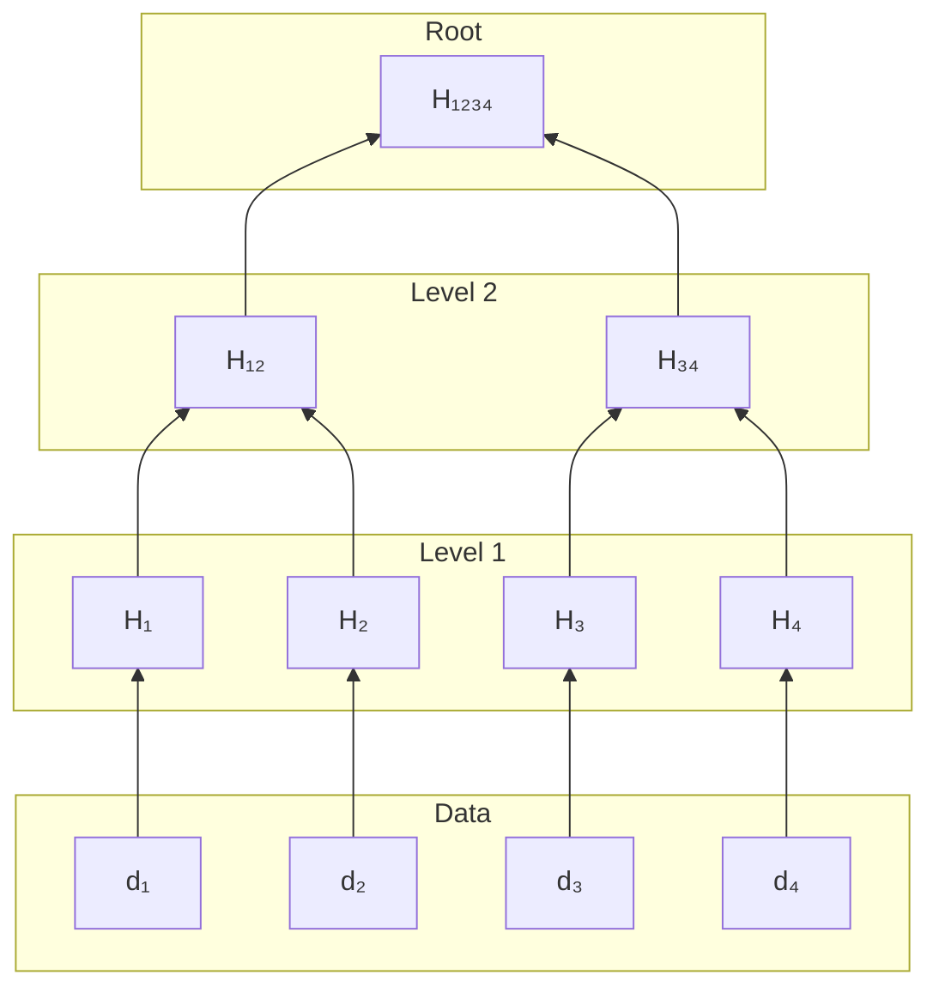

# Chapter 10: Hash-Based Polynomial Commitments and FRI

In 2016, the National Institute of Standards and Technology issued a warning that sent cryptographers scrambling. Quantum computers were coming, and they would break everything built on elliptic curves: RSA, Diffie-Hellman, ECDSA. This included every SNARK that existed. Groth16, the darling of the blockchain world, would become worthless the day a sufficiently powerful quantum computer came online.

The "toxic waste" problem of trusted setups was bad. The "quantum apocalypse" was existential.

This urgency drove the creation of a new kind of proof system. The goal was not just to remove the trusted setup; it was to build on cryptographic primitives believed to resist quantum attacks. Hash functions are one such primitive (lattice-based cryptography is another).

One answer came from Eli Ben-Sasson and collaborators: FRI (2017) and STARKs (2018). These are proof systems built entirely on hash functions, where "transparency" is not marketing but a technical property. No secrets. No ceremonies. No trapdoors that could compromise the system if they leaked, because no trapdoors exist at all.

---

## The Merkle Tree: Committing to Evaluations

The foundation of hash-based commitments is the **Merkle tree**. If you've worked with Git or blockchain systems, you've already used one. The idea is simple: commit to a large dataset with a single hash value, then later prove any element is in the dataset without revealing the rest.

**Construction**:

1. Start with your data elements at the bottom (these are the "leaves")
2. Hash pairs of adjacent elements together: $H(\text{left} \| \text{right})$
3. Now you have half as many values. Repeat: hash pairs together again
4. Keep going until only one hash remains, the root

The root is your commitment. It's just 32 bytes, regardless of whether you're committing to 8 values or 8 million.

**Opening a value**: Suppose someone wants to verify that element $x$ is at position $i$:

1. The prover provides $x$ plus the "authentication path," which consists of the $\log n$ sibling hashes needed to recompute the path from $x$ up to the root
2. The verifier recomputes hashes from leaf to root, checking the result matches the committed root

If any element were different, the root would change (assuming collision-resistant hashes). This makes the commitment *binding*.

**Properties**:

- Commitment size: One hash (32 bytes typically)
- Opening proof size: $O(\log n)$ hashes
- Binding: Changing any leaf changes the root (collision-resistance of hash)

For polynomial commitments, we commit to the polynomial's evaluations over a domain. The Merkle root becomes the polynomial commitment.

## The Core Problem: Low-Degree Testing

Suppose the prover commits to a function $f: D \to \mathbb{F}$ by Merkle-committing its evaluations on a domain $D$ of size $n$. The prover claims $f$ is a low-degree polynomial (say degree less than $d$).

A polynomial evaluation vector *is* a Reed-Solomon codeword. In coding theory, a *codeword* is simply the encoded version of some message. If you have a polynomial $f(X)$ of degree $d-1$ and you evaluate it at $n$ points (where $n > d$), the resulting vector $(f(x_1), f(x_2), \ldots, f(x_n))$ is a codeword of the Reed-Solomon code with parameters $[n, d]$. The polynomial's coefficients are the "message"; its evaluations are the "codeword." The extra evaluations beyond the $d$ needed to specify the polynomial are the "redundancy" that lets us detect errors.

How can the verifier check that a Merkle-committed polynomial is actually low-degree without reading all $n$ evaluations? The naive approach of checking random points doesn't help much: a function that agrees with a degree-$d$ polynomial on all but one point would pass most spot-checks but isn't low-degree. The key is that low-degree polynomials are a sparse subset of all possible functions, and a function that's *not* low-degree must differ from every valid codeword in many positions. FRI exploits this structure to catch deviations with high probability.

Strictly speaking, FRI does not prove that $f$ *is* a low-degree polynomial. It proves that $f$ is *close* to one, meaning it differs from some valid codeword in at most a small fraction of positions (say, 10%). This distinction matters because a cheater could take a valid polynomial and change just one evaluation point. FRI might miss that single corrupted point on any given query.

More formally, a function $f: D \to \mathbb{F}$ is $\delta$-close to degree $d$ if there exists a polynomial $p(X)$ of degree $\leq d$ such that $f$ and $p$ agree on at least $(1-\delta)|D|$ points. The distance $\Delta(f, d) = \min_{\deg p \leq d} |\{x : f(x) \neq p(x)\}|/|D|$ measures how far $f$ is from being low-degree. We tune the parameters (rate, number of queries) so that being "close" is good enough for our application, or so that the probability of missing the difference is cryptographically negligible (e.g., $2^{-128}$). In practice, the gap between "is low-degree" and "is close to low-degree" vanishes into the security parameter.

## The Two Phases of FRI

FRI has two phases. In the **commit phase**, the prover repeatedly folds the polynomial: each round, commit to the current polynomial's evaluations via Merkle tree, receive a random challenge, fold to a smaller polynomial. This continues until the polynomial becomes a constant. In the **query phase**, the verifier spot-checks that the prover actually followed the folding rules, rather than committing to arbitrary values.

The commit phase is where the prover does the work; the query phase is where the verifier checks it.

## The Commit Phase: Split and Fold

FRI transforms the low-degree testing problem through a recursive technique.

Any polynomial $f(X)$ can be decomposed into even and odd parts:

$$f(X) = f_E(X^2) + X \cdot f_O(X^2)$$

where:

- $f_E(Y)$ contains the even-power coefficients: $c_0 + c_2 Y + c_4 Y^2 + \cdots$
- $f_O(Y)$ contains the odd-power coefficients: $c_1 + c_3 Y + c_5 Y^2 + \cdots$

If $\deg(f) \leq d$, then $\deg(f_E) \leq d/2$ and $\deg(f_O) \leq d/2$. More precisely, $\deg(f_E) \leq \lfloor d/2 \rfloor$ and $\deg(f_O) \leq \lfloor (d-1)/2 \rfloor$. This degree halving is the crucial property that makes FRI work.

Given a random challenge $\alpha$ from the verifier, we fold the polynomial:

$$f_1(Y) = f_E(Y) + \alpha \cdot f_O(Y)$$

This new polynomial has degree $\leq d/2$. The claim "f has degree at most $d$" reduces to "$f_1$ has degree at most $d/2$," a strictly smaller problem.

Where do Merkle trees fit in? Each round, the prover:
1. Evaluates the current polynomial $f_i$ on domain $D_i$
2. Builds a Merkle tree over these evaluations (leaves are the $|D_i|$ field elements)
3. Sends the Merkle root to the verifier
4. Receives a random challenge $\alpha_i$
5. Computes the folded polynomial $f_{i+1}$ and repeats

The Merkle root commits the prover to specific evaluation values *before* seeing the challenge. This ordering is crucial: if the prover could see $\alpha_i$ first, they could craft fake evaluations that satisfy the folding check. By committing first, cheating becomes detectable.

Let's trace through the algebra with a concrete example.

## Commit Phase: Worked Example

Let's trace through folding in $\mathbb{F}_{17}$.

**Setup**:

- Initial polynomial: $f_0(X) = X^3 + 2X + 5$ (degree 3, so $d = 4$)
- Domain $D_0$: The subgroup of order 8 generated by $\omega = 9$

  $D_0 = \{1, 9, 13, 15, 16, 8, 4, 2\}$

**Round 0: Commit to $f_0$**

The prover evaluates $f_0$ on $D_0$ and builds a Merkle tree over the 8 evaluations. The prover sends the Merkle root $r_0$ to the verifier.

**Step 1: Decompose into even and odd parts**

Coefficients: $(c_3, c_2, c_1, c_0) = (1, 0, 2, 5)$

- Even part: $f_{0,E}(Y) = c_2 Y + c_0 = 0 \cdot Y + 5 = 5$
- Odd part: $f_{0,O}(Y) = c_3 Y + c_1 = Y + 2$

Verify: $f_0(X) = 5 + X(X^2 + 2)$

**Step 2: Receive challenge and fold**

Verifier sends challenge $\alpha_0 = 3$ (only after receiving $r_0$).

$$f_1(Y) = f_{0,E}(Y) + \alpha_0 \cdot f_{0,O}(Y) = 5 + 3(Y + 2) = 3Y + 11$$

**Result**: We've reduced proving $\deg(f_0) < 4$ to proving $\deg(f_1) < 2$.

**Step 3: New domain**

The new domain $D_1$ consists of the squares of elements in $D_0$:

$D_1 = \{1^2, 9^2, 13^2, 15^2\} = \{1, 13, 16, 4\}$ (size 4)

**Round 1: Commit to $f_1$**

The prover evaluates $f_1$ on $D_1$:

- $f_1(1) = 3(1) + 11 = 14$
- $f_1(13) = 3(13) + 11 = 50 \equiv 16 \pmod{17}$
- $f_1(16) = 3(16) + 11 = 59 \equiv 8 \pmod{17}$
- $f_1(4) = 3(4) + 11 = 23 \equiv 6 \pmod{17}$

The prover builds a Merkle tree over these 4 evaluations and sends root $r_1$ to the verifier.

**Step 4: Next challenge and fold**

Verifier sends challenge $\alpha_1 = 7$ (only after receiving $r_1$).

$$f_2(Z) = 11 + 7 \cdot 3 = 11 + 21 = 32 \equiv 15 \pmod{17}$$

$f_2$ is a constant! The recursion terminates. The prover sends the constant $15$ in the clear.

After $\log_2(d)$ rounds, the verifier holds $\log_2(d)$ Merkle roots (one per round), the random challenges $\alpha_0, \ldots, \alpha_{\log d - 1}$, and a claimed final constant $c$. But how does the verifier know the prover didn't just make up a convenient constant? The Merkle commitments bind the prover to specific values, but the verifier hasn't actually checked any of them yet. This is where the query phase comes in.

## The Query Phase

The commit phase produced $k = \log_2(d)$ Merkle trees, one for each folding round. The $i$-th tree commits to the evaluations of $f_i$ on domain $D_i$, where $|D_i| = |D_0|/2^i$. Each folding halves the domain size, so the trees get progressively smaller: $D_0$ has $n$ leaves, $D_1$ has $n/2$, and so on down to $D_{k-1}$ with $n/2^{k-1}$ leaves. A leaf in the $i$-th tree is a single evaluation $f_i(x)$ for some $x \in D_i$, and an "opening" is a Merkle path proving that leaf belongs to the committed root.

The verifier's goal is to check that these committed codewords are consistent with honest folding. If the prover cheated anywhere, the folding relationships won't hold for most positions. The verifier catches this by spot-checking: pick random positions and verify the folding formula.

The *rate* of a Reed-Solomon code is $\rho = d/n$, where $d$ is the degree bound and $n$ is the domain size. This is the fraction of positions that carry "real information" vs. redundancy. For example, if we commit to a degree-$d$ polynomial by evaluating on a domain of size $n = 4d$, then $\rho = 1/4$.

Why does rate matter? A cheating prover who committed to the wrong polynomial faces this problem: the wrong polynomial differs from the correct one at most positions (they can agree on at most $d$ points). Each random query has probability roughly $\rho$ of hitting one of the "lucky" positions where cheating goes undetected. So each query catches the prover with probability at least $1 - \rho$.

With $\lambda$ independent queries, the probability that *all* queries miss the cheating is at most $\rho^\lambda$. To achieve $\kappa$-bit security (soundness error $\leq 2^{-\kappa}$), we need $\rho^\lambda \leq 2^{-\kappa}$, which gives:

$$\lambda \geq \frac{\kappa}{\log_2(1/\rho)}$$

For $\rho = 1/4$ and $\kappa = 128$ bits of security: $\lambda \geq 128 / \log_2(4) = 128/2 = 64$ queries. Lower rate means more redundancy and fewer queries needed, but larger proof size during the commit phase.

Each query works as follows. The verifier picks a random point $y$ in the final domain $D_k$ and traces backward through all $k$ Merkle trees. Each folded domain $D_{i+1}$ is the set of squares from $D_i$, i.e., $D_{i+1} = \{x^2 : x \in D_i\}$. Since $(-x)^2 = x^2$, every point $y \in D_{i+1}$ has exactly two preimages in $D_i$: some $x$ and its negation $-x$.

To check the folding from $f_i$ to $f_{i+1}$, the verifier needs three values: $f_i(x)$, $f_i(-x)$, and $f_{i+1}(y)$. The prover opens two leaves in the $i$-th Merkle tree (at positions $x$ and $-x$) and one leaf in the $(i+1)$-th tree (at position $y$). Each opening includes a Merkle path proving the leaf belongs to the committed root. The verifier then checks that the folding formula holds:

$$f_{i+1}(y) = \frac{f_i(x) + f_i(-x)}{2} + \alpha_i \cdot \frac{f_i(x) - f_i(-x)}{2x}$$

This is the same $f_E + \alpha \cdot f_O$ folding from before, rewritten to use evaluations. The first term $\frac{f_i(x) + f_i(-x)}{2}$ recovers $f_E(y)$ and the second term $\frac{f_i(x) - f_i(-x)}{2x}$ recovers $f_O(y)$, since $f_i(x) = f_E(x^2) + x \cdot f_O(x^2)$ and $f_i(-x) = f_E(x^2) - x \cdot f_O(x^2)$.

This pairing structure relies on multiplicative subgroups: if $\omega$ generates $D_0$, then $-1 = \omega^{n/2}$, so $-x$ is in the group whenever $x$ is.

The consistency check includes the final round: the verifier computes what $f_k(y)$ *should* be from the last committed codeword $f_{k-1}$, and checks that it equals the claimed constant $c$. If the prover lied about $c$, this check will fail with high probability.

In summary, one query opens $O(\log d)$ Merkle paths (two leaves per round for the sibling pairs, plus the positions in subsequent rounds). The verifier repeats this $\lambda$ times with independent random positions, achieving soundness error $\rho^\lambda$ as described above.

## Query Phase: Worked Example

Let's continue our earlier example and trace through a complete query. Recall:

- $f_0(X) = X^3 + 2X + 5$ over $\mathbb{F}_{17}$
- Domain $D_0 = \{1, 9, 13, 15, 16, 8, 4, 2\}$ (8 elements)
- Challenge $\alpha_0 = 3$ produced $f_1(Y) = 3Y + 11$
- Domain $D_1 = \{1, 13, 16, 4\}$ (4 elements)
- Challenge $\alpha_1 = 7$ produced $f_2 = 15$ (constant)

The prover has built two Merkle trees: one committing to $f_0$'s evaluations on $D_0$ (8 leaves), another committing to $f_1$'s evaluations on $D_1$ (4 leaves). The prover sent both Merkle roots during the commit phase, then sent the final constant 15.

**Step 1: Verifier picks a random query point**

The verifier chooses a random position in $D_1$, say $y = 13$.

**Step 2: Unfold to find preimages**

What points in $D_0$ square to 13? We need $x$ such that $x^2 \equiv 13 \pmod{17}$.

Checking: $9^2 = 81 \equiv 13$ and $(-9)^2 = 8^2 = 64 \equiv 13$. $\checkmark$

So the preimages are $x = 9$ and $-x = 8$.

**Step 3: Query the prover**

The verifier requests:

- $f_0(9)$ and $f_0(8)$ from the first Merkle tree
- $f_1(13)$ from the second Merkle tree

The prover supplies these values with Merkle authentication paths. Let's compute:

- $f_0(9) = 9^3 + 2(9) + 5 = 729 + 18 + 5 \equiv 15 + 1 + 5 = 21 \equiv 4 \pmod{17}$
- $f_0(8) = 8^3 + 2(8) + 5 = 512 + 16 + 5 \equiv 2 + 16 + 5 = 23 \equiv 6 \pmod{17}$
- $f_1(13) = 3(13) + 11 = 50 \equiv 16 \pmod{17}$

**Step 4: Verify consistency (Round 0 → 1)**

The verifier checks: does $f_1(13)$ equal the folded value from $f_0(9)$ and $f_0(8)$?

The consistency formula recovers the even and odd parts from evaluations at $x$ and $-x$:
$$f_{0,E}(y) = \frac{f_0(x) + f_0(-x)}{2}, \quad f_{0,O}(y) = \frac{f_0(x) - f_0(-x)}{2x}$$

*Why this works*: Since $f_0(X) = f_{0,E}(X^2) + X \cdot f_{0,O}(X^2)$, we have $f_0(x) = f_{0,E}(y) + x \cdot f_{0,O}(y)$ and $f_0(-x) = f_{0,E}(y) - x \cdot f_{0,O}(y)$ where $y = x^2$. Adding these gives $2f_{0,E}(y)$; subtracting gives $2x \cdot f_{0,O}(y)$. Solving recovers the even and odd parts.

With $x = 9$, $-x = 8$, $y = x^2 = 13$:

$$f_{0,E}(13) = \frac{4 + 6}{2} = \frac{10}{2} = 5$$

For the odd part, note that $2x = 18 \equiv 1 \pmod{17}$:
$$f_{0,O}(13) = \frac{4 - 6}{1} = -2 \equiv 15 \pmod{17}$$

Now apply the folding with $\alpha_0 = 3$:
$$f_1(13) \stackrel{?}{=} f_{0,E}(13) + \alpha_0 \cdot f_{0,O}(13) = 5 + 3 \cdot 15 = 5 + 45 = 50 \equiv 16 \pmod{17}$$

$\checkmark$ The Round 0 → 1 consistency check passes.

**Step 5: Verify consistency (Round 1 → 2)**

Now check: does the claimed constant $c = 15$ match what we'd get from folding $f_1$?

For the final round, the "domain" $D_2$ has collapsed to a single point. The verifier checks:
$$c \stackrel{?}{=} \frac{f_1(y) + f_1(-y)}{2} + \alpha_1 \cdot \frac{f_1(y) - f_1(-y)}{2y}$$

We have $y = 13$, so $-y = -13 \equiv 4 \pmod{17}$.

We need $f_1(4)$. The verifier requests this from the second Merkle tree (the prover opens the leaf at position 4 with a Merkle path). We have $f_1(4) = 3(4) + 11 = 23 \equiv 6 \pmod{17}$.

$$\frac{f_1(13) + f_1(4)}{2} = \frac{16 + 6}{2} = \frac{22}{2} = 11$$

For the second term, we need $(2 \cdot 13)^{-1} = 26^{-1} = 9^{-1} \equiv 2 \pmod{17}$:
$$\frac{f_1(13) - f_1(4)}{2 \cdot 13} = \frac{16 - 6}{26} = \frac{10}{9} = 10 \cdot 2 = 20 \equiv 3 \pmod{17}$$

$$c \stackrel{?}{=} 11 + 7 \cdot 3 = 11 + 21 = 32 \equiv 15 \pmod{17}$$

$\checkmark$ **The query passes.** Both consistency checks hold, confirming that (at this query point) the prover's commitments are consistent with honest folding.

If the prover had lied about the constant, say claimed $c = 10$ instead of 15, this final check would fail: $11 + 21 = 32 \equiv 15 \neq 10$.

The verifier repeats this process at multiple random query points. Each independent query that passes increases confidence that the prover's polynomial truly has low degree.

## The Folding Paradigm

FRI's "split and fold" is not an isolated trick; it's an instance of one of the most powerful patterns in zero-knowledge proofs. Now that we've seen both phases concretely, let's step back and recognize where we've encountered folding before.

The core idea: use a random challenge to collapse two objects into one, halving the problem size while preserving the ability to detect cheating. More precisely:

1. You have a claim about a "large" object (size $n$, degree $d$, dimension $k$)
2. Split the object into two "halves"
3. Receive a random challenge $\alpha$
4. Combine the halves via weighted sum: $\text{new} = \text{left} + \alpha \cdot \text{right}$
5. The claim about the original reduces to a claim about the folded object (size $n/2$, degree $d/2$, dimension $k-1$)
6. Repeat until trivial

Randomness is what makes this work. If the original object was "bad" (not low-degree, not satisfying a constraint), the two halves encode this badness. A cheater would need the errors in left and right to cancel: $\text{error}_L + \alpha \cdot \text{error}_R = 0$. But they committed to both halves *before* seeing $\alpha$, so this requires $\alpha = -\text{error}_L / \text{error}_R$ (a single value out of the entire field). Probability $\leq d/|\mathbb{F}|$.

We have already seen this pattern multiple times:

- **Sum-check (Chapter 3)**: Each round folds the hypercube in half. A claim "$\sum_{b \in \{0,1\}^n} g(b) = H$" becomes "$\sum_{b \in \{0,1\}^{n-1}} g(r_1, b) = V_1$".

- **MLE streaming evaluation (Chapter 4)**: Fold a table of $2^n$ values down to one. Each step combines $(T(0, \ldots), T(1, \ldots))$ with weights $(1-r, r)$.

- **IPA/Bulletproofs (Chapter 9)**: Fold the commitment vector. Two group elements become one: $C' = C_L^{\alpha^{-1}} \cdot C_R^{\alpha}$.

- **FRI (this chapter)**: Fold the polynomial's coefficient space. A degree-$d$ polynomial becomes degree-$d/2$ via $f_E + \alpha \cdot f_O$.

The deep insight is that folding is *dimension reduction via randomness*. High-dimensional objects are hard to verify directly; you'd need to check exponentially many conditions. But each random fold projects away one dimension while preserving the distinction between valid and invalid objects (with overwhelming probability). After $\log n$ folds, you're left with a trivial claim.

And yet the structure persists. At each level, the polynomial is smaller but the relationships that matter (the algebraic constraints, the divisibility conditions, the distance from invalidity) all survive the descent. You're looking at a different polynomial in a smaller domain, but it's recognizably the same *kind* of object, facing the same *kind* of test. The recursion doesn't change the nature of the problem, only its scale.

Algebraically, this works because the objects being folded have low-degree polynomial structure. Schwartz-Zippel guarantees that distinct low-degree polynomials disagree almost everywhere. A random linear combination of two distinct polynomials is still distinct from the "honest" combination; you can't make errors cancel without predicting the randomness.

Another way to see it: one way to test if a polynomial is zero is to evaluate at a random point. Folding is this idea applied recursively with structure. Each fold is a random evaluation in disguise, and the structure ensures that evaluations compose coherently across rounds.

This paradigm extends beyond what we cover here. *Nova* and *folding schemes* (Chapter 23) fold entire R1CS instances: not polynomials, but constraint systems. The same principle applies: random linear combination of two instances yields a "relaxed" instance that's satisfiable iff both originals were.

## Soundness and DEEP-FRI

The original FRI analysis (Ben-Sasson et al. 2018) established soundness but with somewhat pessimistic bounds. Achieving 128-bit security required many queries, increasing proof size.

**DEEP-FRI** (Ben-Sasson et al. 2019) improves soundness by sampling *outside* the evaluation domain. The idea: after the prover commits to the polynomial $f$, the verifier picks a random point $z$ outside $D$ and asks the prover to reveal $f(z)$. This "out-of-domain" sample provides additional security because a cheating prover can't anticipate which external point will be queried.

The name stands for **D**omain **E**xtending for **E**liminating **P**retenders. The technique achieves tighter soundness bounds, reducing the number of queries needed for a given security level. More recent work continues to improve these bounds: STIR (2024) achieves query complexity $O(\log d + \lambda \log \log d)$ compared to FRI's $O(\lambda \log d)$, where $\lambda$ is the security parameter and $d$ is the degree bound. WHIR (2024) further improves verification time to a few hundred microseconds. These protocols maintain FRI's core split-and-fold structure while optimizing the recursion.

## FRI as a Polynomial Commitment Scheme

So far we've shown how FRI proves that a function is close to a low-degree polynomial. But a polynomial commitment scheme needs to prove *evaluation claims*: "my committed polynomial $f$ satisfies $f(z) = v$." How do we bridge this gap?

The answer uses the **divisibility trick** from earlier chapters.

### Applying the Divisibility Trick

Recall that $f(z) = v$ if and only if $(X - z)$ divides $f(X) - v$. When the claim is true, the quotient $q(X) = \frac{f(X) - v}{X - z}$ is a polynomial of degree $\deg(f) - 1$. When the claim is false, this "quotient" has a pole at $z$; it's not a polynomial at all.

This transforms evaluation proofs into degree bounds:

| If... | Then the quotient $q(X) = \frac{f(X) - v}{X - z}$... |
|-------|------------------------------------------------------|
| $f(z) = v$ (honest) | is a polynomial of degree $\deg(f) - 1$ |
| $f(z) \neq v$ (cheating) | has a pole at $z$; not a polynomial at all |

To prove $f(z) = v$, the prover constructs $q(X)$ and runs FRI configured with degree bound $d - 1$ to prove that $q$ has degree $< d - 1$. This is not the same as proving $q$ is merely "low-degree" in some vague sense; FRI must target the *specific* bound $d - 1$ matching the claimed degree of $f$. If a cheating prover submitted a $q$ of degree $d$ (one too high), FRI with bound $d - 1$ would catch it.

But FRI on $q$ alone is not sufficient. It shows $q$ has the right degree; it does not show that $q$ is actually $\frac{f(X) - v}{X - z}$ rather than some unrelated polynomial of the same degree. The verifier must also spot-check the relationship $f(x) - v = (x - z) \cdot q(x)$ at random query points. If both checks pass, the quotient has the right degree *and* is correctly derived from $f$, which together imply $f(z) = v$.

### The Full Protocol

**Setup**: Fix an evaluation domain $D$ of size $n$ (a multiplicative subgroup), a hash function $H$ for Merkle trees, and a degree bound $d < n$.

**Commit** (prover):
1. Evaluate $f$ on $D$ to get $(f(x_1), \ldots, f(x_n))$
2. Build a Merkle tree $T_f$ over these evaluations
3. Send the Merkle root $\text{root}_f$ to the verifier

After commit, the verifier holds only $\text{root}_f$. The prover holds $f$, all evaluations, and the full Merkle tree $T_f$.

**Open** (interactive, to prove $f(z) = v$):

*Step 1: Construct the quotient*
- Prover computes $q(x) = \frac{f(x) - v}{x - z}$ for each $x \in D$
- Prover builds Merkle tree $T_{q_0}$ over evaluations of $q_0 := q$, sends $\text{root}_{q_0}$

*Step 2: FRI commit phase (folding)*

For $i = 0, 1, \ldots, k-1$ where $k = \log_2(d)$:
- Verifier sends random challenge $\alpha_i$
- Prover computes folded polynomial $q_{i+1}(Y) = q_{i,E}(Y) + \alpha_i \cdot q_{i,O}(Y)$
- Prover evaluates $q_{i+1}$ on the folded domain $D_{i+1}$
- Prover builds Merkle tree $T_{q_{i+1}}$, sends $\text{root}_{q_{i+1}}$

After $k$ rounds, $q_k$ is a constant $c$. Prover sends $c$.

*Step 3: FRI query phase*
- Verifier sends $\lambda$ random query positions
- For each query, prover opens:
  - $f(x)$ from $T_f$ (to check divisibility relation)
  - $q_0(x)$ from $T_{q_0}$ (to check divisibility relation)
  - Sibling pairs $q_i(x), q_i(-x)$ from each $T_{q_i}$ (to check folding consistency)

**Verify**:
1. Check Merkle proofs for all opened values
2. Check divisibility at each query: $f(x) - v \stackrel{?}{=} (x - z) \cdot q_0(x)$
3. Check folding consistency at each query: for each round $i$, verify $q_{i+1}(x^2) = \frac{q_i(x) + q_i(-x)}{2} + \alpha_i \cdot \frac{q_i(x) - q_i(-x)}{2x}$
4. Check final constant: the last folding step yields $c$

The verifier never sees the full polynomials $f$ or $q$. They only see $\lambda$ spot-checked evaluations, verified against the Merkle commitments.

Note that FRI doesn't speed anything up. It *is* the low-degree test. Without FRI, you'd have a Merkle commitment but no way to prove anything about degree: the prover could commit to arbitrary garbage. FRI is what makes this a *polynomial* commitment scheme rather than just a vector commitment.

There is a subtlety in the protocol above that deserves explicit attention. The FRI run proves $q$ has degree $< d - 1$, and the spot-check proves $q$ is consistent with $f$. Together these imply $f(z) = v$, *but only if $f$ itself has degree $< d$*. What if the prover committed to a high-degree $f$ (or arbitrary non-polynomial values) in the Merkle tree? Then $q = (f(X) - v)/(X - z)$ could pass the degree check by coincidence: a high-degree $f$ minus $v$, divided by $(X - z)$, might produce a low-degree quotient if the high-degree terms cancel. The spot-check at query points would still pass because it verifies $f(x) - v = (x - z) \cdot q(x)$, which holds by construction regardless of the degree of $f$.

In the standalone FRI-as-PCS protocol presented here, $f$ needs its own degree proof. The prover must either run a separate FRI instance on $f$ to establish $\deg(f) < d$, or bundle $f$ into a batched FRI alongside $q$ (the next section shows how). In the STARK setting (Chapter 15), this issue is handled differently: FRI runs on the *composition polynomial*, which is a random linear combination of constraint quotients. The composition polynomial's degree bound implicitly constrains the trace polynomials, so no separate degree proof for the trace is needed. But in any context where FRI serves as a general-purpose PCS for opening evaluations, the degree of the committed polynomial must be established independently.

### Batching

Multiple polynomials and evaluation points can be combined into a single FRI proof. Suppose we have $k$ opening claims: $f_1(z_1) = v_1, \ldots, f_k(z_k) = v_k$. Each claim produces a quotient polynomial $q_i(X) = \frac{f_i(X) - v_i}{X - z_i}$.

The verifier sends a random batching challenge $\beta$. The prover computes the combined quotient:

$$Q(X) = q_1(X) + \beta \cdot q_2(X) + \beta^2 \cdot q_3(X) + \cdots + \beta^{k-1} \cdot q_k(X)$$

Now the prover runs FRI on $Q$:

1. Build a Merkle tree $T_Q$ over evaluations of $Q$ on domain $D$
2. For each folding round, build a Merkle tree over the folded polynomial
3. Send all Merkle roots and the final constant

The individual quotients $q_i$ don't need their own FRI proofs since they're combined into $Q$ before FRI runs. The savings come from running one FRI proof instead of $k$.

However, the verifier still needs to check that each original divisibility relation holds. At each query point $x$, the verifier:
- Opens $f_1(x), \ldots, f_k(x)$ from their respective Merkle trees
- Opens $Q(x)$ from $T_Q$
- Computes each $q_i(x) = \frac{f_i(x) - v_i}{x - z_i}$
- Checks that $Q(x) = q_1(x) + \beta \cdot q_2(x) + \cdots + \beta^{k-1} \cdot q_k(x)$

The FRI cost (the expensive part) is amortized across all $k$ claims. The divisibility spot-checks scale linearly with $k$, but these are just field arithmetic, cheap compared to FRI.

## Practical Considerations

### The Blow-up Factor

FRI evaluates polynomials on a domain much larger than their degree. If a polynomial has degree $d$, the evaluation domain has size $n = \rho^{-1} \cdot d$ where $\rho < 1$ is the **rate**.

Typical choices: $\rho = 1/4$ to $1/16$ (blow-up factor 4x to 16x).

**Trade-off**: Lower rate (more redundancy) means:

- Larger initial commitment (more evaluations)
- But stronger soundness per query (fewer queries needed)
- Net effect often neutral on total proof size

Chapter 20 quantifies this tradeoff for STARK provers, showing how grinding (proof-of-work) and batched FRI interact with the blowup factor to determine the optimal operating point for prover speed versus proof size.

### Coset Domains

The examples above used multiplicative subgroups directly: $D_0 = \{1, \omega, \omega^2, \ldots\}$ where $\omega^n = 1$. In practice, FRI implementations typically use **cosets** instead: sets of the form $D = g \cdot H = \{g, g\omega, g\omega^2, \ldots\}$ where $H$ is a multiplicative subgroup and $g \notin H$ is a generator offset.

Why the difference? Subgroups always contain 1, and satisfy $x^n = 1$ for all elements. This structure can be exploited in certain attacks. Cosets avoid this: no element satisfies $x^n = 1$ (since $g^n \neq 1$), removing a potential attack surface.

The folding arithmetic works identically. If $D_i = g_i \cdot H_i$, then squaring every element gives $D_{i+1} = g_i^2 \cdot H_{i+1}$ where $H_{i+1} = \{x^2 : x \in H_i\}$. The sibling structure ($x$ and $-x$ mapping to the same $y = x^2$) is preserved. The only change is bookkeeping: the verifier tracks the coset offset $g_i$ alongside the subgroup.

### Hash Function Choice

STARKs using FRI rely on collision-resistant hash functions:

- Traditional: SHA-256, Keccak
- SNARK-friendly: Poseidon, Rescue (fewer constraints when verified in-circuit)

The hash function determines concrete security. If the hash has 256-bit output, and we assume collision-resistance, FRI inherits 128-bit security (birthday bound).

## Comparing FRI to Algebraic PCS

| Property        | FRI                       | KZG             | IPA           |
|-----------------|---------------------------|-----------------|---------------|
| Trusted setup   | None                      | Required        | None          |
| Assumption      | Hash collision-resistance | Pairings + DLog | DLog          |
| Post-quantum    | Yes                       | No              | No            |
| Commitment size | $O(1)$                    | $O(1)$          | $O(1)$        |
| Proof size      | $O(\lambda \log^2 d)$     | $O(1)$          | $O(\log d)$   |
| Verifier time   | $O(\lambda \log^2 d)$     | $O(1)$          | $O(d)$        |
| Prover time     | $O(d \log d)$             | $O(d)$          | $O(d \log d)$ |

**When to use FRI**:

- Trust minimization is critical (no setup ceremony)
- Post-quantum security is required
- Larger proofs are acceptable (still polylogarithmic)

**When to avoid FRI**:

- Proof size must be constant (KZG better)
- On-chain verification cost is critical (pairing checks cheaper than FRI verification)

## FRI in the Wild: STARKs

FRI is the cryptographic backbone of **STARKs** (Scalable Transparent ARguments of Knowledge):

1. **Arithmetization**: Convert computation to polynomial constraints (AIR format)
2. **Low-degree extension**: Encode computation trace as polynomial evaluations
3. **Constraint checking**: Combine with composition polynomial
4. **FRI**: Prove the composed polynomial is low-degree

The "T" in STARK stands for "Transparent": no trusted setup, enabled by FRI.
The "S" stands for "Scalable": prover time is quasi-linear, enabled by FFT and the recursive structure of FRI.

Modern systems like **Plonky2** and **Plonky3** combine PLONK's flexible arithmetization with FRI-based commitments, getting the best of both worlds.

## Key Takeaways

1. **Merkle trees commit to evaluations, not coefficients.** FRI commits to a polynomial by hashing its evaluations over a domain $D$. The Merkle root is 32 bytes regardless of polynomial size. Opening a single evaluation costs $O(\log |D|)$ hashes.

2. **FRI proves proximity to low-degree, not exact low-degree.** A function passing FRI is $\delta$-close to some degree-$d$ polynomial (agrees on at least $(1-\delta)|D|$ points). For cryptographic applications, "close enough" suffices because the gap vanishes into the security parameter.

3. **Folding halves the degree per round.** The decomposition $f(X) = f_E(X^2) + X \cdot f_O(X^2)$ splits a degree-$d$ polynomial into two degree-$d/2$ parts. A random combination $f_1 = f_E + \alpha \cdot f_O$ preserves errors: if $f$ wasn't low-degree, neither is $f_1$ (with overwhelming probability).

4. **Commit before challenge, verify after.** Each round the prover Merkle-commits to the current polynomial's evaluations, *then* receives the folding challenge $\alpha$. This ordering prevents the prover from crafting fake evaluations that happen to satisfy the folding check.

5. **Query cost depends on rate.** With rate $\rho = d/n$, each query catches cheating with probability $\geq 1 - \rho$. For $\kappa$-bit security: $\lambda \geq \kappa / \log_2(1/\rho)$ queries. Lower rate means fewer queries but larger commitments.

6. **Divisibility converts evaluation claims to degree bounds.** To prove $f(z) = v$, show that $q(X) = (f(X) - v)/(X - z)$ is a polynomial of degree $d-1$. If $f(z) \neq v$, then $q$ has a pole at $z$ and isn't a polynomial at all.

7. **FRI is the mechanism, not an optimization.** Without FRI, a Merkle commitment is just a vector commitment with no degree guarantees. FRI is what makes this a *polynomial* commitment scheme.

8. **Transparency comes from hash functions.** The only cryptographic assumption is collision-resistance of the hash. No trusted setup, no toxic waste, no trapdoors. Anyone can verify proofs with the same public parameters.

9. **Post-quantum security.** Hash functions are believed to resist quantum attacks (Grover's algorithm only provides quadratic speedup). FRI-based proofs remain secure when elliptic curve schemes break.

10. **The cost is proof size.** FRI proofs are $O(\lambda \log^2 d)$ compared to KZG's $O(1)$. For applications where on-chain verification cost dominates (Ethereum L1), this matters. For applications prioritizing trust minimization or quantum resistance, FRI wins.
