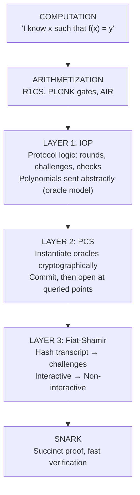

# Chapter 11: The SNARK Recipe: Assembling the Pieces

Before compilers, programmers wrote machine code by hand. Each program required intimate knowledge of the target CPU's instruction set. A program for one machine wouldn't run on another. It was slow, error-prone, and expertise barely transferred between architectures.

Then came FORTRAN (1957) and the idea of a compiler: a standardized translation process that takes a high-level program and produces machine code for any target. The programmer writes once; the compiler handles the details. Different programs produce different executables, but the *methodology* is uniform.

For the first 30 years of zero-knowledge (1985–2015), protocols were like hand-written assembly. A cryptographer would craft a protocol for Graph Isomorphism, then start from scratch for Hamiltonian Cycles. Each proof system was a custom creation.

Modern SNARKs are like compilers. You feed in a computation, and out comes a proof. Different computations produce different proofs, but the *recipe* is standardized. This chapter describes that recipe. It powers every modern SNARK from Groth16 to Halo 2 to STARKs.

(The analogy extends further: a zkVM is like compiling an *interpreter* once, then running arbitrary programs through it. One circuit, any computation. If you're unfamiliar with zkVMs, don't worry; the concept will make more sense after seeing how circuits work.)

Modern SNARKs decompose into three layers, each with a distinct role. Understanding this decomposition is more valuable than memorizing any particular system; it provides the conceptual vocabulary to navigate the entire landscape. The key abstraction enabling this modularity is the *Interactive Oracle Proof* (IOP), introduced by Ben-Sasson, Chiesa, and Spooner in 2016. IOPs unified the earlier notions of interactive proofs and probabilistically checkable proofs into a single framework that makes the "IOP + PCS" compilation strategy possible.


## The Three-Layer Architecture

Every modern SNARK follows the same structural pattern:



**Layer 1** defines the protocol logic: the sequence of rounds, what polynomials the prover "sends," what queries the verifier makes, and what checks determine acceptance. This is where sum-check lives, where PLONK's permutation argument is specified, where GKR's layer-by-layer reduction happens. The prover "sends polynomials" in an abstract sense; the verifier has *oracle access* (can query any evaluation without seeing the full polynomial). Layer 1 specifies *what* to prove and *how* to check it.

**Layer 2** instantiates the oracle model cryptographically. Oracle access becomes commitment and opening: the prover commits to a polynomial before seeing queries, then provides evaluation proofs at requested points. The binding property of the commitment scheme ensures the prover cannot retroactively modify their polynomial.

**Layer 3** eliminates interaction. The verifier's random challenges are replaced by hash function outputs computed from the transcript. The prover simulates the entire interaction locally and outputs a static proof.

This separation is not merely pedagogical. It enables genuine modularity: the same IOP can be compiled with different commitment schemes, yielding systems with different trust assumptions, proof sizes, and verification costs. PLONK with KZG gives constant-size proofs requiring trusted setup. PLONK with FRI gives larger proofs but no trusted setup and post-quantum security. The IOP is unchanged; only the cryptographic instantiation differs.


## Layer 1: Interactive Oracle Proofs

An **Interactive Oracle Proof (IOP)** is an interactive protocol where the prover sends *polynomials* rather than field elements, and the verifier has oracle access to these polynomials: they can query any evaluation without seeing the full polynomial description. The IOP defines the protocol logic: what polynomials are exchanged, what queries the verifier makes, and what checks determine acceptance.

### Example: Sum-Check as an IOP

To make this concrete, consider how the sum-check protocol fits into the IOP framework. (This is just one example; other IOPs like PLONK's permutation argument or GKR have different structures.)

1. Prover sends univariate polynomial $g_1(X_1)$
2. Verifier evaluates $g_1(0)$ and $g_1(1)$, checks $g_1(0) + g_1(1) = H$ (the claimed sum)
3. Verifier sends random challenge $r_1$
4. Prover sends univariate polynomial $g_2(X_2)$
5. Verifier evaluates $g_2(0)$ and $g_2(1)$, checks $g_1(r_1) = g_2(0) + g_2(1)$
6. Continue for $n$ rounds
7. **Final step**: Verifier queries the original polynomial $f$ at $(r_1, \ldots, r_n)$ and checks $g_n(r_n) = f(r_1, \ldots, r_n)$

The univariate polynomials $g_i$ are low-degree (degree at most $d$ in one variable), so they can be sent explicitly as $O(d)$ coefficients. But the final step requires oracle access to $f$: the verifier must query $f(r_1, \ldots, r_n)$ to verify that the sum-check reductions were honest. This is where the PCS comes in.

### IOP Quality Metrics

Not all IOPs are equivalent. The critical parameters:

**Query complexity**: The number of evaluation queries the verifier makes. Each query becomes an evaluation proof in the compiled SNARK, directly affecting proof size.

**Round complexity**: The number of prover-verifier exchanges. Each round becomes a hash computation in Fiat-Shamir. Sum-check has $O(\log n)$ rounds; some IOPs achieve constant rounds.

**Prover complexity**: The computational cost of generating the prover's messages. This should be quasi-linear in the computation size: $O(n \log n)$ or $O(n \log^2 n)$. Quadratic prover complexity renders the system impractical for large computations.

**Soundness error**: The probability that a cheating prover convinces the verifier. Typically $O(d/|\mathbb{F}|)$ per round, where $d$ is the maximum polynomial degree.

These parameters trade off against each other. Fewer queries mean smaller proofs but often require more prover work or stronger assumptions. The art of IOP design lies in navigating these trade-offs for specific applications.


### From Oracle Model to Cryptography

IOPs assume the verifier can query certain polynomials at points of their choosing, with the polynomial fixed before the query point is revealed. In sum-check, the univariate polynomials $g_i$ are sent explicitly, so the verifier evaluates them directly. But the original polynomial $f$ is too large to send. The verifier needs to query $f(r_1, \ldots, r_n)$ at the final step, and this query must be answered by something other than sending the entire polynomial. This is where oracle access matters.

Why does the ordering matter? Recall the Schwartz-Zippel lemma: a nonzero polynomial of degree $d$ has at most $d$ roots. If the verifier picks a random point $r$ from a field of size $|\mathbb{F}|$, a cheating prover's polynomial (which should be zero but isn't) will fail the check with probability at least $1 - d/|\mathbb{F}|$. With typical parameters ($|\mathbb{F}| = 2^{256}$, $d = 10^6$), a single random query catches cheating with overwhelming probability.

But this analysis assumes the polynomial is fixed before $r$ is chosen. If the prover sees $r$ first, they can construct a polynomial that passes the check at $r$ while being wrong elsewhere. The oracle model captures this constraint abstractly; Layer 2 enforces it cryptographically through commitment schemes.


## Layer 2: Polynomial Commitment Schemes

The IOP assumes the verifier can query polynomial evaluations. In reality, there is no oracle: the prover must send something over a communication channel. The **polynomial commitment scheme (PCS)** bridges the gap, turning the abstract oracle into a concrete cryptographic mechanism. Chapters 9 and 10 covered PCS in detail; here's the quick reminder of what matters for compilation.

A PCS provides three operations: Commit (polynomial to short commitment), Open (produce evaluation proof), and Verify (check the proof). The critical property is **binding**: once the prover sends a commitment, they cannot open it to evaluations of a different polynomial. For arguments *of knowledge*, the PCS must also be *extractable*: if a prover can pass verification, there exists an extractor that can reconstruct the polynomial they committed to.

### Compilation

The compilation from IOP to **interactive argument**, a protocol where prover and verifier exchange messages with soundness based on cryptographic assumptions rather than information-theoretic guarantees, is mechanical:

- When the IOP specifies "prover sends polynomial $f$," the compiled protocol has the prover send $C = \text{Commit}(f)$
- When the IOP specifies "verifier queries $f(z)$," the compiled protocol has the verifier announce $z$, the prover respond with $v = f(z)$ and proof $\pi$, and the verifier check $\text{Verify}(C, z, v, \pi)$

### Why Compilation Preserves Soundness

The IOP's soundness proof assumes the verifier receives the true evaluation $f(z)$ when they query. After compilation, the verifier instead receives a claimed value $v$ with a proof $\pi$.

The binding property ensures the prover can only open to evaluations the committed polynomial actually takes. Since the prover sends $C$ before seeing the query point $z$, binding cryptographically enforces the ordering that the oracle model assumes. If binding fails, the prover could commit to one polynomial and open to another, collapsing soundness entirely.

### PCS Choices

Different commitment schemes offer different trade-offs:

| PCS | Setup | Proof Size | Verification | Assumption |
|-----|-------|------------|--------------|------------|
| KZG | Trusted | $O(1)$ | $O(1)$ | q-SDH + Pairings |
| IPA | Transparent | $O(\log n)$ | $O(n)$ | DLog |
| FRI | Transparent | $O(\log^2 n)$ | $O(\log^2 n)$ | Collision-resistant hash |

The choice is application-dependent. On-chain verification pays per byte and per operation; KZG's constant-size proofs minimize gas costs. Systems prioritizing trust minimization accept larger proofs for transparent setup. Long-term security considerations may favor FRI's resistance to quantum attacks.

### Soundness Composition

Recall that soundness error is the probability a cheating prover convinces the verifier of a false statement, and binding error is the probability a prover can open a commitment to two different values. Both are negligible for secure constructions.

Let the IOP have soundness error $\epsilon_{\text{IOP}}$ and the PCS have binding error $\epsilon_{\text{bind}}$. The resulting SNARK (IOP + PCS) has soundness error at most $\epsilon_{\text{IOP}} + \epsilon_{\text{bind}}$.

*Proof sketch*: A cheating prover either (1) breaks the IOP soundness by finding a cheating strategy that succeeds with the committed polynomial, or (2) breaks binding by opening to evaluations inconsistent with the commitment. By union bound, cheating succeeds with probability at most $\epsilon_{\text{IOP}} + \epsilon_{\text{bind}}$.


## Layer 3: The Fiat-Shamir Transformation

The Fiat-Shamir transformation is deceptively simple but foundational. Virtually every deployed SNARK uses it, and subtle implementation errors have led to real-world vulnerabilities.

Adi Shamir and Amos Fiat introduced the technique in 1986, originally to convert interactive identification schemes into digital signatures. Their insight was that if the verifier's only role is to provide randomness, a hash function can play that role instead. The idea predates SNARKs by decades, but it applies directly: after PCS compilation, we have an *interactive* argument where the verifier's only contribution is random challenges. For many applications (blockchain verification, credential systems, asynchronous protocols) this interaction is unacceptable. We need a static proof that anyone can verify without engaging in a conversation.

The **Fiat-Shamir transformation** achieves this by replacing the verifier's random challenges with hash function outputs.

In the interactive protocol:
```
Prover -> commitment C_1 -> Verifier
Verifier -> random r_1 -> Prover
Prover -> commitment C_2 -> Verifier
Verifier -> random r_2 -> Prover
...
```

After Fiat-Shamir:
```
Prover computes:
  C_1 = Commit(f_1)
  r_1 = Hash(C_1)
  C_2 = Commit(f_2)
  r_2 = Hash(C_1 || r_1 || C_2)
  ...
Prover outputs: (C_1, C_2, ..., evaluations, proofs)
```

The verifier reconstructs challenges from the transcript and performs all checks.

### Security Analysis

The interactive protocol's soundness rests on *unpredictability*: the prover commits to $C_1$ without knowing what challenge $r_1$ will be. This prevents the prover from crafting commitments that exploit specific challenges.

In an interactive proof, the verifier sends a random challenge *after* the prover commits. The prover cannot change the past. In a non-interactive proof, the prover generates the challenge themselves. What stops them from cheating?

Fiat-Shamir preserves unpredictability under the **random oracle model**: the assumption that the hash function behaves like a truly random function. If the prover cannot predict $\text{Hash}(C_1)$ before choosing $C_1$, they face the same constraint as in the interactive setting.

A cheating prover's only recourse is to try many values of $C_1$, compute $\text{Hash}(C_1)$ for each, and hope to find one yielding a favorable challenge. This is a **grinding attack**. If the underlying protocol has soundness error $\epsilon$, and the prover can compute $T$ hashes, the effective soundness error becomes roughly $T \cdot \epsilon$.

For a protocol with $\epsilon = 2^{-128}$ and an adversary computing $T = 2^{40}$ hashes, the effective soundness is $2^{-88}$ (still negligible). Larger fields provide additional margin.

### Transcript Construction

A subtle but critical requirement: the hash must include the *entire* transcript up to that point.

The challenge $r_i$ must depend on:

- The public statement being proved
- All previous commitments $C_1, \ldots, C_{i-1}$
- All previous challenges $r_1, \ldots, r_{i-1}$
- All previous evaluation proofs

Omitting the public statement allows the same proof to verify for different statements (a complete soundness failure). Omitting previous challenges may allow the prover to fork the transcript and find favorable paths. These aren't hypothetical concerns: the "Frozen Heart" vulnerability (2022) affected Bulletproofs, PlonK, and multiple production codebases because public inputs weren't included in transcript hashes. The "Last Challenge Attack" (2024) exploited similar issues in KZG batching. A 2023 survey found over 30 weak Fiat-Shamir implementations across 12 different proof systems.

Modern implementations prevent these errors using the **sponge model** for transcript construction. Every time the prover speaks, they "absorb" their message into the sponge state. Every time they need a challenge, they "squeeze" to extract random bits. This ensures each challenge depends on the *entire* history, not just the most recent message. You cannot get fresh randomness out without first putting your commitment in, and once something is absorbed, it permanently affects all future outputs.

### The Random Oracle Caveat

Fiat-Shamir security is proven in the random oracle model. Real hash functions are not random oracles; they are deterministic algorithms with internal structure.

No practical attacks are known against carefully instantiated Fiat-Shamir. But there is no proof of security from standard assumptions. The hash function must be collision-resistant, but collision resistance alone does not suffice for Fiat-Shamir security.

This remains one of the gaps between theory and practice in deployed cryptography.


## Concrete Trace: R1CS to SNARK

The three layers assume the computation is already expressed as polynomial identities. This prior step, **arithmetization**, converts the statement "I know $w$ such that $C(x, w) = 1$" into constraint systems (R1CS, PLONK gates, AIR) that the IOP can work with.

Consider proving knowledge of a satisfying R1CS witness.

**Arithmetization**

The R1CS constraint $(A \cdot Z) \circ (B \cdot Z) = C \cdot Z$ must hold for the witness vector $Z = (1, \text{io}, W)$, where io contains the public inputs/outputs and $W$ contains the private values. The full witness is encoded as its multilinear extension $\tilde{Z}$: the unique polynomial of degree at most 1 in each variable satisfying $\tilde{Z}(b) = Z_b$ for all $b \in \{0,1\}^n$. Define $\tilde{g}(X)$ such that $\tilde{g}$ vanishes on all of $\{0,1\}^n$ if and only if the constraints are satisfied.

**IOP (Sum-Check)**

To prove all constraints are satisfied, the prover proves:

$$\sum_{X \in \{0,1\}^n} \tilde{g}(X) = 0$$

Each sum-check round, the prover sends the univariate polynomial $g_i$ in the clear (it's low-degree, so this is just a few field elements). After $n$ rounds, this reduces to a single evaluation of $\tilde{Z}$ at a random point $(r_1, \ldots, r_n)$.

**PCS Compilation (with KZG)**

The only polynomial requiring commitment is $\tilde{Z}$ (too large to send explicitly):

- Prover sends $C_Z = \text{KZG.Commit}(\tilde{Z})$ at the start
- Final evaluation $\tilde{Z}(r_1, \ldots, r_n)$ comes with a KZG opening proof

**Fiat-Shamir**: Each challenge $r_i$ is computed as $\text{Hash}(\text{transcript})$. The final proof is the transcript of round polynomials plus the opening proof.

### Proof Size Analysis

For a circuit with $n = 20$ variables (approximately one million gates), with KZG:

- Sum-check round polynomials: ~20 rounds × ~3 coefficients × 32 bytes = ~2 KB
- Batched KZG opening proof: ~48 bytes

Total: approximately 2 KB.

The witness contains millions of field elements. The proof is five orders of magnitude smaller. This is succinctness.

With FRI instead of KZG, proof size grows to ~100 KB (larger, but still succinct, and requiring no trusted setup).


## Zero-Knowledge

We have focused on succinctness and soundness. The basic construction does not provide zero-knowledge: the sum-check polynomials reveal information about the witness.

A proof system is *zero-knowledge* if there exists a simulator $\mathcal{S}$ that, given only the statement (not the witness), produces transcripts indistinguishable from real proofs. Intuitively: the proof reveals nothing about the witness beyond the truth of the statement. The verifier could have generated the same transcript themselves without seeing the witness.

Adding zero-knowledge requires additional techniques:

- **Hiding commitments**: randomized commitments (Pedersen with blinding factors) so the commitment reveals nothing about the polynomial
- **Masking polynomials**: random low-degree polynomials added to the prover's messages that sum to zero (preserving correctness) but obscure individual evaluations

Chapter 17 develops these techniques in detail. The key point here: zero-knowledge is a property *layered on top* of the basic SNARK construction. The three-layer architecture applies equally to zero-knowledge and non-zero-knowledge systems.


## Modularity in Practice

The three-layer decomposition has practical consequences beyond conceptual clarity.

- **Upgradability**: When a better PCS is developed, existing IOPs can adopt it. PLONK was originally specified with KZG. It now has FRI-based variants (Plonky2, Plonky3) that inherit PLONK's arithmetization and IOP while gaining transparency and post-quantum resistance.
- **Specialized optimization**: Each layer can be optimized independently. Improvements to sum-check proving (Chapter 19) benefit all sum-check-based SNARKs regardless of their PCS. Improvements to KZG batch opening benefit all KZG-based systems regardless of their IOP.
- **Analysis decomposition**: Security analysis can proceed layer by layer. The IOP's soundness is analyzed in the oracle model. The PCS's binding property is analyzed under its cryptographic assumption. Fiat-Shamir security is analyzed in the random oracle model. Each analysis is self-contained.
- **System comprehension**: When encountering a new SNARK, the first questions are: What is the IOP? What is the PCS? This decomposition makes the landscape navigable. New systems become variations on known themes rather than entirely novel constructions.

## Taxonomy

With the three-layer model, we can classify the SNARK landscape:

**By IOP**:

- *Linear PCP-based*: Groth16 (the prover's messages are linear combinations of wire values, enabling constant verification via encrypted linear checks)
- *Polynomial IOP-based*: PLONK, Marlin (the prover sends polynomials, the verifier checks polynomial identities)
- *Sum-check-based*: Spartan, Lasso (verification reduces to sum-check over multilinear polynomials)
- *FRI-based*: STARKs (low-degree testing via the FRI protocol)

**By PCS**:

- *Pairing-based*: KZG (constant-size proofs, trusted setup)
- *Discrete-log-based*: IPA/Bulletproofs (logarithmic proofs, transparent)
- *Hash-based*: FRI (polylogarithmic proofs, post-quantum)

**By setup requirements**:

- *Circuit-specific*: Groth16 (new trusted setup per circuit)
- *Universal*: PLONK, Marlin (single trusted setup for all circuits up to a size bound)
- *Transparent*: STARKs, Spartan+IPA (no trusted setup)

No single system dominates all metrics. The choice depends on what constraints bind most tightly in a given application. The coming chapters examine many of these systems in detail: Groth16, PLONK, STARKs, Spartan, and others.


## Key Takeaways

1. **Three-layer architecture**: IOP defines protocol logic, PCS provides cryptographic binding, Fiat-Shamir eliminates interaction. Each layer is analyzed independently.

2. **Commitment ordering is the key**: The prover commits before the verifier queries. The PCS's binding property cryptographically enforces this ordering, which is what enables random evaluation to catch cheating.

3. **Fiat-Shamir security requires complete transcripts**: Every prover message must enter the hash, including the public statement. Omissions break soundness; grinding attacks bound the effective advantage.

4. **Modularity is structural**: Same IOP, different PCS yields different systems. This is how the field evolves.

5. **Query complexity determines proof size**: Each IOP query becomes a PCS opening proof.

6. **Zero-knowledge is additive**: The basic construction gives succinctness and soundness. Zero-knowledge requires additional masking.

7. **No universal optimum**: KZG minimizes proof size with trusted setup. FRI eliminates setup with larger proofs. IPA trades verification time for transparency. The choice is application-dependent.
