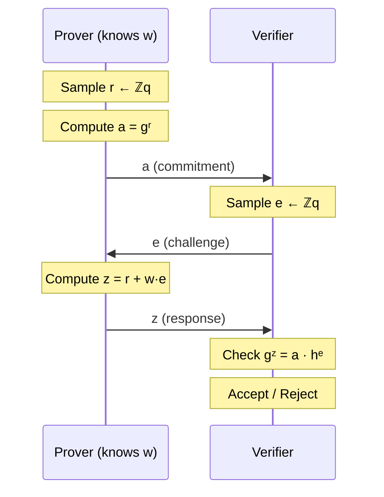

# Chapter 16: $\Sigma$-Protocols: The Simplest Zero-Knowledge Proofs

In 1989, a Belgian cryptographer named Jean-Jacques Quisquater faced an unusual challenge: explaining zero-knowledge proofs to his children.

The mathematics was forbidding. Goldwasser, Micali, and Rackoff had formalized the concept four years earlier, but their definitions involved Turing machines, polynomial-time simulators, and computational indistinguishability. Quisquater wanted something a six-year-old could grasp.

So he invented a cave.

> **The Children's Story**
>
> In Quisquater's tale, Peggy (the Prover) wants to prove to Victor (the Verifier) that she knows the magic word to open a door deep inside a cave. The cave splits into two paths (Left and Right) that reconnect at the magic door.
>
> Peggy enters the cave and takes a random path while Victor waits outside. Victor then walks to the fork and shouts: "Come out the Left path!"
>
> If Peggy knows the magic word, she can always comply. If she originally went Left, she walks out. If she went Right, she opens the door with the magic word and exits through the Left. Either way, Victor sees her emerge from the Left.
>
> If Peggy *doesn't* know the word, she's trapped. Half the time, Victor shouts for the path she's already on (she succeeds). Half the time, he shouts for the other side (she fails, stuck behind a locked door).
>
> They repeat this 20 times. A faker has a $(1/2)^{20}$ ≈ one-in-a-million chance of consistently appearing from the correct side. But someone who knows the word succeeds every time.
>
> This story, published as "How to Explain Zero-Knowledge Protocols to Your Children," captures the essence of what we now call a $\Sigma$-protocol: **Commitment** (entering the cave), **Challenge** (Victor shouting), **Response** (appearing from the correct side). Almost all modern cryptography, from your credit card chip to your blockchain wallet, is a mathematical version of this cave.

The paper became a classic, despite the fact that most children would probably stop listening after "takes a random path" to ask what "random" means. The cave analogy appears in nearly every introductory cryptography course regardless. What makes it so powerful is that it captures the *structure* of zero-knowledge: the prover commits to a position before knowing the challenge, then demonstrates knowledge by responding correctly.

This chapter develops the mathematics behind the cave. A prover commits to something random. A verifier challenges with something random. The prover responds with something that combines both randomnesses with their secret. The verifier checks a simple algebraic equation. If it holds, accept; if not, reject.

This is a $\Sigma$-protocol. The name comes from the shape of the message flow: three arrows forming the Greek letter $\Sigma$ when drawn between prover and verifier. The structure is so pervasive that it appears everywhere cryptography touches authentication: digital signatures, identification schemes, credential systems, and as building blocks within the complex SNARKs we've studied.

Why study something so simple after the machinery of Groth16 and STARKs?

Because $\Sigma$-protocols crystallize the *core* ideas of zero-knowledge. The simulator that we'll construct, picking the response first then computing what the commitment "must have been," is the archetype of all simulation arguments. The special soundness property (that two accepting transcripts with different challenges allow witness extraction) is the template for proofs of knowledge everywhere. And the Fiat-Shamir transform, which converts interaction into non-interaction, was developed precisely for $\Sigma$-protocols.

Understand $\Sigma$-protocols, and the zero-knowledge property itself becomes clear. This chapter prepares the ground for Chapter 17, where we formalize what "zero-knowledge" means. Here, we see it in its simplest form.

## The Discrete Logarithm Problem

We return to familiar ground. Chapter 6 introduced the discrete logarithm problem as the foundation for Pedersen commitments. Now it serves a different purpose: enabling proofs of knowledge.

The setting is a cyclic group $\mathbb{G}$ of prime order $q$ with generator $g$. Every element $h \in \mathbb{G}$ can be written as $h = g^w$ for some $w \in \mathbb{Z}_q$. This $w$ is the *discrete logarithm* of $h$ with respect to $g$. Computing $w$ from $h$ is hard; computing $h$ from $w$ is easy. This asymmetry, the one-wayness that made Pedersen commitments binding, now enables something new.

We use multiplicative notation throughout this chapter. In practice, most implementations use elliptic curves, where the group operation is written additively: $g^w$ becomes $w \cdot G$, $g^r \cdot g^s$ becomes $r \cdot G + s \cdot G$, and the Schnorr verification equation $g^z = a \cdot h^e$ becomes $z \cdot G = A + e \cdot H$. The mathematics is identical; only the symbols change.

The prover *knows* $w$. The verifier sees $h$ but cannot compute $w$ directly. The prover wants to convince the verifier that they know $w$ without revealing what $w$ is.

The naive approach fails immediately. If the prover just sends $w$, the verifier can check $g^w = h$, but the secret is exposed. If the prover sends nothing, the verifier has no basis for belief. There seems to be no middle ground.

Interactive proofs create that middle ground.

## Schnorr's Protocol

Claus Schnorr discovered the canonical solution in 1989. The protocol is three messages, two exponentiations for the prover, two exponentiations for the verifier.

Both parties know a group $\mathbb{G}$, a generator $g$, and the public value $h = g^w$. The prover alone knows the witness $w$. The protocol proceeds in three moves:

1. **Commitment.** The prover samples a random $r \leftarrow \mathbb{Z}_q$ and computes $a = g^r$. The prover sends $a$ to the verifier.

2. **Challenge.** The verifier samples a random $e \leftarrow \mathbb{Z}_q$ and sends $e$ to the prover.

3. **Response.** The prover computes $z = r + w \cdot e \mod q$ and sends $z$ to the verifier.

4. **Verification.** The verifier checks whether $g^z = a \cdot h^e$. Accept if yes, reject otherwise.

That's the entire protocol. The diagram above makes the $\Sigma$ shape visible: three arrows zigzagging between prover and verifier. Let's understand why it works.

**Completeness.** An honest prover with the correct $w$ always passes verification:
$$g^z = g^{r + we} = g^r \cdot g^{we} = g^r \cdot (g^w)^e = a \cdot h^e$$

The algebra is straightforward. The commitment $a = g^r$ hides $r$; the response $z = r + we$ reveals a linear combination of $r$ and $w$; but one equation in two unknowns doesn't determine either.

**Soundness.** A prover who doesn't know $w$ can cheat only by guessing the challenge $e$ before committing. Once they send $a$, they're locked in. For a random $e$, there's exactly one $z$ that satisfies the verification equation (namely $z = r + we$). A cheating prover who doesn't know $w$ cannot compute this $z$.

More precisely: suppose a cheater could answer two different challenges $e_1$ and $e_2$ for the same commitment $a$. Then we'd have:
$$g^{z_1} = a \cdot h^{e_1} \quad \text{and} \quad g^{z_2} = a \cdot h^{e_2}$$

Dividing these equations:
$$g^{z_1 - z_2} = h^{e_1 - e_2}$$

The extractor computes $w$ from the known exponents:
$$w = \frac{z_1 - z_2}{e_1 - e_2} \mod q$$

This is well-defined since $e_1 \neq e_2$ and $q$ is prime. To verify: $g^w = (g^{z_1}/g^{z_2})^{1/(e_1-e_2)} = (ah^{e_1}/ah^{e_2})^{1/(e_1-e_2)} = h^{(e_1-e_2)/(e_1-e_2)} = h$. $\square$

This extraction is a proof technique, not something the verifier can actually do. In a real execution, the prover answers only one challenge, so $w$ stays hidden. But the argument shows that anyone who *could* answer two challenges for the same commitment must already know $w$. Contrapositively, someone who doesn't know $w$ cannot reliably answer even a single random challenge. This property is called **special soundness**: two accepting transcripts with different challenges allow extracting the witness. It is why $\Sigma$-protocols prove you *know* something, not merely that something exists.

There is a clean geometric way to see this. Schnorr's protocol is secretly proving you know the equation of a line. In $z = r + w \cdot e$, think of $w$ as the slope and $r$ as the y-intercept. The prover commits to the intercept ($r$, hidden as $a = g^r$). The verifier picks an x-coordinate ($e$). The prover reveals the y-coordinate ($z$). In a single execution, the verifier learns one point $(e, z)$ on the line, which is consistent with infinitely many slopes, so $w$ stays hidden. But if an extractor could rewind and obtain a second point $(e_2, z_2)$ on the same line (same intercept $r$, since $a$ was fixed), two points would determine the slope.

**Honest-verifier zero-knowledge (HVZK).** Here is where things become subtle. What follows is a restricted form of zero-knowledge that assumes the verifier behaves honestly (samples $e$ uniformly at random). Chapter 17 formalizes the full definition, which must handle malicious verifiers. For now, consider a simulator that doesn't know $w$ but wants to produce a valid-looking transcript $(a, e, z)$. The simulator proceeds *backwards*:

1. Sample $e \leftarrow \mathbb{Z}_q$ (the challenge first!)
2. Sample $z \leftarrow \mathbb{Z}_q$ (the response, uniform and independent)
3. Compute $a = g^z \cdot h^{-e}$ (the commitment that *makes* the equation hold)

Check: $g^z = a \cdot h^e = g^z h^{-e} \cdot h^e = g^z$.

The transcript $(a, e, z)$ is valid. And its distribution is identical to a real transcript:

- In a real transcript: $e$ is uniform (verifier's randomness), $z = r + we$ is uniform (because $r$ is uniform), and $a = g^r$ is determined.
- In a simulated transcript: $e$ is uniform (simulator's choice), $z$ is uniform (simulator's choice), and $a = g^z h^{-e}$ is determined.

Both distributions have $e$ and $z$ uniform and independent, with $a$ determined by the verification equation. They are identical.

More formally, let $\mathcal{T}_{\text{real}}$ denote the distribution of real transcripts and $\mathcal{T}_{\text{sim}}$ the simulator's output. Both are distributions over $\mathbb{G} \times \mathbb{Z}_q \times \mathbb{Z}_q$. In $\mathcal{T}_{\text{real}}$: $(a, e, z) = (g^r, e, r + we)$ where $r, e \stackrel{\$}{\leftarrow} \mathbb{Z}_q$. In $\mathcal{T}_{\text{sim}}$: $(a, e, z) = (g^z h^{-e}, e, z)$ where $e, z \stackrel{\$}{\leftarrow} \mathbb{Z}_q$. In both cases, $e$ and $z$ are uniform and independent (in the real case, $z = r + we$ is uniform because $r$ is uniform and independent of $e$). The value $a$ is then uniquely determined by the verification equation $g^z = ah^e$. Since both distributions have identical marginals on $(e, z)$ and $a$ is a deterministic function of $(e, z)$, we have $\mathcal{T}_{\text{real}} \equiv \mathcal{T}_{\text{sim}}$ (perfect equality, not just computational indistinguishability).

The transcript reveals nothing about $w$ that the verifier couldn't have generated alone.

In real execution, events unfold forward: Commitment → Challenge → Response. The simulator reverses this. It picks the answer first ($z$), invents a question that fits ($e$), then back-calculates what the commitment "must have been" ($a = g^z h^{-e}$). This temporal reversal is invisible in the final transcript. Anyone looking at $(a, e, z)$ cannot tell whether it was produced forward (by someone who knows $w$) or backward (by someone who doesn't). If a transcript can be faked without the secret, then having the secret cannot be what makes the transcript convincing. The transcript itself carries no information about $w$.

### A Concrete Computation

Let's trace through Schnorr's protocol with actual numbers, then see how a simulator fakes a transcript.

Work in $\mathbb{Z}_{11}^*$ (order 10) with generator $g = 2$. The prover knows $w = 6$, and the public value is $h = 2^6 \equiv 9 \pmod{11}$.

**Real transcript:** The prover samples $r = 4$, computes $a = 2^4 \equiv 5$, and sends it. The verifier sends challenge $e = 7$. The prover computes $z = r + we = 4 + 42 = 46 \equiv 6 \pmod{10}$ (note: we reduce modulo the group order 10, not the prime 11). Verification: $g^z = 2^6 \equiv 9$ and $a \cdot h^e = 5 \cdot 9^7 \equiv 5 \cdot 4 \equiv 9 \pmod{11}$. Both sides match.

The transcript is $(a, e, z) = (5, 7, 6)$.

**Simulated transcript:** A simulator who doesn't know $w$ picks $e = 7$ and $z = 6$ (both uniform), then computes $a = g^z \cdot h^{-e} = 2^6 \cdot 9^{-7} \equiv 9 \cdot 4^{-1} \equiv 9 \cdot 3 \equiv 5 \pmod{11}$ (since $4 \cdot 3 = 12 \equiv 1$). The simulated transcript is $(5, 7, 6)$, identical to the real one. The simulator produced a valid proof without knowing $w = 6$. This is HVZK in action: the transcript carries no information about the witness.

## Pedersen Commitments and $\Sigma$-Protocols

Schnorr's protocol proves knowledge of a single discrete log. But in practice, we often need to prove knowledge of values hidden inside commitments. Chapter 6 introduced Pedersen commitments: $C = g^m h^r$ commits to message $m$ with blinding factor $r$, where $g, h$ are generators with unknown discrete log relation. $\Sigma$-protocols let us go further and *prove things* about committed values.

This is not a coincidence. Schnorr's protocol and Pedersen commitments are algebraically the same construction. In Schnorr, the prover commits to $a = g^r$ and later reveals $z = r + we$ (a linear combination of the randomness and the secret). In Pedersen, the committer computes $C = g^m h^r$ (a linear combination of two generators weighted by the message and randomness). Both rely on the same hardness assumption; both achieve the same hiding property.

Recall from Chapter 6: a Pedersen commitment $C = g^m h^r$ is perfectly hiding (reveals nothing about $m$) and computationally binding (opening to a different value requires solving discrete log). The additive homomorphism $C_1 \cdot C_2 = g^{m_1+m_2} h^{r_1+r_2}$ lets us compute on committed values.

What Chapter 6 couldn't address: how does a prover demonstrate they *know* the opening $(m, r)$ without revealing it? This is precisely what $\Sigma$-protocols provide.

### Proving Knowledge of Openings

Schnorr handles one exponent; Pedersen commitments involve two: $C = g^m h^r$. To prove knowledge of the opening $(m, r)$, we need the two-dimensional generalization. The structure mirrors Schnorr exactly (commit, challenge, respond) but now with two secrets handled in parallel:

1. **Commitment.** Prover samples $d, s \leftarrow \mathbb{Z}_q$ and sends $a = g^d h^s$.

2. **Challenge.** Verifier sends random $e \leftarrow \mathbb{Z}_q$.

3. **Response.** Prover sends $z_1 = d + m \cdot e$ and $z_2 = s + r \cdot e$.

4. **Verification.** Check $g^{z_1} h^{z_2} = a \cdot C^e$.

This is just two Schnorr protocols glued together. One proves knowledge of the message part ($m$, committed via $g^m$), the other proves knowledge of the randomness part ($r$, committed via $h^r$). The same challenge $e$ binds them, ensuring the prover cannot mix-and-match unrelated values.

The analysis parallels Schnorr's protocol:

**Completeness.**
$$g^{z_1} h^{z_2} = g^{d + me} h^{s + re} = g^d h^s \cdot (g^m h^r)^e = a \cdot C^e \checkmark$$

**Special soundness.** Two transcripts with the same $a$ but different challenges $e_1, e_2$ yield:
$$g^{z_1^{(1)} - z_1^{(2)}} h^{z_2^{(1)} - z_2^{(2)}} = C^{e_1 - e_2}$$
From which both $m$ and $r$ can be extracted.

**HVZK.** Simulator picks $e, z_1, z_2$ uniformly, sets $a = g^{z_1} h^{z_2} \cdot C^{-e}$.

The prover demonstrates knowledge of the commitment opening without revealing what that opening is.

### Proving Relations on Committed Values

The homomorphic property enables proving statements about committed values without revealing them.

For addition, given commitments $C_1, C_2, C_3$, we can prove that the committed values satisfy $m_1 + m_2 = m_3$.

Consider the product $C_1 \cdot C_2 \cdot C_3^{-1}$. Expanding the Pedersen structure:

$$C_1 \cdot C_2 \cdot C_3^{-1} = g^{m_1} h^{r_1} \cdot g^{m_2} h^{r_2} \cdot g^{-m_3} h^{-r_3} = g^{m_1 + m_2 - m_3} \cdot h^{r_1 + r_2 - r_3}$$

If the relation $m_1 + m_2 = m_3$ holds, the $g$ exponent vanishes:

$$C_1 \cdot C_2 \cdot C_3^{-1} = g^0 \cdot h^{r_1 + r_2 - r_3} = h^{r_1 + r_2 - r_3}$$

The combined commitment collapses to a pure power of $h$. To prove the relation holds, the prover demonstrates knowledge of this exponent $r_1 + r_2 - r_3$ (a single Schnorr proof with base $h$ and public element $C_1 \cdot C_2 \cdot C_3^{-1}$).

Multiplication is harder. Pedersen commitments aren't multiplicatively homomorphic. Given $C_1 = g^{m_1} h^{r_1}$, $C_2 = g^{m_2} h^{r_2}$, $C_3 = g^{m_3} h^{r_3}$, how do we prove $m_1 \cdot m_2 = m_3$?

The key insight is to change bases. Observe that:
$$g^{m_3} = g^{m_1 \cdot m_2} = (g^{m_1})^{m_2}$$

If $C_3 = g^{m_1 m_2} h^{r_3}$, then $C_3$ can also be viewed as:
$$C_3 = (g^{m_1})^{m_2} h^{r_3}$$

Now substitute $g^{m_1} = C_1 \cdot h^{-r_1}$:
$$C_3 = (C_1 \cdot h^{-r_1})^{m_2} h^{r_3} = C_1^{m_2} \cdot h^{r_3 - r_1 m_2}$$

This expresses $C_3$ as a "Pedersen commitment with base $C_1$" to the value $m_2$ with blinding factor $r_3 - r_1 m_2$.

The prover runs three parallel $\Sigma$-protocols:

1. Prove knowledge of $(m_1, r_1)$ opening $C_1$ (standard Pedersen opening)
2. Prove knowledge of $(m_2, r_2)$ opening $C_2$ (standard Pedersen opening)
3. Prove knowledge of $(m_2, r_3 - r_1 m_2)$ opening $C_3$ with respect to bases $(C_1, h)$

The third proof *links* to the second because the same $m_2$ appears. This linking requires careful protocol design, but the core technique is $\Sigma$-protocol composition with shared secrets.

## Fiat-Shamir: From Interaction to Non-Interaction

Interactive proofs are impractical for many applications. A signature scheme cannot require real-time communication with every verifier. A blockchain proof must be verifiable by anyone, at any time, without the prover present.

The **Fiat-Shamir transform** removes interaction. The idea is elegant: replace the verifier's random challenge with a hash of the transcript.

In Schnorr's protocol:

1. Prover computes $a = g^r$
2. Instead of waiting for verifier's $e$, prover computes $e = H(a)$ (or $H(g, h, a)$ for domain separation)
3. Prover computes $z = r + we$
4. Proof is $(a, z)$

Verification:

1. Recompute $e = H(a)$
2. Check $g^z = a \cdot h^e$

The transform works because $H$ is modeled as a **random oracle**: a function that returns uniformly random output for each new input. The prover cannot predict $H(a)$ before choosing $a$. Once $a$ is fixed, the hash determines $e$ deterministically. The prover faces a random challenge, just as in the interactive version.

In practice, $H$ is a cryptographic hash function like SHA-256. The random oracle model is an idealization (hash functions aren't truly random functions) but the heuristic is empirically robust for well-designed protocols.

Schnorr signatures are the direct application. Given secret key $w$ and public key $h = g^w$:

- **Sign message $M$:** Compute $a = g^r$, $e = H(h, a, M)$, $z = r + we$. Signature is $(a, z)$.
- **Verify:** Check $g^z = a \cdot h^e$ where $e = H(h, a, M)$.

Schnorr patented his signature scheme in 1989 (U.S. Patent 4,995,082). NIST needed a standard and designed DSA, later ECDSA, specifically to work around the patent. The result was a signing equation $s = k^{-1}(H(m) + rx)$ that includes a modular inversion $k^{-1}$. This non-linearity is the algebraic cost of the workaround: you cannot simply add ECDSA signatures, because the inverses don't combine.

The patent expired in 2008, and Schnorr signatures finally entered widespread use as EdDSA (Ed25519), now standard in TLS, SSH, and cryptocurrency systems. Bitcoin launched in 2009, but ECDSA was already the entrenched standard, so Satoshi used it. Ethereum launched in 2015 with ECDSA as well: audited Schnorr implementations on secp256k1 simply did not exist yet, and Ethereum still uses ECDSA today. It took until the 2021 Taproot upgrade for Bitcoin to adopt Schnorr. The linearity of $z = r + we$ enables what ECDSA cannot:

- **Batch verification**: check many signatures faster than individually by taking random linear combinations (Schwartz-Zippel ensures invalid signatures can't cancel)
- **Native aggregation**: multiple signers can combine signatures into one. MuSig2 produces a single 64-byte signature for $n$ parties that verifies against an aggregate public key
- **ZK-friendliness**: no modular inversions, so Schnorr verification is cheap inside arithmetic circuits

## Composition: AND and OR

$\Sigma$-protocols compose cleanly, enabling proofs of complex statements from simple building blocks.

For AND composition, to prove "I know $w_1$ such that $h_1 = g^{w_1}$ AND $w_2$ such that $h_2 = g^{w_2}$":

1. Run both protocols in parallel with independent commitments
2. Use the same challenge $e$ for both
3. Check both verification equations

If the prover knows both witnesses, they can respond to any challenge. If they lack either witness, they can't respond correctly.

OR composition is more subtle. To prove "I know $w_1$ OR $w_2$" (without revealing which):

1. For the witness you *don't* know, simulate a transcript $(a_i, e_i, z_i)$ (using the honest-verifier simulator from the zero-knowledge property)
2. For the witness you *do* know, commit honestly to $a_j$
3. When you receive the verifier's challenge $e$, set $e_j = e - e_i$
4. Respond honestly to $e_j$ using your witness

The verifier checks:

- Both verification equations hold
- $e_1 + e_2 = e$

As an example, suppose Alice knows the discrete log of $h_1 = g^{w_1}$ but not $h_2$. She wants to prove she knows at least one of them.

1. **Simulate the unknown:** Alice picks $e_2 = 7$ and $z_2 = 13$ at random, then computes $a_2 = g^{z_2} h_2^{-e_2} = g^{13} h_2^{-7}$. This is a valid-looking transcript for $h_2$.

2. **Commit honestly for the known:** Alice picks $r_1 = 5$ and computes $a_1 = g^{r_1} = g^5$. She sends $(a_1, a_2)$ to the verifier.

3. **Split the challenge:** The verifier sends $e = 19$. Alice sets $e_1 = e - e_2 = 19 - 7 = 12$.

4. **Respond honestly:** Alice computes $z_1 = r_1 + w_1 \cdot e_1 = 5 + w_1 \cdot 12$ and sends $(e_1, z_1, e_2, z_2) = (12, z_1, 7, 13)$.

The verifier checks $g^{z_1} = a_1 \cdot h_1^{e_1}$ and $g^{z_2} = a_2 \cdot h_2^{e_2}$, plus $e_1 + e_2 = 19$. Both equations hold. The verifier cannot tell which transcript was simulated; the simulated $(a_2, e_2, z_2)$ is statistically identical to an honest execution.

You can prove you know one of two secrets without revealing which. Ring signatures, anonymous credentials, and many privacy-preserving constructions build on this technique.

## Key Takeaways

1. **Three messages suffice** for zero-knowledge proofs of knowledge. Commit → Challenge → Response. The commitment must come before the challenge; reversing this order destroys soundness.

2. **Special soundness**: two accepting transcripts with different challenges enable witness extraction. This makes $\Sigma$-protocols *proofs of knowledge*, not merely proofs of existence.

3. **Zero-knowledge via simulation**: pick the challenge and response first, compute what the commitment must have been. If a transcript can be faked without the secret, the transcript carries no information about the secret.

4. **Schnorr is the archetype**. Every $\Sigma$-protocol in this chapter is a variation on $z = r + we$: Pedersen openings run two Schnorr proofs in parallel, relations on committed values reduce to Schnorr proofs after algebraic simplification.

5. **Fiat-Shamir** removes interaction by hashing the commitment to derive the challenge. This yields Schnorr signatures and non-interactive proofs.

6. **Composition** builds complex proofs from simple ones. AND runs protocols in parallel with a shared challenge. OR uses simulation for the unknown witness; the verifier cannot tell which branch is real.

7. **Minimal assumptions**: $\Sigma$-protocols require only the discrete logarithm assumption. No pairings, no trusted setup, no hash functions beyond Fiat-Shamir.
