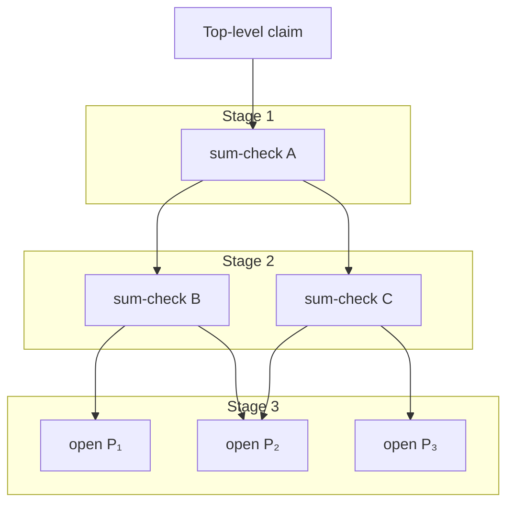

# Chapter 21: Minimizing Commitment Costs

> *This chapter closes Part VI (Prover Optimization, Chapters 19-21), which is optional on a first read. The rest of the book does not depend on it. The material here is essential for anyone designing or implementing a fast prover.*
>
> *This chapter lives at the frontier. The techniques here, some from papers published in 2024 and 2025, represent the current edge of what's known about fast proving. We assume comfort with polynomial commitments (Chapter 9), sum-check (Chapter 3), and the memory checking ideas from Chapter 14. First-time readers may find themselves reaching for earlier chapters often; that's expected. The reward for persisting is a view of how the fastest SNARKs actually work.*

Profile any modern SNARK prover and the same pattern appears. The proving algorithm touches each constraint once. The information-theoretic protocol is near-optimal. Yet wall-clock time is dominated by something else entirely: polynomial commitments.

For elliptic curve-based systems, the bottleneck is multi-scalar multiplication (MSM): computing $\sum_i s_i \cdot G_i$ where each $s_i$ is a scalar and each $G_i$ is a curve point. A single curve exponentiation costs roughly 3,000 field multiplications. An MSM over $N$ points costs about $N / \log N$ exponentiations. For a polynomial of degree $10^6$, commitment alone requires $\approx 3 \times 10^8$ field operations, while the proving algorithm itself, after the linear-time sum-check techniques of Chapter 19, runs in only $10^7$. The cryptography dwarfs the algebra. The two surrounding chapters develop the rest of the picture: Chapter 19 establishes why sum-check provers are now fast enough that commitments dominate, and Chapter 20 traces the STARK-side optimization story, where the bottleneck instead concentrates in NTT and hashing because FRI absorbs the commitment cost into the prover pipeline.

This chapter focuses on the elliptic curve setting, where sum-check-based minimization techniques apply most directly.

This observation crystallizes into a design principle: **commit to as little as possible**. Not zero (some commitment is necessary for succinctness) but the absolute minimum required for soundness.

This chapter develops the techniques that make minimization possible. Together with fast sum-check proving, they form the foundation of the fastest modern SNARKs.


## The Two-Stage Paradigm

Every modern SNARK decomposes into two phases. First, the prover *commits* to the witness, to intermediate values, and to auxiliary polynomials that will help later proofs. Second, the prover runs an *interactive argument* that demonstrates those committed objects satisfy the required constraints.

Both phases cost time. And here's the trap: **more commitment means more proving**. Every committed object must later be shown well-formed. If you commit to a polynomial, you'll eventually need to prove something about it: its evaluations, its degree, its relationship to other polynomials. Each such proof compounds the cost.

The obvious extremes are both suboptimal. Commit nothing, and proofs cannot be succinct: the verifier must read the entire witness. Commit everything, and you drown in overhead: each intermediate value requires cryptographic operations and well-formedness proofs.

The art lies in the middle: commit to exactly what enables succinct verification. No more.

### Untrusted Advice

Sometimes the sweet spot involves *enlarging the witness*: adding extra values that the prover must compute alongside the original ones. The witness is what gets committed, so adding a few helper values just makes the same witness polynomial slightly longer. The trade-off can be favorable: the extra values often let the constraint system avoid hard operations entirely.

Consider division. Proving "I correctly computed $a/b$" by directly encoding division as a constraint is expensive, since division is not a native operation in polynomial constraint systems. The constraint system speaks the language of multiplication and addition over a finite field, not Euclidean division.

The workaround is to enlarge the witness with the quotient $q$ and remainder $R$, and then verify the multiplicative identity:

1. The prover adds $q$ and $R$ to the witness vector. They are committed as part of the same polynomial(s) that already hold $a$ and $b$, with no separate commitment object.
2. The constraint system enforces $a = q \cdot b + R$ and $R < b$.

Every value lives inside the committed witness polynomial; the verifier never sees any of them in the clear. The constraint is checked the same way every other constraint is: as a polynomial identity opened at a random point via the PCS. The win is that this identity uses only multiplication and a range check, both native, instead of requiring the constraint system to implement division. The prover paid for slightly more witness entries to avoid encoding a hard operation, and the verifier never had to learn what $q$ and $R$ actually are.

This pattern is called **untrusted advice**: the prover volunteers additional witness data that, *if* the constraints check out, accelerates the overall proof. The verifier does not trust the advice blindly; the constraints guarantee it is consistent with the original claim.

The trade-off is specific: we pay for a slightly longer witness polynomial (more entries to commit, so a slightly larger MSM) to save on constraint degree. The constraints that check the enlarged witness can be lower-degree than the constraints that would have encoded the hard operation directly. Since high-degree constraints are expensive to prove via sum-check, the exchange often favors a longer witness with simpler constraints.

The pattern generalizes. Any computation with an efficient verification shortcut benefits:

**Square roots.** To prove $y = \sqrt{x}$, the prover commits to $y$ and proves $y^2 = x$ and $y \geq 0$. One multiplication plus a range check, rather than implementing the square root algorithm in constraints.

**Sorting.** To prove a list is sorted, the prover commits to the sorted output and proves: (1) it's a permutation of the input (via permutation argument), and (2) adjacent elements satisfy $a_i \leq a_{i+1}$. Linear comparisons rather than $O(n \log n)$ sorting constraints.

**Inverses.** To prove $y = x^{-1}$, commit to $y$ and check $x \cdot y = 1$. Field inversion (expensive to express directly) becomes a single multiplication.

**Exponentiation.** To prove $y = g^x$, the prover commits to $y$ and all intermediate values from the square-and-multiply algorithm: $r_0 = 1, r_1, r_2, \ldots, r_k = y$. Each step satisfies $r_{i+1} = r_i^2$ (if bit $x_i = 0$) or $r_{i+1} = r_i^2 \cdot g$ (if $x_i = 1$). Verifying $k$ quadratic constraints is far cheaper than expressing the full exponentiation logic.

Whenever verifying a result costs less than computing it, the prover should compute and commit while the constraint system only checks. The prover bears the computational burden; the constraint system bears only the verification burden. This division of labor is the essence of succinct proofs, now applied within the proof system itself.


## Batch Evaluation Arguments

Suppose the prover has committed to addresses $(y_1, \ldots, y_T)$ and claimed *read results* $(z_1, \ldots, z_T)$, the values the prover claims it received from each lookup. A public function $f: \{0,1\}^\ell \to \mathbb{F}$ is known to all. The prover wants to demonstrate:

$$z_1 = f(y_1), \quad z_2 = f(y_2), \quad \ldots, \quad z_T = f(y_T)$$

One approach: prove each evaluation separately. That's $T$ independent proofs, linear in the number of evaluations. Can we do better?

Think of $f$ as a memory array indexed by $\ell$-bit addresses. Each $(y_i, z_i)$ pair is a read operation, "I read value $z_i$ from address $y_i$," and the prover claims all $T$ reads are consistent with the memory $f$. (Later in this chapter we will see that this read-only setting is the simpler half of a more general *memory checking* problem, where the table itself can be updated over time.)

One approach uses lookup arguments (Chapter 14), proving that each $(y_i, z_i)$ pair exists in the table $\{(x, f(x)) : x \in \{0,1\}^\ell\}$. But sum-check offers a more direct path that exploits the structure of the problem.

### Three Flavors of Batching

Before diving into sum-check, let's map the batching landscape. The term "batching" appears throughout this book, but it means different things in different contexts.

**Approach 1: Batching verification equations.** The simplest form. Suppose you have $T$ equations to check: $L_1 = R_1, \ldots, L_T = R_T$. Sample a random $\alpha$ and check the single combined equation $\sum_j \alpha^j L_j = \sum_j \alpha^j R_j$. By Schwartz-Zippel, if any original equation fails, the combined equation fails with high probability. This reduces $T$ verification checks to one.

Chapter 2 uses this for Schnorr batch verification. Chapter 13 uses it to combine PLONK's constraint polynomials. Chapter 15 uses it to merge STARK quotients. The pattern is ubiquitous: random linear combination collapses many checks into one.

**Approach 2: Batching PCS openings.** Polynomial commitment schemes often support proving multiple evaluations cheaper than proving each separately. KZG's batch opening (Chapter 9) proves $f(z_1) = v_1, \ldots, f(z_k) = v_k$ with a single group element, using the quotient $\frac{f(X) - R(X)}{Z(X)}$ where $R$ is the interpolant of the claimed evaluations and $Z$ is the vanishing polynomial of the query points. This quotient exists as a polynomial iff every claimed evaluation is correct, so its commitment doubles as the batch proof. Proof size stays constant regardless of $k$. This batching is PCS-specific; other schemes have different mechanisms.

**Approach 3: Batching via domain-level sum-check.** This is what this section develops. Rather than batch the $T$ *claims* directly, we restructure the problem as a sum over the *domain* of $f$. The key equation:

$$\tilde{z}(r') = \sum_{x \in \{0,1\}^\ell} \widetilde{ra}(x, r') \cdot \tilde{f}(x)$$

This sum nominally has $2^\ell$ terms (one per address in the domain), but $\widetilde{ra}$ is sparse: out of $K \cdot T$ possible entries, only $T$ are non-zero, since each access touches exactly one address. Sum-check exploits this sparsity in the *access matrix*, not in $f$ itself ($f$ can be perfectly dense). At the end of the protocol, the verifier needs a single evaluation $\tilde{f}(r)$ at a random point: one PCS opening, not $T$.

#### Comparing the three approaches

The three approaches batch at different levels, and that is what determines what each one saves. Approaches 1 and 2 operate at the *claim level*: the prover must still open $f$ at all $T$ points $y_1, \ldots, y_T$. Approach 1 saves verifier work (one check instead of $T$) but does not reduce openings; Approach 2 compresses the proof but still requires the prover to compute all $T$ evaluations internally. Approach 3 batches at the *domain level*: the $T$ point evaluations collapse into a single random evaluation, and the prover opens $\tilde{f}$ at exactly one point.

Each approach therefore answers a different question.

*Approach 1 (batch verification equations)* answers "I have many unrelated checks; can the verifier handle them in one shot?" Use it whenever you have multiple equations to verify, even outside the PCS setting. The combiner is just transcript-level randomness, costing nothing beyond sampling one field element. The prover does the same work either way; only verifier work shrinks. This is what PLONK uses to combine constraint polynomials and what STARK quotient batching uses.

*Approach 2 (PCS batch opening)* answers "I have one committed polynomial; how do I send many opening proofs in one go?" Use it when $f$ is already committed (typically via KZG) and you need to prove evaluations at multiple points. The win is purely in proof size: one group element instead of $T$. The prover still computes all $T$ evaluations internally and does the corresponding MSM work; nothing about $f$'s structure or the access pattern matters.

*Approach 3 (sum-check over the domain)* answers "I have many evaluations of the same polynomial with structured access; can the prover do less work overall?" Use it when (a) you are proving many evaluations $f(y_j)$ of the same $f$, and (b) the access pattern has structure the sum-check can exploit, in particular the one-hot or tensor-decomposable structure of the access matrix $ra$. Crucially, this is structure in *how the polynomial is queried*, not structure in the polynomial itself. The decisive parameters are $T$ (number of accesses) and $K = 2^\ell$ (domain size): when $T \ll K$, exploiting the access sparsity is what makes $T$ accesses to a $K$-sized table feasible. Without that structure, Approach 3 has nothing to exploit and Approach 2 is simpler.

There is a deeper connection across all three. Evaluating an MLE at a random point $r'$ *is* a random linear combination, weighted by the Lagrange basis $\widetilde{\text{eq}}(r', \cdot)$ rather than powers of $\alpha$. The sum-check formulation in Approach 3 is random linear combination in MLE clothing, but operating at the domain level unlocks optimizations that claim-level batching (Approaches 1 and 2) cannot reach.

### The Sum-Check Approach

Now we develop Approach 3 in detail. Let $\tilde{f}$ be the multilinear extension of $f$. The access matrix $ra(x, j)$ from the previous section is the Boolean matrix with $ra(x, j) = 1$ iff $y_j = x$, so each column $j$ is one-hot at the row corresponding to address $y_j$.

**Example.** Suppose $f$ is defined on 2-bit addresses $\{00, 01, 10, 11\}$, and we have $T = 3$ accesses to addresses $y_1 = 01$, $y_2 = 11$, $y_3 = 01$. The access matrix is:

$$ra = \begin{pmatrix} 0 & 0 & 0 \\ 1 & 0 & 1 \\ 0 & 0 & 0 \\ 0 & 1 & 0 \end{pmatrix} \quad \text{rows: } x \in \{00, 01, 10, 11\}, \quad \text{columns: } j \in \{1, 2, 3\}$$

Each column $j$ encodes "which address did access $j$ hit?" as a one-hot vector: column $j$ equals the basis vector $e_{y_j}$. Here column 1 is $e_{01}$ (since $y_1 = 01$), column 2 is $e_{11}$ (since $y_2 = 11$), and column 3 is $e_{01}$ again (since $y_3 = 01$).

For a single evaluation, we can write:

$$z_j = \sum_{x \in \{0,1\}^\ell} ra(x, j) \cdot f(x)$$

This looks like overkill. The one-hot structure of $ra(\cdot, j)$ zeroes out every term except the one at address $y_j$, so the sum trivially collapses to $f(y_j) = z_j$. Why bother?

The heuristic that turns this into a single check is the multilinear extension trick used throughout the book: lift a vector of values defined on the Boolean hypercube into a polynomial on the full field, then evaluate that polynomial at one random point off the hypercube. By Schwartz-Zippel, that one evaluation catches any error in the original vector with overwhelming probability.

Define the "error" at index $j$ as the gap between the claimed output and what the lookup should return:

$$e_j = z_j - \sum_{x \in \{0,1\}^\ell} ra(x, j) \cdot f(x)$$

There are $T$ such errors, one per access. All evaluations are correct iff $e_j = 0$ for every $j$. Checking $T$ separate equalities defeats the purpose of batching, so we apply the trick. The vector $(e_1, \ldots, e_T)$ is defined on the hypercube $\{0,1\}^{\log T}$. Its multilinear extension $\tilde{e}$ is a polynomial on $\mathbb{F}^{\log T}$, and $\tilde{e}$ is the zero polynomial iff *every* $e_j = 0$. The verifier picks a random $r' \in \mathbb{F}^{\log T}$ and asks: is $\tilde{e}(r') = 0$? If all $e_j$ vanish, the answer is yes for any $r'$; if any $e_j$ is non-zero, Schwartz-Zippel says the answer is no with overwhelming probability. One evaluation, $T$ checks collapsed.

Substituting the definition of $e_j$ and using the linearity of the MLE construction, the check $\tilde{e}(r') = 0$ becomes:

$$\tilde{z}(r') = \sum_{x \in \{0,1\}^\ell} \widetilde{ra}(x, r') \cdot \tilde{f}(x)$$

If this single identity holds at the random $r'$, all $T$ original evaluations are correct with high probability. The $T$ separate access claims have collapsed into one identity over the *entire domain* $\{0,1\}^\ell$, which sum-check is built to prove.

Sum-check proves this identity. The prover commits to $\widetilde{ra}$ and $\tilde{z}$, then runs sum-check to verify consistency with the public $\tilde{f}$.

### The Sparsity Advantage

The sum nominally ranges over all $2^\ell$ addresses, potentially enormous (imagine $\ell = 128$ for CPU word operations). The reason it stays tractable is the structure of the access matrix. A vector or matrix is **one-hot** if every column contains exactly one non-zero entry, and that entry equals 1. The access matrix $ra$ is one-hot by construction: each access $j$ touches exactly one address $y_j$, so column $j$ has a 1 at row $y_j$ and zeros everywhere else.

The consequence is dramatic. The matrix $ra$ has dimensions $K \times T$ with $K = 2^\ell$, so naively it has $K \cdot T$ entries, but only $T$ of them are non-zero. Any sum that appears to range over $K$ positions actually touches only the $T$ non-zero terms. This is why batch evaluation costs $O(T)$ rather than $O(KT)$: the one-hot structure makes the exponentially large table effectively linear-sized. When $K = 2^{128}$ (as in Jolt's instruction lookups), this is the difference between tractable and impossible.

One-hotness handles the access side (only $T$ non-zero terms in $\widetilde{ra}$) but the sum still nominally folds the dense polynomial $\tilde{f}$ over the full $2^\ell$-element domain. Naive sum-check over this dense factor still costs $O(2^\ell)$. The prefix-suffix algorithm from Chapter 19 closes the remaining gap: by splitting the variables into halves and running two chained sum-checks, the dense work shrinks from $O(2^\ell)$ to $O(2^{\ell/c})$ for any constant $c$. Combined with the one-hot access, the prover runs in $O(T + 2^{\ell/c})$ total. Compared to proving each evaluation separately (which costs $\Omega(T)$ just to state the claims), the batch approach matches the lower bound while providing cryptographic guarantees.


## Virtual Polynomials

Start with a toy case. Suppose the prover has committed to multilinear polynomials $\tilde{a}$ and $\tilde{b}$, and the protocol later refers to $\tilde{c}(x) = \tilde{a}(x) \cdot \tilde{b}(x)$. Should the prover separately commit to $\tilde{c}$?

No, because $\tilde{c}$ contains no information beyond what is already in $\tilde{a}$ and $\tilde{b}$. Whenever the verifier needs $\tilde{c}(r)$ at a random point $r$, the protocol can ask for $\tilde{a}(r)$ and $\tilde{b}(r)$ instead, then compute $\tilde{c}(r) = \tilde{a}(r) \cdot \tilde{b}(r)$ locally. The polynomial $\tilde{c}$ is **virtual**: it exists implicitly through the formula $\tilde{c} = \tilde{a} \cdot \tilde{b}$, never committed, never stored. The prover saves one MSM; the verifier loses nothing.

The general principle behind virtualization is that any polynomial algebraically determined by already-committed polynomials does not need its own commitment. Whenever the verifier needs an evaluation of the virtual polynomial at some point $r$, the protocol reduces that demand to evaluations of the source polynomials at $r$, and the verifier reconstructs the result from the formula. The savings cascade: if a virtual polynomial's sources are themselves virtual, the same trick applies recursively, and only the *root* polynomials in the dependency graph ever get committed.

This principle is what makes the access matrix tractable. In our batch evaluation, $ra$ has $K = 2^\ell$ rows (one per possible address) and $T$ columns (one per access). For a zkVM with 32-bit addresses, $K = 2^{32}$, so the matrix has billions of entries. Committing to it directly is impossible. The escape is to *not* commit $ra$ as a single object: instead, decompose it into smaller pieces that can be committed and treat the full $ra$ as virtual. The next subsection develops this decomposition.

### Tensor Decomposition

The access matrix is the natural target for virtualization, but virtualization needs source polynomials to factor through. The trick is that addresses themselves are bit strings, and matching an $\ell$-bit address means matching every bit. We can therefore factor the address-match into separate per-chunk matches, each over a much smaller space.

Concretely, an address $k \in \{0,1\}^\ell$ splits into $d$ chunks of $\ell/d$ bits each:

$$k = (k_1, \ldots, k_d) \quad \text{where each } k_i \in \{0,1\}^{\ell/d}$$

For each chunk $i$, define a smaller access matrix $ra_i$ where $ra_i(k_i, j) = 1$ iff the $i$-th chunk of access $y_j$ equals $k_i$. Each $ra_i$ has dimensions $K^{1/d} \times T$, exponentially smaller than the original $K \times T$.

The full access happens when *every* chunk matches, which is exactly the product:

$$ra(k, j) = \prod_{i=1}^{d} ra_i(k_i, j)$$

The original $ra$ never gets committed. The prover commits only to the $d$ small matrices $ra_1, \ldots, ra_d$, and the full $ra$ exists virtually through this product formula.

**Example.** Return to our 2-bit addresses with accesses $y_1 = 01$, $y_2 = 11$, $y_3 = 01$. Split each address into $d = 2$ chunks of 1 bit each: $y_1 = (0, 1)$, $y_2 = (1, 1)$, $y_3 = (0, 1)$.

The chunk matrices are (columns: $j \in \{1, 2, 3\}$):

$$ra_1 = \begin{pmatrix} 1 & 0 & 1 \\ 0 & 1 & 0 \end{pmatrix} \quad \text{rows: first bit } k_1 \in \{0, 1\}$$

$$ra_2 = \begin{pmatrix} 0 & 0 & 0 \\ 1 & 1 & 1 \end{pmatrix} \quad \text{rows: second bit } k_2 \in \{0, 1\}$$

In $ra_1$: row 0 has 1s in columns 1 and 3 because accesses $y_1 = 01$ and $y_3 = 01$ have first bit 0. Row 1 has a 1 in column 2 because $y_2 = 11$ has first bit 1.

In $ra_2$: row 1 has 1s in all columns because all three accesses ($01, 11, 01$) have second bit 1.

To recover $ra(01, j=1)$: check $ra_1(0, 1) \cdot ra_2(1, 1) = 1 \cdot 1 = 1$. Indeed, access 1 hit address 01. For $ra(10, j=1)$: $ra_1(1, 1) \cdot ra_2(0, 1) = 0 \cdot 0 = 0$. Access 1 did not hit address 10.

Instead of one $4 \times 3$ matrix (12 entries), we store two $2 \times 3$ matrices (12 entries total, same here, but the savings grow with $\ell$).

The commitment savings are dramatic. Instead of a $K \times T$ matrix, the prover commits to $d$ matrices of size $K^{1/d} \times T$ each. For $K = 2^{128}$ and $d = 4$: from $2^{128}$ to $4 \times 2^{32}$.

The exponential has become polynomial.

### Virtualizing Everything

Once you see virtualization, you see it everywhere. The product example above is the smallest case; in real systems the same principle applies to entire computation traces. A zkVM executing a million instructions touches several polynomials per instruction: opcode, operands, intermediate values, flags. Naive commitment requires millions of polynomials, each with its own MSM. Virtualization reduces this to perhaps a dozen root polynomials, with everything else derived. The difference is a 30-second proof versus a 3-second proof.

**The read values need not exist.** Recall the batch evaluation setup: $z = (z_1, \ldots, z_T)$ is the vector of *read results*, with $z_j$ being the value returned when the prover read address $y_j$ in step $j$. These feel like primary data; in a zkVM they are exactly the values an instruction sees coming out of memory, and the rest of the computation depends on them. Surely they need to be committed?

They do not. The read results are completely determined by the access pattern $ra$ (which addresses were read) and the table $f$ (what each address contains). Concretely:

$$\tilde{z}(r') = \sum_{x \in \{0,1\}^\ell} \widetilde{ra}(x, r') \cdot \tilde{f}(x)$$

The right side *defines* $\tilde{z}$ implicitly from $ra$ and $f$. The prover never commits to $z$. When the verifier needs $\tilde{z}(r')$, sum-check reduces this evaluation to evaluations of $\widetilde{ra}$ and $\tilde{f}$, both of which are already committed (the access matrix) or public (the table). The pattern is the same as $\tilde{c} = \tilde{a} \cdot \tilde{b}$ from earlier, just with a sum instead of a product as the defining formula.

**GKR as virtualization.** The GKR protocol (Chapter 7) builds an entire verification strategy from this idea. A layered arithmetic circuit computes layer by layer from input to output. The naive approach commits to every layer's values. GKR commits to almost nothing:

Let $\tilde{V}_k$ denote the multilinear extension of gate values at layer $k$. The layer reduction identity:

$$\tilde{V}_k(r) = \sum_{i,j \in \{0,1\}^s} \widetilde{\text{mult}}_k(r, i, j) \cdot \tilde{V}_{k-1}(i) \cdot \tilde{V}_{k-1}(j) + \ldots$$

Each layer's values are virtual: defined via sum-check in terms of the previous layer. Iterate from output to input: only $\tilde{V}_0$ (the input layer) is ever committed. A circuit with 100 layers has 99 virtual layers that exist only as claims passed through sum-check reductions.

**More examples.** The pattern appears throughout modern SNARKs.

- *Constraint polynomials.* In Spartan (Chapter 19), the polynomial $\tilde{a}(x) \cdot \tilde{b}(x) - \tilde{c}(x)$ is never committed. Sum-check verifies it equals zero on the hypercube by evaluating at random points.

- *Grand products.* Permutation arguments express $Z(X)$ as a running product. Each $Z(i)$ is determined by $Z(i-1)$ and the current term. One starting value plus a recurrence defines everything.

- *Folding.* In Nova (Chapter 23), the accumulated instance is virtual. Each fold updates a claim about what could be verified (not data sitting in memory).

- *Write values from read values.* In read-write memory checking, the prover commits to read addresses, write addresses, and increments $\Delta$. What about write values? They need not be committed: $\textsf{wv}(j) = \textsf{rv}(j) + \Delta(j)$. The write value at cycle $j$ is the previous value at that address plus the change. Three committed objects define four.

The design principle that emerges from these examples is to ask not "what do I need to store?" but "what can I define implicitly?" Every polynomial expressible as a function of others is a candidate for virtualization. Every value recoverable from a sum-check reduction need never be committed. The fastest provers are the ones that commit least, because computation is cheap but cryptography is expensive.

### Sum-checks as a DAG

The design principle above applies to individual polynomials, but virtualization at scale creates a structural picture worth seeing in its own right. When a sum-check ends at a random point $r$ and the polynomial it was reasoning about is virtual, the resulting evaluation claim has to be discharged by *another* sum-check. That second sum-check might itself end with a claim about another virtual polynomial, requiring a third, and so on. The dependencies form a directed acyclic graph (DAG): each sum-check is a node, the output claims it produces are outgoing edges, and the input claims it consumes are incoming edges. Committed polynomials are sources (no incoming edges from other sum-checks); the final opening proof is the sink.

The DAG induces a partial order, and that partial order determines the minimum number of *stages* the protocol must run in. Two sum-checks can share a stage only if neither depends on the other's output. The longest path in the DAG sets a lower bound on the number of stages: protocols with deep chains of virtualization unavoidably have many sequential rounds. Jolt, which proves RISC-V execution, runs roughly 40 sum-checks organized into 8 stages by this dependency structure.

Within each stage, independent sum-checks can be batched via random linear combination. Sample $\rho_1, \ldots, \rho_k$ from the verifier's transcript, form $g_{\text{batch}} = \sum_i \rho_i \cdot g_i$, and run one sum-check on the combined claim. This is the *horizontal* dimension of optimization: batching within a stage. Stages are the *vertical* dimension: sequential dependencies that cannot be avoided. The design recipe for a fast prover is to map the full DAG, minimize the number of stages (constrained by the longest path), and batch every independent sum-check within each stage.

A small example illustrates the structure:



Read top-to-bottom for execution order. Stage 1 runs one sum-check that ends with two residual claims, both about virtual polynomials. Stage 2 discharges those residual claims with two independent sum-checks (B and C), which collapse into a single batched sum-check via random linear combination. Stage 3 discharges the resulting claims with PCS openings on the three committed polynomials, which collapse into a single batched opening.

The vertical axis (stages) is bounded by dependencies: stage 2 cannot start until stage 1 has produced its residual claims, and stage 3 cannot start until stage 2 is done. The horizontal axis within each stage is free, so anything independent collapses via batching. A protocol designer cannot shrink the height (stages) without restructuring the protocol's data dependencies, but they can always shrink the width by batching anything independent.

## Time-Varying Functions

So far virtualization has applied to *static* objects: a derived polynomial $\tilde{c} = \tilde{a} \cdot \tilde{b}$, an access matrix $ra$ that factors into chunks, a vector of read results $z$ determined by addresses and a fixed table. The next test for the principle is a moving target: state that changes over time. This is the third instance of the virtualization theme, now applied to the trickier case where the table being read evolves between accesses.

Batch evaluation proves claims of the form $z_j = f(y_j)$ where $f$ is fixed. Real computation does not work that way. Registers change. Memory gets written. The lookup tables from Chapter 14 assume static data, yet a CPU's registers are anything but static. When a zkVM executes `ADD R1, R2, R3`, it reads R1 and R2, computes the sum, writes to R3. The next instruction might read R3 and get the new value. The value at R3 depends on *when* you query it.

The general phenomenon is the **time-varying function problem**. A function $f$ that gets updated at certain steps; a query $f(y_j)$ at time $j$ returns the value $f$ held at that moment. The claim "I correctly evaluated $f$" depends on the timing of the evaluation.

### Setup and the Naive Cost

Formally, over $T$ time steps the computation performs operations on a table with $K$ entries. Each operation is either a *read* (query position $k$, receive value $v$) or a *write* (set position $k$ to value $v$). The prover's job is to demonstrate that every read returns the value from the most recent write to that position.

The naive way to verify this is to commit to a $K \times T$ matrix where entry $(k, j)$ records the value at position $k$ after step $j$. For a zkVM with 32 registers and a million instructions, this is $32 \times 10^6 = 3.2 \times 10^7$ entries: expensive but conceivable. For RAM with $2^{32}$ addresses and a million instructions, this is $2^{52}$ entries, vastly beyond what any prover could commit. Direct commitment is impossible at zkVM scale.

This is exactly the situation virtualization was built for. The state table is enormous, but it is *determined* by the write history. We do not need to commit it; we need to commit only the data that uniquely determines it.

### The Unified Principle

What lets us virtualize the state table is that read-only and time-varying tables turn out to share the same verification structure. Both answer the question "what value should this read return?" the same way: as a sum over positions, weighted by an access indicator, verified via sum-check. The only difference is whether the table itself is fixed or reconstructed from a write history. Throughout this subsection, $K$ is the table size (number of positions), $T$ is the number of operations, and we use the standard memory-checking notation: $ra$ for *read addresses*, $rv$ for *read values* (the same object as $z$ in the batch evaluation section), $wa$ for *write addresses*, $wv$ for *write values*. The parallel naming makes the read/write symmetry visible.

Recall the read-only case from the batch evaluation section: the value at position $k$ is just a fixed $f(k)$, the verification equation is $rv_j = \sum_k ra(k, j) \cdot f(k)$, and the prover commits to the tensor-decomposed chunks of $ra$ while leaving the read values $rv$ virtual. The function $f$ itself is public or preprocessed; nothing about $f$ needs to be committed at all.

The read-write case has the same verification equation but with one critical change: $f$ now depends on time. Define $f(k, j)$ as "what value is stored at position $k$ just before time $j$?" Then:

$$rv_j = \sum_{k} ra(k, j) \cdot f(k, j)$$

The challenge is that $f(k, j)$ is now a $K \times T$ table, far too large to commit. The previous trick (tensor decomposition) does not save us: the time-dependence does not factor through chunking the way an address does. We need a different escape, and virtualization provides it. The state table is *determined* by the write history, so we can reconstruct it from writes rather than store it. Let $wa_{j'}$ denote the address written to at step $j'$, and $\Delta_{j'}$ the value added to that address (zero if step $j'$ is a read, non-zero if it is a write). Then:

$$f(k, j) = \text{initial}(k) + \sum_{j' < j} \mathbf{1}[wa_{j'} = k] \cdot \Delta_{j'}$$

Read this as a walk through history. For each past step $j' < j$, the indicator $\mathbf{1}[wa_{j'} = k]$ asks "did we write to address $k$ at step $j'$?" If yes, include the increment $\Delta_{j'}$; if no, skip it. The sum picks out exactly the prior writes that targeted address $k$ and adds them to the initial value.

The massive $K \times T$ state table dissolves into two sparse objects. The first is a $T$-vector of write addresses $wa$. Just like the read addresses $ra$, each entry of $wa$ is an $\ell$-bit position in the same $K$-sized table, so the same tensor decomposition applies: split each $\ell$-bit address into $d$ chunks of $\ell/d$ bits, encode $wa$ as $d$ smaller chunk matrices $wa_1, \ldots, wa_d$ of size $K^{1/d} \times T$ each, and treat the full $wa$ as virtual through the product $wa(k, j) = \prod_i wa_i(k_i, j)$. Nothing about the read versus write distinction changes how chunking works; it depends only on addresses being bit strings. The second sparse object is a length-$T$ increment vector $\Delta$, which has no address structure to chunk and gets committed directly. The state table $f(k,j)$ itself is virtual.

The committed objects in each case:

| Case | Committed | Virtual |
|------|-----------|---------|
| Read-only | $ra$ chunks | $rv$, table $f$ (public) |
| Read-write | $ra$ chunks, $wa$ chunks, $\Delta$ | $rv$, state table $f(k,j)$ |

The read-write prover commits to a few extra objects (write addresses and the increment vector) but never commits the state table. This is what makes time-varying memory tractable.

| Data | Changes? | Technique | Committed | Virtual |
|------|----------|-----------|-----------|---------|
| Instruction tables | No | Read-only | $ra$ chunks | $rv$, table $f$ |
| Bytecode | No | Read-only | $ra$ chunks | $rv$, table $f$ |
| Registers | Yes | Read-write | $ra$, $wa$ chunks, $\Delta$ | $rv$, state $f(k,j)$ |
| RAM | Yes | Read-write | $ra$, $wa$ chunks, $\Delta$ | $rv$, state $f(k,j)$ |

Both techniques use the same sum-check structure. The difference is that read-only tables have $f(k)$ fixed (public or preprocessed), while read-write tables have $f(k,j)$ that must be virtualized from the write history.

Both paths lead to the same destination, where commitment cost is proportional to operations $T$ (not table size $K$). A table with $2^{128}$ entries costs no more to access than one with $2^{8}$.

### Why This Matters for Real Systems

In a zkVM proving a million CPU cycles, memory operations dominate the execution trace. Every instruction reads registers, many access RAM, all fetch from bytecode. A RISC-V instruction like `lw t0, 0(sp)` involves: one bytecode fetch (read-only), one register read for `sp` (read-write), one memory read (read-write), one register write to `t0` (read-write). Four memory operations for one instruction.

If each memory operation required commitment proportional to memory size, proving would be impossible. A million instructions × four operations × $2^{32}$ addresses = $2^{54}$ commitments. The sun would burn out first.

The techniques above make it tractable. Registers, RAM, and bytecode all reduce to the same pattern: commit to addresses and values (or increments), virtualize everything else. The distinction between "read-only" and "read-write" is simply whether the table $f$ is fixed or must be reconstructed from writes.

What emerges is a surprising economy. A zkVM with $2^{32}$ bytes of addressable RAM, 32 registers, and a megabyte of bytecode commits roughly the same amount per cycle regardless of these sizes. The commitment cost tracks operations, not capacity. Memory becomes (in a sense) free. You pay for what you use, not what you could use.

There is a deeper connection worth noting. Circuit *wiring* (the copy-constraint problem from Chapter 13) is itself a memory access pattern. When the output of gate $j$ feeds into gate $k$ as an input, the circuit is "reading" a value that was "written" by gate $j$. Quotienting-based systems handle this through permutation arguments (grand products over accumulated ratios). In the memory-checking framework developed here, the same constraint reduces to a read-write access pattern over a table of wire values, verified via the same $ra$/$wa$ machinery. Chapter 22 develops this parallel explicitly, showing that wiring constraints are where the two PIOP paradigms diverge most sharply in abstraction while converging in purpose.


## The Padding Problem and Jagged Commitments

We've virtualized polynomials, memory states, and intermediate circuit layers. But a subtler waste remains: the boundaries between different-sized objects.

This problem emerged when zkVM teams tried to build *universal* recursion circuits. Recursion (Chapter 23) is the technique of proving that a verifier accepted another proof, expressed as a circuit and proven about. The dream of universal recursion is one such circuit that can verify any program's proof, regardless of what instructions that program used, so the same recursive infrastructure handles every workload. The reality was that different programs have different instruction mixes, and the verifier circuit seemed to depend on those mixes.

### The Problem: Tables of Different Sizes

A zkVM's computation trace comprises multiple tables, one per CPU instruction type. The ADD table holds every addition executed; the MULT table every multiplication; the LOAD table every memory read. These tables have wildly different sizes depending on what the program actually does.

Consider two programs:

- Program A: heavy on arithmetic. 1 million ADDs, 500,000 MULTs, 10,000 LOADs.
- Program B: heavy on memory. 100,000 ADDs, 50,000 MULTs, 800,000 LOADs.

Same total operations, but completely different table shapes. If the verifier circuit depends on these shapes, we need a different circuit for every possible program behavior. That's not universal recursion but combinatorial explosion.

Now we need to commit to all this data. What are our options?

**Option 1: Commit to each table separately.** Each table becomes its own polynomial commitment. The problem is that verifier cost scales linearly with the number of tables. In a real zkVM with dozens of instruction types and multiple columns per table, verification becomes expensive. Worse, in recursive proving, where we prove that a verifier accepted, each separate commitment adds complexity to the circuit we're proving.

**Option 2: Pad everything to the same size.** Put all tables in one big matrix, padding shorter tables with zeros until they match the longest. Now we commit once. The problem is that if the longest table has $2^{20}$ rows and the shortest has $2^{10}$, we're committing to a million zeros for the short table. Across many tables, the wasted commitments dwarf the actual data.

Neither option is satisfactory. We want the efficiency of a single commitment without paying for empty space.

### The Intuition: Stacking Books on a Shelf

Think of each table as a stack of books. The ADD table is a tall stack (many additions). The MULT table is shorter (fewer multiplications). The LOAD table is somewhere in between.

If we arrange them side by side, we get a jagged skyline: different heights and lots of empty space above the shorter stacks. Committing to the whole rectangular region wastes the empty space.

But what if we packed the books differently? Take all the books off the shelf and line them up end-to-end in a single row. The first million books come from ADD, the next 50,000 from MULT, then 200,000 from LOAD. No gaps and no wasted space. The total length equals exactly the number of actual books.

This is the jagged commitment idea, which is to *pack different-sized tables into one dense array*. We commit to the packed array (cheap and without wasted space) and separately tell the verifier where each table's data begins and ends.

### A Concrete Example

Suppose we have three tiny tables:

| Table | Data | Height |
|-------|------|--------|
| A | [a₀, a₁, a₂] | 3 |
| B | [b₀, b₁] | 2 |
| C | [c₀, c₁, c₂, c₃] | 4 |

If we arranged them as columns in a matrix, padding to height 4:

```
     A    B    C
0:  a₀   b₀   c₀
1:  a₁   b₁   c₁
2:  a₂    0   c₂
3:   0    0   c₃
```

We'd commit to 12 entries, but only 9 contain real data. The three zeros are waste.

Instead, pack them consecutively into a single array:

```
Index:  0   1   2   3   4   5   6   7   8
Value: a₀  a₁  a₂  b₀  b₁  c₀  c₁  c₂  c₃
```

Now we commit to exactly 9 values: the real data. We also record the cumulative heights: table A ends at index 3, table B ends at index 5, table C ends at index 9. Given these boundaries, we can recover which table any index belongs to, and its position within that table.

### From Intuition to Protocol

Now formalize this. We have $2^k$ tables (columns), each with its own height $h_y$. Arranged as a matrix, this forms a *jagged function* $p(x, y)$ where $x$ is the row (up to $2^n$) and $y$ identifies the table. The function satisfies $p(x, y) = 0$ whenever row $x \geq h_y$ (beyond that table's height).

The total non-zero entries number $M = \sum_y h_y$. This sum is the **trace area**, the only quantity that actually matters for proving.

The prover packs all non-zero entries into a single dense array $q$ of length $M$, deterministically: table 0's entries first, then table 1's, and so on. The 2D table with variable-height columns becomes a 1D array that skips the padding zeros entirely. We will call this operation **flattening**, since the variable-height skyline of the original tables is collapsed into a single flat row.

The cumulative heights $t_y = \sum_{y' < y} h_{y'}$ track where each column starts in the flattened array. Given a dense index $i$, two functions recover the original coordinates:

- $\text{row}_t(i)$: the row within the padded table (offset from that column's start)
- $\text{col}_t(i)$: which column $i$ belongs to (found by comparing $i$ against cumulative heights)

For example, with heights $(16, 16, 256)$, the cumulative heights are $(0, 16, 32)$ (one entry per column, recording where each column *starts* in the dense array). The total trace area is $M = 16 + 16 + 256 = 288$, the position just past the last entry. Column 2 therefore occupies the range $[32, 288)$. Index $i = 40$ falls in column 2 (since $32 \leq 40 < 288$) at row $40 - 32 = 8$.

The prover commits to:

- $q$: the dense array of length $M$ containing all actual values
- The cumulative heights $t_y = h_0 + h_1 + \cdots + h_{y-1}$, sent in the clear (just $2^k$ integers)

The jagged polynomial $p$ is never committed. It exists only as a relationship between the dense $q$ and the boundary information.

### Making It Checkable

The verifier wants to query the original jagged polynomial and ask, "what is $\tilde{p}(z_r, z_c)$?" This asks for a weighted combination of entries from table $z_c$ at rows weighted by $z_r$.

The key equation translates this into a sum over the dense array:

$$\tilde{p}(z_r, z_c) = \sum_{i \in \{0,1\}^m} q(i) \cdot \widetilde{\text{eq}}(\text{row}(i), z_r) \cdot \widetilde{\text{eq}}(\text{col}(i), z_c)$$

The two $\widetilde{\text{eq}}$ factors are selectors. The first, $\widetilde{\text{eq}}(\text{col}(i), z_c)$, picks out entries belonging to the requested table; the second, $\widetilde{\text{eq}}(\text{row}(i), z_r)$, picks out entries at the requested row. Their product enforces *double selection*: a term contributes $q(i)$ only when dense index $i$ maps to both the correct row and the correct column.

This is a sum over $M$ terms and exactly the sum-check form we've used throughout the chapter. The prover runs sum-check; at the end, the verifier needs $\tilde{q}(r)$ at a random point (handled by the underlying PCS) and the selector function evaluated at that point.

The selector function (despite involving $\text{row}_t(i)$ and $\text{col}_t(i)$) is efficiently computable, since it's a simple comparison of $i$ against the cumulative heights. This comparison can be done by a small read-once branching program (essentially a specialized circuit that checks if an index falls within a specific range using very few operations). This means its multilinear extension evaluates in $O(m \cdot 2^k)$ field operations.

> **Remark (Batching selector evaluations).** During sum-check, the verifier must evaluate the selector function $\hat{f}_t$ at each round's challenge point. With $m$ rounds, that's $m$ evaluations at $O(2^k)$ each, totaling $O(m \cdot 2^k)$. A practical optimization: the prover claims all $m$ evaluations upfront, and the verifier batches them via random linear combination. Sample random $\alpha$, check $\sum_j \alpha^j \hat{f}_t(r_j) = \sum_j \alpha^j y_j$ where $y_j$ are the claimed values. The left side collapses to a single $\hat{f}_t$ evaluation at a combined point. Cost drops from $O(m \cdot 2^k)$ to $O(m + 2^k)$.

### The Payoff

The prover performs roughly $5M$ field multiplications, or five per actual trace element, regardless of how elements are distributed across tables. The constant 5 comes from the sum-check structure: the summand is a product of three multilinear factors ($q$ and the two $\widetilde{\text{eq}}$ selectors), giving a degree-3 polynomial in each variable. The halving trick from Chapter 19, applied to a degree-$d$ sum-check, costs roughly $(d+2) \cdot N$ field multiplications across all rounds (the $d$ factor for folding each multilinear piece each round, the $+2$ for forming the round polynomial's evaluations). With $d = 3$ and $N = M$, that lands at $\approx 5M$. No padding, no wasted commitment, and a constant that does not depend on table count or table heights.

For the verifier, something useful happens. The verification circuit depends only on $m = \log_2(M)$ (the log of total trace area), not on the individual table heights $h_y$. Whether the trace has 100 tables of equal size or 100 tables of wildly varying sizes, the verifier does the same work.

This is the solution to the universal recursion problem from the beginning of this section. When proving proofs of proofs, the verifier circuit becomes the statement being proved. A circuit whose size depends on table configuration creates the combinatorial explosion we feared. But a circuit depending only on total trace area yields one universal recursion circuit.

One circuit to verify any program. The jagged boundaries dissolve into a single integer: total trace size.

### The Deeper Point

Each virtualization earlier in this chapter replaced a *polynomial* with a formula: $\tilde{c} = \tilde{a} \cdot \tilde{b}$ avoided committing $\tilde{c}$; the tensor decomposition avoided committing the full access matrix $ra$; the write-history formula avoided committing the state table $f(k,j)$. In each case, the thing being virtualized was a *value* at each point.

Jagged commitments extend the same idea to *structure*. What gets virtualized is not a polynomial's values but its shape: the staircase of boundaries where each table ends. The prover never commits to the $2^{n+k}$-sized jagged polynomial $p$ with its zeros above each table's height. Instead it commits to the dense $M$-sized array $q$ and sends the cumulative heights $t_0, t_1, \ldots$ in the clear. The boundary information (which index belongs to which table, at which row) exists only through the formula that compares an index against the heights. The zeros that a padded approach would waste space on were never real data; they were artifacts of forcing variable-height tables into a rectangular grid. Flattening eliminates the grid, and the boundaries become metadata rather than committed content.

This is the chapter's recurring theme pushed to its furthest application: ask not what exists but what can be computed. Values, access patterns, state history, and now shape itself dissolve into formulas over committed roots.


## Small-Value Preservation

We've focused on *what* to commit, but *how large* the committed values are matters too. Real witness values are usually small: 8-bit bytes, 32-bit words, 64-bit addresses. These fit in a single machine word even though the protocol's field has 256-bit elements. The dominant cost in curve-based commitment, computing $g^x$ via double-and-add, scales as $O(\log |x|)$ group operations. If $x$ is a 64-bit integer rather than a 256-bit field element, exponentiation takes 64 steps instead of 256, a 4× speedup. For an MSM over a million points, this translates to seconds of wall-clock time.

The optimization follows from keeping values small for as long as possible. Random challenges injected by the verifier are the main source of large field elements. Once a small witness value gets multiplied by a 256-bit challenge, the result is 256 bits and the cheapness is gone. A well-designed protocol postpones this inflation, arranging computations so that the bulk of the prover's work touches values that still fit in machine words. Jolt, Lasso, and related systems (Arasu et al., 2024) reported 4× prover speedups simply from tracking value sizes through the protocol, maintaining separate "small" and "large" categories for polynomials, and routing each to the appropriate arithmetic.

The impact compounds everywhere:

- MSM with 64-bit scalars: 4× faster than 256-bit
- Hashing small values has fewer field reductions
- FFT with small inputs gives smaller intermediate values and fewer overflows
- Sum-check products where inputs fit in 64 bits yield products that fit in 128 bits, so no modular reduction is needed

Modern sum-check-based systems track value sizes explicitly, and Jolt, Lasso, and related systems maintain separate "small" and "large" polynomial categories. Small polynomials get optimized 64-bit arithmetic. Large polynomials get full field operations. The boundary is tracked through the protocol.

The difference between a 10-second prover and a 2-second prover often lies in these details.


## Key Takeaways

1. **Commitment dominates prover cost in curve-based systems.** A single elliptic curve exponentiation costs $\approx 3{,}000$ field multiplications; an MSM over $N$ points costs $\approx N/\log N$ exponentiations. After the linear-time sum-check techniques of Chapter 19, the prover spends more time committing than proving. Every optimization in this chapter reduces what the prover must commit.

2. **Enlarge the witness to simplify constraints (untrusted advice).** Adding helper values (quotients, square roots, intermediate exponentiation steps) to the witness polynomial makes the commitment slightly larger but lets the constraint system avoid expensive non-native operations. The prover computes; the constraints only verify.

3. **Batch many lookups into one evaluation via sum-check.** Proving $T$ evaluations $z_j = f(y_j)$ reduces to a single sum-check instance over the domain of $f$, exploiting the one-hot sparsity of the access matrix $ra$. The access matrix factors via tensor decomposition ($\ell$-bit addresses split into $d$ chunks of $\ell/d$ bits), reducing commitment from $2^\ell \times T$ to $d \times 2^{\ell/d} \times T$. A table with $2^{128}$ entries costs no more to access than one with $2^{8}$.

4. **Virtualization is the chapter's unifying principle.** Any polynomial algebraically determined by already-committed polynomials does not need its own commitment. This applies to derived polynomials ($\tilde{c} = \tilde{a} \cdot \tilde{b}$), read results (defined by access pattern and table), time-varying state (reconstructed from write history via $f(k,j) = \text{initial}(k) + \sum_{j' < j} \mathbf{1}[wa_{j'} = k] \cdot \Delta_{j'}$), and GKR layer values (each defined via sum-check in terms of the previous layer). The same principle appears on the STARK side as DEEP-ALI (Chapter 20).

5. **Virtualization creates a DAG of sum-checks.** Each virtual polynomial requires another sum-check to discharge the evaluation claim. The protocol's structure is a directed acyclic graph: committed polynomials are sources, the final opening proof is the sink. The longest path determines the minimum number of sequential stages; everything independent within a stage collapses via batching.

6. **Jagged commitments virtualize *structure*, not values.** Flattening variable-height tables into one dense array avoids committing to padding zeros. The verifier circuit depends only on total trace area $M$, not individual table heights, enabling one universal recursion circuit for all programs.

7. **Keep values small as long as possible.** MSM cost scales with scalar bit-width ($O(\log|x|)$ group operations per exponentiation). Witness values are typically 8-64 bits; random challenges are 256 bits. Postponing the inflation from multiplying small values by large challenges keeps the bulk of the prover's work in cheap machine-word arithmetic.

8. **Commitment cost tracks operations, not capacity.** A zkVM with $2^{32}$ addressable memory, dozens of instruction types, and millions of cycles commits roughly the same amount per cycle regardless of memory size or instruction mix. Memory is free; only actual computation costs.
