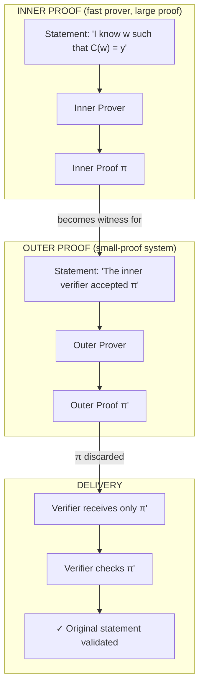

# Chapter 23: Composition and Recursion

Could you build a proof system that runs forever? A proof that updates itself every second, attesting to the entire history of a computation, but never growing in size?

The only way to keep a proof from growing is to compress it at every step. That means each new proof must *verify the previous proof* and then replace it, absorbing all the history into a fixed-size certificate. The proof system must verify its own verification logic, "eating itself." For years, this remained a theoretical curiosity, filed under "proof-carrying data" and assumed impractical.

This chapter traces how the impossible became routine. We start with **composition**: wrapping one proof inside another to combine their strengths. We then reach **recursion**: proofs that verify themselves, enabling unbounded computation with constant-sized attestations. Finally, we arrive at **folding**: a recent revolution that makes recursion cheap by deferring verification entirely. The destination is IVC (incrementally verifiable computation), where proofs grow with time but stay constant-sized. Today's zkEVMs and app-chains are built on this foundation.

No single SNARK dominates all others. Fast provers tend to produce large proofs. Small proofs come from slower provers. Transparent systems avoid trusted setup but sacrifice verification speed. Post-quantum security demands hash-based constructions that bloat proof size. Every deployed system occupies a point in this multi-dimensional trade-off space.

But here's a thought: what if we could *combine* systems? Use a fast prover for the heavy computational lifting, then wrap its output in a small-proof system for efficient delivery to verifiers. Or chain proofs together, where each proof attests to the validity of the previous, enabling unlimited computation with constant verification.

These ideas, **composition** and **recursion**, transform SNARKs from isolated verification tools into composable building blocks. The result is proof systems that achieve properties no single construction could reach alone.

## Composition: Proving a Proof Is Valid

**Composition** means generating a *new proof* that an existing proof was valid. The distinction from verification is that the output is itself a proof, not a yes/no verdict. You have a proof $\pi$ of some statement. Verifying $\pi$ is a computation. You express that verification as a circuit, then prove the circuit was satisfied. The result is a second proof $\pi'$ that attests to $\pi$'s validity, potentially with different properties (smaller, faster to verify, based on different assumptions) than $\pi$ itself.

Why do this? Different proof systems have different strengths. A STARK proves quickly but produces a 100KB proof. Groth16 produces a 128-byte proof but proves slowly. Composition lets you have both: prove the computation with a STARK, then compose the result into Groth16 for compact delivery. The formal treatment below shows why this combination inherits the fast prover of the first system and the small proof of the second, without either system's weakness dominating.

### Inner and Outer

The names **inner** and **outer** describe the nesting:

- The **inner proof** is created first. It proves the statement you actually care about ("I executed this program correctly," "I know a secret satisfying this relation").

- The **outer proof** is the wrapper, created second. It proves "I ran the inner verifier and it accepted."

The verifier of the outer proof never sees the inner proof or the original witness. They see only $\pi'$ and check that it's valid. If the outer system is zero-knowledge, nothing leaks about $\pi$ or $w$.

Think of it like nested containers: the inner proof is a large box containing detailed evidence. The outer proof is a small envelope containing a signed attestation that someone trustworthy opened the box and verified its contents. Recipients need only check the signature on the envelope.

## The Composition Construction

Composition works because verification is itself a computation, and any computation can be proven. To see why the composed system inherits the best of both components, we trace the construction step by step and analyze its cost.

Consider two SNARKs with complementary profiles. Let $|C| = N$ denote the original circuit size.

**Inner SNARK $\mathcal{I}$** (fast prover, large proofs): prover time $O(N)$, proof size $O(\sqrt{N})$, verification time $O(\sqrt{N})$. Example: STARK-like systems.

**Outer SNARK $\mathcal{O}$** (slow prover, tiny proofs): prover time $O(N \log N)$, proof size $O(1)$, verification time $O(1)$. Example: Groth16.

**Step 1: Run the inner prover.** The prover executes $\mathcal{I}$ on the original circuit $C$ with witness $w$, producing proof $\pi_I$. Cost: $O(N)$.

**Step 2: Arithmetize the inner verifier.** The verification algorithm $V_I$ of the inner SNARK is a computation: it reads the proof, performs checks, outputs accept or reject. Express this verification as a circuit $C_{V_I}$ with public input $x$ (the original statement), witness $\pi_I$, and output 1 iff $V_I$ accepts. Since $\mathcal{I}$ has $O(\sqrt{N})$ verification time, $|C_{V_I}| = O(\sqrt{N})$, far smaller than $C$.

**Step 3: Run the outer prover.** The prover executes $\mathcal{O}$ on the verifier circuit $C_{V_I}$, using $\pi_I$ as the witness. Cost: $O(\sqrt{N} \log \sqrt{N})$, since the outer prover is superlinear but operates on a circuit of size $\sqrt{N}$, not $N$.

**Step 4: Deliver only the outer proof.** The prover discards $\pi_I$ and sends only $\pi_O$ to the verifier. The inner proof was a means to an end; it never leaves the prover's machine.

**Step 5: Verify.** The end verifier runs $V_O$ on $\pi_O$. Cost: $O(1)$ (inherited from the outer system). The verifier never sees $\pi_I$ or $w$.

The cost analysis makes the payoff visible. Total prover time is $O(N) + O(\sqrt{N} \log N) \approx O(N)$, dominated by the fast inner prover. The slow outer prover contributes negligibly because it only processes the small verifier circuit. Proof size and verification time both inherit from $\mathcal{O}$: constant and fast.

For a concrete sense of scale: a million-gate circuit ($N = 10^6$) might take 5 seconds to prove with the inner STARK, producing a proof the verifier can check in $\sim 1000$ operations. The verifier circuit $C_{V_I}$ has $\sim 1000$ gates. Groth16 proves that 1000-gate circuit in about 1 second. Total: $\sim 6$ seconds. Proof size: $\sim 100$ bytes. Verification: 3 pairings. Without composition, running Groth16 directly on the full circuit would take minutes.

### Soundness, witnesses, and delivery

The original witness $w$ is consumed entirely in Step 1. The outer proof's witness is $\pi_I$ (the inner proof), not $w$. The outer system proves "I possess a valid inner proof," not "I know the original witness." The soundness chain is:

$$\pi_O \text{ valid} \implies \pi_I \text{ valid} \implies w \text{ satisfies } C$$

The outer proof transitively guarantees the original statement without directly involving $w$. Only $\pi_O$ is delivered; $\pi_I$ is discarded. If the outer system is zero-knowledge, nothing leaks about $\pi_I$ or $w$.

### Field mismatches and verifier circuit blowup

The analysis above assumed the inner verifier circuit $C_{V_I}$ is small and easy to express in the outer system. But what if the inner and outer systems speak different languages? STARKs operate over one field; Groth16 operates over another. Encoding foreign field arithmetic can blow up the verifier circuit by orders of magnitude. Trusted setup requirements, field mismatches, and post-quantum concerns all constrain which combinations actually work. The later sections on **The Verifier Circuit Problem** and **Curve Cycles** address these issues in detail.

### Adding Zero-Knowledge

Here's a bonus. Suppose the inner SNARK lacks zero-knowledge: some STARK variants reveal execution traces that leak witness information. But the outer SNARK is fully ZK.

The composed system inherits zero-knowledge from the outer layer. The final proof $\pi_O$ proves knowledge of a valid inner proof $\pi_I$ without revealing $\pi_I$ itself. Since $\pi_I$ depends on the witness $w$, hiding $\pi_I$ suffices to hide $w$.

The inner SNARK's lack of ZK is encapsulated and hidden by the outer layer.

## Recursion: Composing with Yourself

If composing two different SNARKs is useful, what about composing a SNARK with *itself*?

### Shrinking the verifier tower

Take a hypothetical SNARK $\mathcal{S}$ where verifying a proof for a circuit of size $N$ costs $O(\sqrt{N})$ operations. (This is pedagogical; real SNARKs have $O(1)$ verification like Groth16, or $O(\text{polylog } N)$ like STARKs. The $\sqrt{N}$ gives clean math for illustration.)

Now trace what happens when we recurse:

**Layer 0:** Prove the original circuit $C$ (size $N$). This produces proof $\pi_0$. Verifying $\pi_0$ costs $O(\sqrt{N})$ operations.

**Layer 1:** Wrap $\pi_0$ in another proof. The circuit being proved is now the *verifier* for $\pi_0$, which has size $O(\sqrt{N})$. This produces $\pi_1$. Verifying $\pi_1$ costs $O(\sqrt{\sqrt{N}}) = O(N^{1/4})$ operations.

**Layer 2:** Wrap $\pi_1$. The circuit is the verifier for $\pi_1$, size $O(N^{1/4})$. Verifying $\pi_2$ costs $O(N^{1/8})$ operations.

The pattern: each layer proves "the previous verifier accepted," and since verifiers are smaller than the circuits they verify, each layer's circuit shrinks.

After $k$ layers:

$$\text{Verifier cost for } \pi_k = O(N^{1/2^k})$$

Verification cost reaches a constant after $O(\log \log N)$ layers, which is the **recursion threshold**. The derivation is short: we need $N^{1/2^k} \leq c$ for some constant $c$, giving $2^k \geq \log N / \log c$, so $k = O(\log_2 \log N)$. Each layer halves the exponent; doing this $\log \log N$ times reduces it to a constant.

We are not proving the original circuit $C$ over and over. Each layer proves a *different* (smaller) circuit: the verifier of the previous layer. The shrinking comes from the fact that verification is cheaper than computation.

### Proof of Proof of Proof...

From the prover's perspective, deep recursion means building a tower of proofs:

1. $\pi_1$: proves "I know witness $w$ satisfying circuit $C$"
2. $\pi_2$: proves "I know a valid proof $\pi_1$"
3. $\pi_3$: proves "I know a valid proof $\pi_2$"
4. Continue until the verifier circuit is minimal

Each $\pi_i$ is a proof *about* the previous proof. The final $\pi_k$ can be verified in constant time regardless of the original computation's size.

### The Strange Loop

A proof that proves a proof that proves a proof: the structure feels like it should be paradoxical. Gödel showed that sufficiently powerful formal systems can express statements about their own provability, and this self-reference produces incompleteness. "This statement is unprovable" is a sentence the system can formulate but cannot resolve.

Recursive SNARKs avoid the trap because they ask a different question. Gödel's self-reference asks "is this *provable*?", a meta-logical assertion the system cannot settle about itself. Recursive SNARKs ask "is this *verifiable*?", and verification is a concrete, bounded computation: read the proof, check some equations, output accept or reject. A proof system can prove statements about its own verifier for the same reason it can prove statements about any other circuit. The self-reference leads not to paradox but to compression.

### The Extraction Caveat

Everything above assumed recursive SNARKs are sound. They are, in practice. But the standard way of *proving* soundness breaks down with recursion depth, and understanding why reveals a genuine gap between what we can prove and what we believe.

The problem in one sentence: proving a SNARK is secure requires running the attacker many times to extract a witness, and each layer of recursion multiplies the number of runs exponentially. At depth $k$, the security proof requires $R^k$ runs of the attacker, where $R$ is the extraction cost per layer. For $k = 100$ and $R = 100$, this is $10^{200}$ operations, far beyond anything meaningful. The security theorem degrades to vacuity even though no one can actually break the system.

To see where this exponential comes from, we need to trace how SNARK security proofs work. We cannot prove a cryptographic system is secure in an absolute sense (that would require proving $P \neq NP$ and more). Instead, we prove *relative* security: "if someone can break system X, they can also break problem Y." If we believe Y is hard, then X must be hard too.

A SNARK security proof constructs an algorithm (the "reducer") that treats any successful attacker as a black box. If the attacker can forge proofs, the reducer extracts a valid witness from those proofs. The witness encodes a solution to a hard problem like discrete log, because the commitment scheme was constructed so that knowing a valid witness implies knowing a discrete log. Since we believe discrete log is hard, forging proofs must also be hard.

The extraction step is where the cost enters. To extract a witness, the reducer uses **rewinding**: run the prover once, record its state, then rewind to an earlier point and run it again with a different random challenge. Two runs with different challenges on the same commitment overdetermine the witness.

**Worked example (rewinding in a $\Sigma$-protocol).** Consider a $\Sigma$-protocol (Chapter 16) where the prover sends commitment $a$, receives challenge $e$, and responds with $z$. The extractor recovers the witness as follows:

1. Run the prover. It sends $a$, you send challenge $e_1$, it responds with $z_1$.
2. Rewind to just after the prover sent $a$. (In a proof, we model the prover as a stateful algorithm we can checkpoint and restore.)
3. Send a *different* challenge $e_2$.
4. The prover responds with $z_2$.
5. From $(e_1, z_1)$ and $(e_2, z_2)$ with the same $a$, algebraically solve for the witness.

This works because $\Sigma$-protocols have **special soundness** (Chapter 16): the commitment $a$ fixes enough structure that two different challenge-response pairs overdetermine the witness. In Schnorr's protocol, for instance, $z = k + e \cdot x$ where $x$ is the secret. Two transcripts give $z_1 - z_2 = (e_1 - e_2)x$, so $x = (z_1 - z_2)/(e_1 - e_2)$. Not all interactive proofs have this property, but $\Sigma$-protocols are designed for it.

The $\Sigma$-protocol example needed only $R = 2$ rewinds (two transcripts with different challenges). More complex SNARKs may need more: a protocol with $k$ rounds of interaction generally requires $R = O(d^k)$ rewinds, where $d$ is the degree of the round polynomials. For a modern SNARK, $R$ might be in the hundreds. Recursion compounds this cost. For a single-layer proof, extraction costs $R$ prover runs. For a 2-layer recursive proof, you must:

1. Extract the inner proof $\pi_I$ from the outer layer: $R$ runs
2. For *each* of those $R$ runs, extract the witness from $\pi_I$: $R$ more runs each
3. Total: $R \times R = R^2$ runs

For depth $k$: $R^k$ runs. At depth 100 with $R = 100$, that's $100^{100} = 10^{200}$ operations.

This breaks the security proof. Security theorems have the form: "if an attacker breaks the SNARK, our reducer solves discrete log."

But the reducer must be *efficient*. If the reducer takes $10^{200}$ operations to extract a witness, the theorem becomes: "if an attacker breaks the SNARK, discrete log can be solved in $10^{200}$ operations." This is useless. We already know discrete log can be brute-forced in $2^{256} \approx 10^{77}$ operations. The reduction no longer rules out attackers, and the provable security level drops accordingly: each additional layer of recursion multiplies the reducer's running time by $R$, weakening the security guarantee by $\log_2 R$ bits per layer.

To be clear: this degradation is in the *provable bound*, not in the system's actual resistance to attack. More rewinds doesn't make the system easier to break. It makes our proof technique too slow to demonstrate security. The reducer's inefficiency is a problem for the theorist writing the proof, not for the attacker trying to exploit the system.

In practice, the system might be perfectly secure. No one has found attacks that exploit the recursive structure, and the underlying hard problems (discrete log, collision resistance) remain hard. What breaks is not the system but the *proof technique*: standard reductions become too expensive to carry through, so the security theorem degrades even though the system itself does not weaken.

The practical heuristic for recursive SNARKs is therefore: security degrades *on paper* with recursion depth, but not *in reality*. A system with 100 layers of recursion has the same concrete security as one with 2 layers (no known attack exploits the depth), but its provable security guarantee is weaker because the reduction's running time grows as $R^k$. This parallels the random oracle model, where hash functions are used in ways that resist all known attacks but lack full theoretical justification. Practitioners accept the gap and ship; researchers work on tighter proof techniques (folding schemes, discussed next, partly sidestep this issue by avoiding deep recursion entirely).

## The Curve Cycle Problem

For pairing-based SNARKs like Groth16, recursion faces a fundamental obstacle: field mismatch.

### Two Fields, One Problem

Every pairing-based SNARK involves two distinct fields. To understand why, recall how elliptic curve cryptography works.

An elliptic curve $E$ is defined over a **base field** $\mathbb{F}_q$. Points on the curve have coordinates $(x, y)$ where $x, y \in \mathbb{F}_q$. When you add two points or compute $k \cdot P$ (scalar multiplication), you're doing arithmetic in $\mathbb{F}_q$: additions, multiplications, and inversions of these coordinates.

But the *scalars* $k$ live in a different field. The curve's points form a group under addition, and this group has an **order** $p$: the number of elements in the group. For any point $P$, we have $p \cdot P = \mathcal{O}$ (the identity). Scalars are integers modulo $p$, giving us the **scalar field** $\mathbb{F}_p$.

**A concrete example with BN254** (the curve Ethereum uses for precompiles):

- Base field: $\mathbb{F}_q$ where $q \approx 2^{254}$ (coordinates of curve points live here; all curve arithmetic, including point addition and pairings, is computed over $\mathbb{F}_q$)
- Scalar field: $\mathbb{F}_p$ where $p \approx 2^{254}$ (a completely different prime of similar size; scalars in $k \cdot G$, witness values, and circuit constraints live here)
- A point on the curve: $(x, y)$ with $x, y \in \mathbb{F}_q$
- A Groth16 proof element: $\pi_A = s \cdot G$ where $s \in \mathbb{F}_p$ (scalar field) and the result $\pi_A$ is a curve point with coordinates in $\mathbb{F}_q$ (base field)

**Where each field appears in Groth16:**

- *Scalar field $\mathbb{F}_p$*: Your circuit's witness values and all constraint equations. If you're proving "I know $x$ such that $x^3 + x + 5 = 35$," then $x \in \mathbb{F}_p$. The reason constraints must live in $\mathbb{F}_p$ is that the commitment scheme requires it. In Groth16, committing to a witness value $s$ means computing $s \cdot G$ (a scalar multiplication on the curve). For this to be a well-defined group operation, $s$ must be an element of $\mathbb{F}_p$, because the curve group has order $p$ and scalars are taken modulo $p$. The constraint system inherits this field because it constrains the same values the commitment scheme binds.

- *Base field $\mathbb{F}_q$*: The proof elements themselves. The proof $\pi = (\pi_A, \pi_B, \pi_C)$ consists of elliptic curve points, which have coordinates in $\mathbb{F}_q$. Verification requires point additions and pairings, all computed over $\mathbb{F}_q$.

In a single proof, the two fields coexist without friction. The prover uses both (scalars from $\mathbb{F}_p$ feed the constraint system and commitment scheme; curve arithmetic in $\mathbb{F}_q$ constructs the proof elements), but the *constraint system* lives entirely in $\mathbb{F}_p$. The verifier checks the proof using $\mathbb{F}_q$ operations (pairings, point arithmetic), but that happens outside any circuit. Recursion forces the two fields into the same circuit. When the inner proof $\pi = (\pi_A, \pi_B, \pi_C)$ becomes the witness of the outer circuit, the outer circuit must *verify* $\pi$, which means performing pairing checks and point arithmetic on the coordinates of $\pi_A, \pi_B, \pi_C$. Those coordinates are $\mathbb{F}_q$ elements. But the outer circuit's constraints are polynomial equations over $\mathbb{F}_p$ (the scalar field of whatever curve the outer system uses). The outer circuit must therefore manipulate $\mathbb{F}_q$ values using $\mathbb{F}_p$ arithmetic.

To do $\mathbb{F}_q$ arithmetic inside an $\mathbb{F}_p$ circuit, you must *emulate* it: decompose each $\mathbb{F}_q$ element into multiple $\mathbb{F}_p$-sized limbs and implement multiplication with schoolbook carry propagation, as Chapter 13 described for non-native arithmetic in PLONK. A single $\mathbb{F}_q$ multiplication can cost 50-100+ $\mathbb{F}_p$ constraints. The verifier circuit explodes from a few thousand native operations to hundreds of thousands of emulated ones.

Two terms clarify this distinction. When we say arithmetic is *native*, we mean it's cheap inside the circuit: one field operation becomes one constraint. A circuit over $\mathbb{F}_p$ can do $\mathbb{F}_p$ arithmetic natively. It must *emulate* $\mathbb{F}_q$ arithmetic, paying 100+ constraints per operation. The curve cycle trick ensures we're always doing native arithmetic by switching fields at every recursive step.

### Cycles of Curves

**For single composition**, the fix is straightforward: choose an outer curve whose scalar field matches the inner curve's base field. If the inner verifier does $\mathbb{F}_q$ arithmetic, use an outer system over $\mathbb{F}_q$. One wrap, native arithmetic, done.

**For deep recursion**, this isn't enough. After wrapping once, you have a new proof whose verifier does arithmetic in some *other* field. To wrap again natively, you need yet another matching curve. The solution is a **cycle of elliptic curves** $(E_1, E_2)$:

- $E_1$ has scalar field $\mathbb{F}_p$ and base field $\mathbb{F}_q$
- $E_2$ has scalar field $\mathbb{F}_q$ and base field $\mathbb{F}_p$

The fields swap roles between curves. Recursion alternates:

- Proof $\pi_1$ on curve $E_1$: verifier performs $\mathbb{F}_q$ arithmetic
- Proof $\pi_2$ on curve $E_2$: verifier performs $\mathbb{F}_p$ arithmetic, can *natively* prove about $\pi_1$'s verification
- Proof $\pi_3$ on curve $E_1$: can natively prove about $\pi_2$'s verification
- And so on indefinitely

Each step's verifier circuit uses native field arithmetic. The alternation continues as long as needed, with no expensive cross-field emulation at any layer.

### Practical Curve Cycles

**Pasta curves (Pallas and Vesta):** A true cycle, meaning the scalar field of each equals the base field of the other. This enables unbounded recursion: the prover alternates between the two curves at every step, and each step's verifier circuit uses native arithmetic because the next curve's scalar field matches the previous curve's base field. Neither curve is pairing-friendly, but both support efficient Pedersen commitments and inner-product arguments. Used in Halo 2 and related systems.

**BN254 / Grumpkin:** Also a true cycle (Grumpkin is obtained by swapping BN254's base and scalar fields), enabling the same unbounded alternating recursion as Pasta. The difference is asymmetry: BN254 is pairing-friendly while Grumpkin is not, so the cycle alternates between pairing-based proofs (on the BN254 side) and inner-product-based proofs (on the Grumpkin side). Since BN254 has Ethereum precompiles, proofs that land on the BN254 side can be verified cheaply on-chain. Aztec uses this cycle for their rollup architecture.

The choice between cycles depends on the deployment target. BN254/Grumpkin is the default when on-chain Ethereum verification matters, because BN254 has EVM precompiles and pairings enable constant-size final proofs (Groth16-style). The cost is a trusted setup on the BN254 side. Pasta is preferred when transparency matters (IPA on both sides, no trusted setup), as in Zcash's Orchard protocol via Halo 2, but lacks EVM support and produces larger proofs.

**BLS12-377 / BW6-761:** Both curves are pairing-friendly, giving pairings on *both* sides of the recursion (unlike BN254/Grumpkin where only one side has pairings). BW6-761's scalar field matches BLS12-377's base field, allowing native verification of BLS12-377 proofs. The pair is called a "half-cycle" because the match goes in one direction only (BW6-761 can natively verify BLS12-377 proofs, but not vice versa), so it supports efficient one-step composition rather than unbounded alternating recursion. Aleo uses this pair for their proof system.

**A related curiosity: embedded curves.** BabyJubjub is defined over BN254's scalar field $\mathbb{F}_p$, so BabyJubjub point operations can be expressed natively as BN254 circuit constraints. This enables in-circuit cryptography: EdDSA signatures, Pedersen hashes, and other EC-based primitives. BabyJubjub doesn't form a cycle with BN254 (its group order is much smaller than BN254's base field), so it cannot be used for recursion. The reader might wonder why Grumpkin doesn't replace BabyJubjub entirely, since both have their base field equal to BN254's scalar field. In principle it could: any curve with the right base field supports native in-circuit arithmetic. The reason BabyJubjub persists is practical. It is a twisted Edwards curve with complete addition formulas (no special cases for doubling or identity), making in-circuit point addition slightly cheaper than on Grumpkin (a short Weierstrass curve). It also predates Grumpkin and has years of deployed implementations and audited libraries. In a greenfield design you could use Grumpkin for both roles; in existing ecosystems the two curves coexist because they were optimized for different concerns.

Finding curve cycles is mathematically delicate. The size constraints (both fields must be large primes), security requirements (curves must resist known attacks), and efficiency demands (curves should have fast arithmetic) severely restrict the design space.

## Incrementally Verifiable Computation (IVC)

Composition combines different proof systems; the recursion we've seen so far compresses proofs through towers of wrapping. But there is a different problem that recursion solves, one that isn't about shrinking proofs or mixing systems: proving computation that hasn't finished yet.

A blockchain processes transactions one by one. A verifiable delay function (VDF) computes a hash chain for hours, proving that real time elapsed. A zkVM executes a program instruction by instruction. In each case, the computation is *sequential*: step $i$ depends on step $i-1$. You can't parallelize it. You can't wait until the end to start proving (the end might be days away, or never).

What you want is a proof that *grows* with the computation. After step 1, you have a proof of step 1. After step 1000, you have a proof of steps 1 through 1000. Crucially, the proof at step 1000 shouldn't be 1000× larger than the proof at step 1. And creating the proof for step 1000 shouldn't require re-proving steps 1 through 999.

This is **incrementally verifiable computation**, or **IVC**: proofs that extend cheaply, verify in constant time, and accumulate the history of an unbounded sequential process. The term appears throughout the literature; systems like Nova, SuperNova, and ProtoStar are "IVC schemes."

### The Setting

Consider a function $F: X \to X$ iterated $T$ times:

$$y_T = F(F(\cdots F(x_0) \cdots)) = F^T(x_0)$$

For $T = 10^9$ iterations, directly proving this requires a circuit of size $O(T \cdot |F|)$: billions of gates. Even fast provers choke on circuits this large. And you'd have to wait until iteration $10^9$ completes before generating any proof at all.

### The Incremental Approach

Generate proofs *incrementally*, one step at a time:

- $\pi_0$: trivial (base case, no computation yet)
- $\pi_1$: proves "$y_1 = F(x_0)$ and I know a valid $\pi_0$"
- $\pi_2$: proves "$y_2 = F(y_1)$ and I know a valid $\pi_1$"
- $\pi_i$: proves "$y_i = F(y_{i-1})$ and I know a valid $\pi_{i-1}$"

Each $\pi_i$ has constant size and proves the *entire* computation from $x_0$ to $y_i$. The proof for step $i$ subsumes all previous proofs.

### The Recursive Circuit

At step $i$, the prover runs a circuit that:

1. **Verifies $\pi_{i-1}$:** Checks that the previous proof is valid
2. **Computes $y_i = F(y_{i-1})$:** Performs one step of the function
3. **Produces $\pi_i$:** Outputs a new proof

The circuit size is $|V| + |F|$: the cost of verifying the previous proof plus the cost of one function evaluation. The overhead of recursion is $|V|$, the verifier circuit size.

For a SNARK with efficient verification, $|V|$ might be a few thousand gates. If $|F|$ is also a few thousand gates (a hash function, say), the overhead roughly doubles the per-step cost. For larger $|F|$, the overhead is proportionally smaller.

### Where IVC Shines

**Verifiable Delay Functions (VDFs).** The canonical example: repeated squaring $x \mapsto x^2 \mod N$ for an RSA modulus $N$. Each squaring depends on the previous result; you can't compute $x^{2^T}$ faster than $T$ sequential multiplications (without knowing the factorization of $N$). After computing $y = F^T(x)$, the prover produces a proof that $y$ is correct, verifiable in time much less than $T$. IVC is natural here: the function is inherently sequential, and the proof accumulates with each step.

**Succinct Blockchains.** Each block contains a proof that:

1. This block's transactions are valid
2. The previous block's proof was valid

A new node syncing to the chain verifies a *single* proof (the most recent one) rather than replaying every transaction since genesis. Mina Protocol pioneered this approach.

**Proof Aggregation.** Multiple independent provers generate $T$ separate proofs. An aggregator combines them into one proof via recursive composition. Batch verification becomes constant-time regardless of the number of original proofs.

## Folding Schemes: Cheaper IVC

The IVC construction above requires the prover to *fully verify* the previous proof $\pi_{i-1}$ at every step. This verification is itself a circuit ($C_{V}$), and it can be large. If the verifier circuit has $|V| = 10{,}000$ gates and the step function has $|F| = 1{,}000$ gates, the prover spends 90% of each step proving it verified correctly, only 10% proving it computed correctly. For tiny $F$ (say, a single hash invocation), the ratio gets even worse. The verification overhead, not the computation itself, becomes the IVC bottleneck.

**Folding schemes** address this by replacing verification with something cheaper.

### Folding instead of verifying

Instead of *fully verifying* $\pi_{i-1}$ at step $i$, we **fold** the claim about step $i-1$ with the claim about step $i$. Folding combines two claims into one claim of the same structure, without verifying either. The accumulated claim grows no larger than each individual claim. Verification is deferred entirely: the prover folds at every step (a few group operations each) and produces a single real SNARK proof only at the very end. The cost of folding per step is drastically cheaper than the cost of in-circuit verification, which is what makes IVC practical for millions of steps.

### Nova's Approach

Nova, the pioneering folding scheme (Kothapalli, Setty, Tzialla, 2021), introduced a modified constraint system: **relaxed R1CS**. Recall from Chapter 19's Spartan section that standard R1CS demands:
$$(A \cdot z) \circ (B \cdot z) = C \cdot z$$

where $A, B, C$ are sparse matrices and $\circ$ is the entrywise (Hadamard) product. This is the same equation Spartan proves via sum-check. Nova adds two slack terms to make folding possible:
$$(A \cdot z) \circ (B \cdot z) = u \cdot (C \cdot z) + E$$

where $u$ is a scalar and $E$ is an "error vector." A standard R1CS instance has $u = 1$ and $E = 0$. Relaxed instances can have $u \neq 1$ and $E \neq 0$, but satisfying a relaxed instance still proves something about the underlying computation.

### Why Relaxation Enables Folding

What makes relaxed R1CS useful is that instances can be *linearly combined*. Suppose we want to fold two instances by taking a random linear combination with challenge $r$:

$$z = z_1 + r \cdot z_2$$

This is the core of folding: two separate witnesses $z_1$ and $z_2$ become a single witness $z$. The folded witness has the same dimension as the originals; we're not concatenating, we're combining. Think of it geometrically: $z_1$ and $z_2$ are points in $\mathbb{F}^n$; the fold $z$ is another point on the line through them, selected by the random challenge $r$.

What happens when we plug this combined witness into the constraint? Let's compute $(Az) \circ (Bz)$:

$$(A(z_1 + rz_2)) \circ (B(z_1 + rz_2))$$
$$= (Az_1 + r \cdot Az_2) \circ (Bz_1 + r \cdot Bz_2)$$
$$= (Az_1 \circ Bz_1) + r \cdot (Az_1 \circ Bz_2 + Az_2 \circ Bz_1) + r^2 \cdot (Az_2 \circ Bz_2)$$

The Hadamard product distributes, but it creates **cross-terms**: the middle expression $Az_1 \circ Bz_2 + Az_2 \circ Bz_1$ mixes the two instances. This is the "interaction" between them.

For standard R1CS, these cross-terms would break everything: the equation $Az \circ Bz = Cz$ has no room for interaction terms that belong to neither instance. This is exactly why relaxation was introduced. The error vector $E$ acts as a "trash can" that absorbs the cross-terms, keeping the equation valid despite the algebraic mess that linear combination creates. Define:

$$T = Az_1 \circ Bz_2 + Az_2 \circ Bz_1 - u_1 \cdot Cz_2 - u_2 \cdot Cz_1$$

This is the **cross-term vector**. To understand where each term comes from, recall that each relaxed R1CS instance has its own slack factor: instance 1 has $(z_1, E_1, u_1)$ and instance 2 has $(z_2, E_2, u_2)$. When we expand the *right side* of the relaxed constraint $u \cdot (Cz)$ using the folded values $u = u_1 + ru_2$ and $z = z_1 + rz_2$:

$$(u_1 + ru_2) \cdot C(z_1 + rz_2) = u_1 Cz_1 + r(u_1 Cz_2 + u_2 Cz_1) + r^2 \cdot u_2 Cz_2$$

The coefficient of $r$ on the right side is $u_1 Cz_2 + u_2 Cz_1$. On the left side (the Hadamard product expansion above), the coefficient of $r$ is $Az_1 \circ Bz_2 + Az_2 \circ Bz_1$. The cross-term $T$ is exactly the difference between these: what the left side produces at $r$ minus what the right side produces at $r$. This mismatch gets absorbed into the error vector.

Note that the $r^2$ coefficient works out automatically: the left side gives $Az_2 \circ Bz_2$ and the right side gives $u_2 Cz_2$, which is exactly instance 2's original constraint (up to $E_2$). The folded error $E = E_1 + rT + r^2 E_2$ absorbs the second instance's error at $r^2$.

### The Folding Protocol

A relaxed R1CS instance consists of a witness vector $z$, an error vector $E$, and a slack scalar $u$. A fresh (non-folded) instance has $u = 1$ and $E = 0$; after folding, both accumulate non-trivial values.

Given two instances $(z_1, E_1, u_1)$ and $(z_2, E_2, u_2)$, the protocol folds them into one. But the verifier doesn't see the actual witness vectors, since that would defeat the point. Instead, the verifier works with **commitments**.

**What the verifier holds:** Commitments $C_{z_1}, C_{z_2}$ to the witness vectors, commitments $C_{E_1}, C_{E_2}$ to the error vectors, and the public scalars $u_1, u_2$. (Public inputs are also visible, but we omit them for clarity.)

**The protocol:**

1. **Prover computes the cross-term $T$:** The formula above requires knowing both witnesses, so only the prover can compute it.

2. **Prover commits to $T$:** Sends commitment $C_T$ to the verifier. This is the only new cryptographic operation per fold.

3. **Verifier sends random challenge $r$.**

4. **Both compute the folded instance using commitments:**

   - $C_z = C_{z_1} + r \cdot C_{z_2}$ (the verifier computes this from the commitments)
   - $u = u_1 + r \cdot u_2$ (public scalars, both can compute)
   - $C_E = C_{E_1} + r \cdot C_T + r^2 \cdot C_{E_2}$ (again from commitments)

The verifier never sees $z_1, z_2, E_1, E_2$, or $T$ directly. They work entirely with commitments. Because commitments are additively homomorphic (Pedersen commitments satisfy $C(a) + C(b) = C(a+b)$), the folded commitment $C_z$ is a valid commitment to the folded witness $z = z_1 + r \cdot z_2$, which only the prover knows.

**Meanwhile, the prover** computes the actual folded witness $z = z_1 + r \cdot z_2$ and the actual folded error $E = E_1 + r \cdot T + r^2 \cdot E_2$. The prover holds these for the next fold (or for the final SNARK).

The folded error vector absorbs the cross-terms at the $r$ coefficient and the second instance's error at the $r^2$ coefficient. This is exactly what makes the constraint hold: the expansion of $(Az) \circ (Bz)$ produces terms at powers $1$, $r$, and $r^2$, and the folded $E$ and $u \cdot Cz$ absorb them all.

Expanding $(Az) \circ (Bz) - u \cdot Cz - E$ using the folded values shows why this is sound: all terms cancel if and only if both original instances satisfied their constraints. The random $r$ acts as a Schwartz-Zippel check: a cheating prover who folds two *unsatisfied* instances would need the folded instance to satisfy the constraint, but this happens with negligible probability over random $r$.

Two claims have become one, without verifying either. The prover paid the cost of one commitment (to $T$) and some field operations. No expensive SNARK proving.

### IVC with Folding

Now we connect the folding protocol to the IVC setting from earlier in the chapter. Recall the problem: prove $y_T = F^T(x_0)$ for large $T$ without circuits that grow with $T$.

The folding protocol combines two relaxed R1CS instances into one. For IVC, we maintain a **running instance** that accumulates all previous steps and fold in each new step as it happens.

**What gets folded:** At each step, we have two things:

- The **running instance** $(C_{z_{acc}}, C_{E_{acc}}, u_{acc})$, where $C_{z_{acc}}$ is the Pedersen commitment to the accumulated witness, $C_{E_{acc}}$ is the commitment to the accumulated error vector, and $u_{acc}$ is the accumulated scalar. Together these represent "all steps so far are correct."
- The **step instance** $(C_{z_i}, C_{E_i} = C_0, u_i = 1)$, a fresh claim that "step $i$ was computed correctly." It is always a standard (non-relaxed) R1CS instance: $u_i = 1$ and $E_i = 0$.

The step instance is always fresh: $u_i = 1$ and $E_i = 0$ because it comes from a standard (non-relaxed) R1CS. Only the running instance accumulates non-trivial slack.

**The IVC loop in detail:**

**Step 0 (Base case):** Initialize the running instance to a trivial satisfiable state. No computation yet.

**Step $i$ (for $i = 1, 2, \ldots, T$):**

1. **Compute:** Execute $y_i = F(y_{i-1})$

2. **Create the step instance:** Express "$y_i = F(y_{i-1})$" as an R1CS constraint. Build the witness vector $z_i$ (the same object as $z_1$ or $z_2$ in the folding derivation above), encoding the input $y_{i-1}$, output $y_i$, and any intermediate values the step function produces. Commit to get $C_{z_i}$.

3. **Fold:** The two inputs to the folding protocol are the running instance $(C_{z_{acc}}, C_{E_{acc}}, u_{acc})$ from the previous iteration and the step instance $(C_{z_i}, C_0, 1)$ just created. This is exactly the two-instance fold from the derivation above, with the running instance playing the role of instance 1 and the step instance playing instance 2:
   - Prover computes the cross-term $T_i$ (from the two witnesses $z_{acc}$ and $z_i$) and commits to get $C_{T_i}$
   - Challenge $r_i$ is derived via Fiat-Shamir from the transcript
   - Both parties compute the new running instance using the homomorphic update:
     - $C_{z_{acc}} \leftarrow C_{z_{acc}} + r_i \cdot C_{z_i}$ (fold the witnesses)
     - $u_{acc} \leftarrow u_{acc} + r_i \cdot 1$ (fold the scalars)
     - $C_{E_{acc}} \leftarrow C_{E_{acc}} + r_i \cdot C_{T_i} + r_i^2 \cdot C_0$ (absorb the cross-term)
   - The error update is where the cross-terms go. Recall from the Hadamard expansion that folding $z_{acc} + r_i \cdot z_i$ produces a degree-1 cross-term $T_i$ in $r_i$. The $r_i \cdot C_{T_i}$ term absorbs it into the error commitment; the $r_i^2 \cdot C_0$ term accounts for the step instance's error (which is zero for a fresh instance, so this term vanishes in practice).
   - Prover updates the actual witnesses (which only the prover holds): $z_{acc} \leftarrow z_{acc} + r_i \cdot z_i$, $E_{acc} \leftarrow E_{acc} + r_i \cdot T_i$

4. **Repeat:** The new running instance becomes input to step $i+1$

**After $T$ steps:** The prover holds a final running instance $(C_{z_{acc}}, C_{E_{acc}}, u_{acc})$ with $u_{acc} = 1 + r_1 + r_1 r_2 + \cdots$ (accumulated from all the folds). This single instance encodes the claim "all $T$ steps were computed correctly." The $T$ individual steps, their witnesses, and their cross-terms have all been absorbed into the running instance's commitments and scalar. No trace of the intermediate states remains.

**The final SNARK:** The prover now produces one conventional SNARK proof demonstrating that the running instance is satisfiable, i.e., that there exists a witness $z_{acc}$ and error vector $E_{acc}$ such that:

$$(Az_{acc}) \circ (Bz_{acc}) = u_{acc} \cdot (Cz_{acc}) + E_{acc}$$

This is the only expensive cryptographic operation in the entire protocol. The preceding $T$ folds each cost only a few group operations (one commitment to $T_i$, one scalar multiplication per running-instance component). The full SNARK proof happens once, at the end, not at every step.

The verifier's job is correspondingly simple. It receives three things: the final running instance $(C_{z_{acc}}, C_{E_{acc}}, u_{acc})$, the SNARK proof for that instance, and the claimed output $y_T$. It verifies the SNARK (confirming the running instance is satisfiable) and checks that $y_T$ matches the output encoded in the instance. If both pass, the verifier is convinced that $y_T = F^T(x_0)$. It never sees any of the $T$ intermediate states, witnesses, or fold challenges. The entire computation history has been compressed into one relaxed R1CS instance and one proof.

### Security Considerations for Folding

Folding schemes have a reputation in the zkVM community for being where security problems arise. This isn't accidental; the architecture creates several subtle attack surfaces.

**Deferred verification.** Traditional recursion verifies at each step: if something is wrong, you catch it immediately. Folding defers *all* verification to the final SNARK. Errors compound silently across thousands of folds before manifesting. Debugging becomes archaeology, trying to identify which of 10,000 folds went wrong.

**The commitment to $T$ must be binding.** The cross-term $T$ must be committed *before* the verifier sends challenge $r$. If the prover can open this commitment to different values after seeing $r$, soundness breaks completely: the prover can fold unsatisfied instances and make them appear satisfied. Nova uses Pedersen commitments (computationally binding under discrete log), so breaking the binding property would require solving discrete log. But implementation bugs in commitment handling have caused real vulnerabilities.

**Accumulator state is prover-controlled.** Between folding steps, the prover holds the running accumulated instance $(z_{acc}, E_{acc}, u_{acc})$. The final SNARK proves this accumulated instance is satisfiable, but doesn't directly verify it came from honest folding. A malicious prover who can inject a satisfiable-but-fake accumulated instance breaks the chain of trust. The "decider" circuit must carefully check that public inputs match the accumulator state.

**Soundness error accumulates.** Each fold uses a random challenge $r$ to combine two instances. A cheating prover escapes detection only if the degree-$d$ cross-term identity accidentally holds at that $r$, which Schwartz-Zippel bounds at probability $\leq d/|\mathbb{F}|$ per fold. Over $T$ independent folds, a union bound gives total soundness error $\leq T \cdot d / |\mathbb{F}|$. For $T = 10^6$ folds over a 256-bit field with $d = 2$, this is $\approx 2^{-236}$, negligible. But for smaller fields or exotic parameters, verify the concrete security.

**Implementation complexity.** Folding has more moving parts than traditional recursion: cross-term computation, accumulator updates, commitment bookkeeping, the interaction between folding and the final decider SNARK. Each is a potential bug location. Several folding implementations have had soundness bugs discovered post-audit. The abstraction is elegant, but the implementation details are unforgiving.

**Post-quantum vulnerability.** Every folding scheme discussed in this chapter (Nova, HyperNova, ProtoStar) uses Pedersen commitments for the cross-term $T$ and the accumulated witness. Pedersen binding relies on discrete log, which Shor's algorithm breaks. A quantum attacker who can open commitments to different values after seeing the folding challenge $r$ destroys soundness entirely, since they can fold unsatisfied instances and make them appear satisfied. The inner folding loop is therefore not post-quantum safe. The same vulnerability appears in composition: the STARK→Groth16 wrapper that production zkVMs use (the hybrid row in the compatibility table below) reintroduces pairing assumptions at the final step, making the on-chain proof quantum-vulnerable even though the inner STARK is hash-based. Lattice-based folding schemes (LatticeFold, Neo, SuperNeo) replace Pedersen with Module-SIS commitments to address this, though none are in production as of this writing. Hash-based full recursive verification (STARK proving a STARK verifier) avoids the problem entirely but at higher per-step cost.

None of this means folding is insecure against classical adversaries. It means the security argument is more delicate than "run a SNARK at each step." The efficiency gains are real, but so is the need for careful implementation, thorough auditing, and awareness of the quantum horizon.

### Folding and the PIOP paradigms

Folding schemes operate at a different level of the proof-system stack than PIOPs or PCS:

1. **Constraint system**: R1CS, Plonkish, CCS, AIR
2. **PIOP paradigm**: How you prove constraints (quotienting or sum-check)
3. **Recursion strategy**: How you chain proofs (full verification, folding, accumulation)

Nova's folding operates at level 3. It takes R1CS instances and folds them algebraically, without committing to a specific PIOP for the final proof. Folding originated in the sum-check lineage (Nova came from the Spartan team, and relaxed R1CS fits naturally with multilinear machinery), but it is no longer confined to it. The "Beyond Nova" section below develops how folding has generalized to CCS, Plonkish, and pairing-based systems, and a compatibility table after that section maps the full landscape of which components pair naturally across all three levels.

### Folding versus traditional recursion

| Aspect | Traditional Recursion | Folding (Nova) |
|--------|----------------------|----------------|
| Per-step overhead | Full SNARK verification | Two group operations |
| Curves needed | Pairing-friendly or cycle | Any curve works |
| Final proof | Proves last recursive step | Proves folded instance |
| Prover bottleneck | Verification overhead | Actual computation $F$ |

For small $F$ (hash function evaluations, state machine transitions), folding is an order of magnitude faster than traditional recursion. The per-step cost drops from thousands of gates to tens of operations.

## Beyond Nova: HyperNova and ProtoStar

Nova achieves cheap IVC for R1CS. R1CS is fully general (any NP computation can be expressed, as Spartan demonstrated in Chapter 19), but its degree-2 restriction means that higher-degree operations must be decomposed into auxiliary variables. Encoding Poseidon's $x^5$ S-box, for example, requires intermediate squaring steps that inflate the constraint count. Custom gates (which handle common operations in fewer constraints) and higher-degree constraints (which pack more logic per gate) can reduce this overhead substantially. Lookups and structured access patterns are a separate concern: R1CS-based systems handle these efficiently through memory checking (Chapter 21's Lasso), not through the constraint system itself. The motivation for CCS is primarily constraint degree and gate flexibility, not lookup support. The question is whether folding can extend to these richer constraint representations without losing Nova's per-step efficiency.

### The CCS Abstraction

The answer starts with a common language for constraints. **Customizable Constraint Systems (CCS)**, introduced in Chapter 8, unify R1CS, Plonkish, and AIR under one framework. As a reminder, the core equation is:

$$\sum_{j=1}^{q} c_j \cdot \bigcirc_{i \in S_j} (M_i \cdot z) = \mathbf{0}$$

Each term $j$ takes a Hadamard product ($\bigcirc$) over the matrix-vector products $M_i \cdot z$ for matrices in multiset $S_j$, then scales by coefficient $c_j$. The multiset sizes determine constraint degree: R1CS uses $|S| = 2$ (degree 2), higher-degree gates use larger multisets, linear constraints use $|S| = 1$.

CCS matters for folding because it gives the scheme designer one interface to target. HyperNova folds CCS instances directly, so any constraint system expressible as CCS, which includes R1CS, Plonkish, and AIR, inherits folding automatically. You can fold circuits written in different constraint languages without converting to a common format first. The abstraction pays for itself when you want custom gates, higher-degree constraints, or mixed constraint types within a single IVC computation.

### HyperNova: Folding CCS

**HyperNova** extends Nova's folding approach to CCS, but the generalization isn't straightforward. The degree problem that Nova sidestepped returns with a vengeance.

**The degree problem.** Recall Nova's cross-term: when folding $z = z_1 + r \cdot z_2$ into a degree-2 constraint, the expansion produces terms at $r^0$, $r^1$, and $r^2$. The error vector $E$ absorbs the cross-term at $r^1$.

For a degree-$d$ constraint, folding $z = z_1 + r \cdot z_2$ produces terms at powers $r^0, r^1, \ldots, r^d$. Each intermediate power $r^1, \ldots, r^{d-1}$ generates a cross-term that must be absorbed. Naive relaxation requires $d-1$ error vectors, each requiring a commitment. The prover cost scales with degree.

HyperNova avoids this by observing that if one of the two instances is already *linear* (degree 1), then the cross-terms don't explode. Folding a linear instance with a degree-$d$ instance produces at most degree $d$, with manageable cross-terms.

**LCCCS (Linearized CCS).** HyperNova converts an accumulated CCS instance into a different form before folding. Recall from above that a CCS constraint is a *vector* equation: all $m$ entries of $\sum c_j \cdot \bigcirc_{i \in S_j}(M_i \cdot z)$ must equal zero. The "linearized" version collapses this to a *scalar* equation by taking a random linear combination of all $m$ constraints. Given random $r \in \mathbb{F}^{\log m}$, weight each constraint by $\widetilde{\text{eq}}(r, k)$ (the multilinear extension of the equality predicate from Chapter 4):

$$\sum_{k \in \{0,1\}^{\log m}} \widetilde{\text{eq}}(r, k) \cdot \left( \sum_{j} c_j \cdot \bigcirc_{i \in S_j} (M_i \cdot z)_k \right) = 0$$

By Schwartz-Zippel, if any entry of the original vector is non-zero, this scalar equation fails with high probability over random $r$. This is the standard "batch to a single equation" trick.

The resulting scalar can be expressed in terms of multilinear extension evaluations: $\tilde{M}_i(r)$ is the MLE of $M_i \cdot z$ evaluated at $r$. The witness $z$ now appears only through these evaluation claims, which sum-check can reduce to polynomial openings.

Why call this "linearized"? The term refers to how the *folding* works, not the constraint degree. When folding an LCCCS (which is a scalar evaluation claim) with a fresh CCS instance (a vector constraint), the interaction between them produces manageable cross-terms. The scalar form of LCCCS means folding doesn't multiply the number of error terms the way naive CCS folding would.

HyperNova therefore folds *asymmetrically*: the two instances being combined have different shapes, and this mismatch is what prevents the cross-term explosion that would occur if both were high-degree.

To see the contrast, recall that Nova folds two things of the *same* shape: relaxed R1CS instance + relaxed R1CS instance → relaxed R1CS instance. Both are degree-2, and the error vector absorbs the single degree-1 cross-term.

HyperNova folds two things of *different* shapes:

- **Running instance (LCCCS):** A scalar claim about polynomial evaluations
- **Fresh instance (CCS):** A vector constraint over $m$ entries

You're not combining "vector + vector → vector." You're combining "scalar + vector → scalar." This asymmetry is what prevents cross-term explosion.

Sum-check is what bridges the two shapes. It takes a claim about a sum (the CCS vector constraint, batched into a scalar) and reduces it to an evaluation claim at a random point. After sum-check, both the running LCCCS and the fresh CCS have been reduced to evaluation claims at the *same* random point. These scalar claims can be linearly combined without degree blowup.

**The loop:**

1. **Running LCCCS:** A scalar claim "$\sum_j c_j \prod_{i \in S_j} \tilde{M}_i(r_{old}) = v_{old}$"
2. **Fresh CCS arrives:** A vector constraint that must hold at all $m$ positions
3. **Sum-check:** Batch the CCS into a scalar claim at a new random point $r_{new}$, then combine with the LCCCS
4. **Result:** A new scalar claim at $r_{new}$, another LCCCS ready for the next fold

The sum-check rounds are the cost of generality: $O(\log m)$ rounds of interaction (or Fiat-Shamir hashing). But once sum-check finishes, combining the evaluation claims needs only one multi-scalar multiplication, the same per-fold cost as Nova regardless of constraint degree.

In Nova, the error vector $E$ absorbs degree-2 cross-terms algebraically. In HyperNova, sum-check absorbs arbitrary-degree cross-terms interactively. Different mechanisms, same goal: constant prover cost per fold.

**Additional benefits:**

- *Multi-instance folding*: Fold $k$ instances simultaneously by running sum-check over all $k$ at once. The cost is $O(\log k)$ additional sum-check rounds. This enables efficient PCD (proof-carrying data), where proofs from multiple sources combine into one.
- *Zero-knowledge requires additional work*: Sum-check round polynomials leak witness information (their coefficients are linear combinations of witness entries). Neither Nova nor HyperNova is zero-knowledge out of the box. The BlindFold technique (discussed later in this chapter) addresses this by committing to round polynomial coefficients and deferring their verification via folding.

### ProtoStar: Accumulation for Special-Sound Protocols

**ProtoStar** takes a different generalization path. Rather than targeting a specific constraint system (as Nova targets R1CS and HyperNova targets CCS), it provides accumulation for any *special-sound interactive protocol*, regardless of how many messages the prover and verifier exchange. Sigma protocols (Chapter 16) are the simplest case: 3 messages, special soundness from two transcripts. But many proof components (sum-check rounds, polynomial evaluation arguments, lookup arguments) are also special-sound protocols with more rounds. ProtoStar accumulates them all under one framework.

**Why special-soundness enables accumulation.** A special-sound protocol has a key property: the verifier's check is a low-degree polynomial equation $V(x, \pi, r) = 0$, where $x$ is the public input, $\pi$ is the prover's messages, and $r$ is the verifier's challenge. The degree $d$ of $V$ in $r$ is typically small (often 1 or 2).

This algebraic structure is exactly what folding exploits. Given two protocol instances with the same structure, you can take a random linear combination:

$$V_{acc}(x, \pi, r) = V_1(x_1, \pi_1, r) + \beta \cdot V_2(x_2, \pi_2, r)$$

If both $V_1 = 0$ and $V_2 = 0$, then $V_{acc} = 0$ for any $\beta$. If either is non-zero, $V_{acc} = 0$ with probability at most $d/|\mathbb{F}|$ over random $\beta$. The accumulated check is equivalent to both original checks, with negligible soundness loss.

**The cost difference.** ProtoStar's per-fold cost is roughly 3 scalar multiplications, compared to 1 MSM for Nova/HyperNova (the comparison table below summarizes this). This reflects different trade-offs:

- Nova/HyperNova commit to the cross-term $T$ (or run sum-check), requiring one multi-scalar multiplication per fold
- ProtoStar works directly with the protocol's algebraic structure, avoiding new commitments but requiring the prover to compute and send $d-1$ "error polynomials" that capture the cross-terms

For degree-2 checks (like most $\Sigma$-protocols), this means a few scalar multiplications instead of an MSM. The MSM dominates for large witnesses, so ProtoStar can be faster when the step function is small.

**Lookup support.** ProtoStar handles lookup arguments with overhead $O(d)$ in the lookup table size, compared to $O(d \log N)$ for HyperNova. The difference: HyperNova encodes lookups via sum-check over the table, adding $\log N$ rounds. ProtoStar accumulates the lookup protocol directly, paying only for the protocol's native degree. For applications with large tables (memory, range checks), this matters.

**ProtoGalaxy.** A refinement of ProtoStar that reduces the recursive verifier's work further. The key observation: when folding $k$ instances, naive accumulation requires $O(k)$ verifier work. ProtoGalaxy uses a Lagrange-basis trick to compress this to $O(\log k)$ field operations plus a constant number of hash evaluations. For multi-instance aggregation (combining proofs from many sources), ProtoGalaxy approaches the minimal possible overhead.

### Comparison

| Feature | Nova | HyperNova | ProtoStar |
|---------|------|-----------|-----------|
| Constraint system | R1CS only | Any CCS (R1CS, Plonk, AIR) | Any special-sound protocol |
| Constraint degree | 2 | Arbitrary | Arbitrary |
| Per-step prover cost | 1 MSM | 1 MSM | 3 scalar muls |
| Lookup support | Via R1CS encoding | $O(d \log N)$ | $O(d)$ |
| Zero-knowledge | Requires blinding | Free from folding | Requires blinding |
| Multi-instance | Sequential only | Native support | Native support |

### When to Use What: A Practitioner's Guide

The progression from Nova to HyperNova to ProtoStar isn't a simple linear improvement. Each occupies a different point in the design space, and the "best" choice depends on your bottleneck.

The deciding factor is where the prover spends its time. Decompose total proving cost into two parts:

- **Step cost $|F|$:** Proving one iteration of your function (one hash, one VM instruction, one state transition)
- **Accumulation overhead $|V|$:** The cost of folding/recursing that step into the running proof

For traditional IVC (recursive SNARKs), $|V|$ is the verifier circuit size, typically thousands to tens of thousands of constraints. For folding, $|V|$ drops to a handful of group operations. The ratio $|F| / |V|$ determines whether folding helps.

**Folding wins when $|F|$ is small:**

- VDFs (repeated squaring): $|F| \approx$ a few hundred constraints per square
- Simple state machines: $|F| \approx$ hundreds to low thousands
- Hash chain proofs: $|F| \approx$ constraint count of one hash invocation

In these cases, traditional IVC spends most of its time proving the *verifier*, not the *computation*. Folding eliminates this overhead almost entirely.

**Folding's advantage shrinks when $|F|$ is large:**

- zkVM instruction execution: $|F| \approx 10,000$ to $100,000$ constraints per instruction
- Complex smart contract proofs: $|F|$ dominates regardless
- Batch proofs of many operations: amortization across the batch matters more than per-step overhead

When $|F| \gg |V|$, the prover spends 95%+ of time on the step function whether using folding or traditional IVC. Folding's 100× reduction in $|V|$ becomes a 5% improvement in total cost.

Engineering maturity matters beyond raw performance:

- *Folding schemes are newer.* Less battle-tested, fewer audits, more subtle security pitfalls.
- *AIR/STARK tooling is mature.* Well-understood compilation, debugging, and optimization paths.
- *Folding debugging is harder.* Errors compound across folds; traditional recursion catches bugs per-step.

Some production teams (Nexus, for example) explored folding and reverted to AIR-based approaches. Not because folding is inferior in theory, but because for their specific $|F|$ (complex zkVM execution), the engineering complexity didn't pay off.

The following table summarizes the decision:

| Scenario | Recommended Approach |
|----------|---------------------|
| Small step function (< 1000 constraints), millions of steps | Folding (Nova/HyperNova) |
| Large step function (> 10000 constraints), complex logic | Traditional IVC or STARK |
| Need multi-instance aggregation | HyperNova or ProtoStar |
| Custom gates, non-R1CS constraints | HyperNova (CCS) or ProtoStar |
| Maximum simplicity, proven tooling | STARK/AIR |
| Smallest possible final proof | Fold, then wrap in Groth16 |

### CycleFold: Efficient Curve Switching

All folding schemes face the curve-cycle problem from earlier in this chapter: the folding verifier performs group operations, which are expensive to prove in-circuit over a different field. But folding has a unique advantage here that traditional recursion doesn't: the "verifier work" per step is tiny (a few scalar multiplications), not a full SNARK verification. CycleFold exploits this.

In Nova's IVC loop, the prover updates the running commitment:

$$C_{z_{acc}} \leftarrow C_{z_{acc}} + r \cdot C_{z_i}$$

This is a scalar multiplication on curve $E_1$. If our main circuit is over the scalar field $\mathbb{F}_p$ of $E_1$, we can't compute this operation natively. The curve points have coordinates in $\mathbb{F}_q$ (the base field), and $\mathbb{F}_q$ arithmetic inside an $\mathbb{F}_p$ circuit is expensive. This is the same field mismatch from the curve cycle section above, but now at the folding level rather than the full-verification level. CycleFold's solution relies on having a curve cycle (Pasta, BN254/Grumpkin) where a second curve $E_2$ has scalar field $\mathbb{F}_q$, making the expensive operation native on $E_2$.

Traditional recursion would embed the entire verifier (including pairings) in the circuit, paying hundreds of thousands of constraints. But Nova's "verifier" is just this one scalar multiplication. Can we handle it more cheaply?

**The CycleFold idea.** Instead of proving the scalar multiplication in the main circuit, *defer* it to a separate accumulator on the cycle curve $E_2$.

Recall the cycle: $E_1$ has scalar field $\mathbb{F}_p$ and base field $\mathbb{F}_q$; $E_2$ has scalar field $\mathbb{F}_q$ and base field $\mathbb{F}_p$. The scalar multiplication $r \cdot C$ on $E_1$ involves $\mathbb{F}_q$ arithmetic (the curve operations). But $E_2$ circuits are *natively* over $\mathbb{F}_q$. So:

1. **Main circuit (on $E_1$):** Proves "$F$ was computed correctly" and that the folding challenges were derived correctly. It takes the *result* of the commitment update $C'_{z_{acc}}$ as a public input but does not check the scalar multiplication that produced it. The main circuit trusts this value for now.

2. **Auxiliary circuit (on $E_2$):** A tiny circuit that checks one claim: "given $C_{z_{acc}}$, $r_i$, and $C_{z_i}$, the output $C'_{z_{acc}} = C_{z_{acc}} + r_i \cdot C_{z_i}$ is correct." Because $E_2$'s scalar field is $\mathbb{F}_q$, the curve arithmetic on $E_1$ points is native here. This circuit is roughly 10,000 constraints, compared to 100,000+ for emulating the same operation non-natively in the main circuit.

3. **Two parallel folding loops.** The main accumulator on $E_1$ folds each step's computation claim, just as in standard Nova. The auxiliary accumulator on $E_2$ folds each step's commitment-update claim. Both accumulators grow in parallel: one step of the IVC loop produces one fold on each curve.

4. **Two final SNARKs.** At the end, the prover produces one SNARK on $E_1$ (proving the accumulated computation is correct) and one SNARK on $E_2$ (proving all commitment updates were correct). The verifier checks both. Each SNARK operates over its native field, so neither requires emulation.

The two accumulators are coupled through shared public inputs: the commitment values that the main circuit assumes correct and the auxiliary circuit verifies. Soundness holds because a cheating prover who fakes a commitment update on the main side will fail the auxiliary accumulator's check at the end.

After $T$ steps:

- Main accumulator: one final SNARK on $E_1$ proves "$F$ was applied correctly $T$ times"
- Auxiliary accumulator: one final SNARK on $E_2$ proves "all $T$ commitment updates were computed correctly"

Both SNARKs are over their native fields. No cross-field emulation anywhere.

**The cost breakdown:**

- Per step: ~10,000 constraints on the cycle curve (the scalar multiplication circuit)
- Final proof: two SNARKs, one on each curve
- Total overhead: roughly $10,000 \cdot T$ constraints across all steps, versus $100,000 \cdot T$ without CycleFold

For long computations, this is a 10× reduction in the curve-cycle overhead.

CycleFold only works for folding, not traditional recursion. Traditional recursion embeds the *entire verifier* in circuit at each step, including pairings, hash evaluations, and complex checks that are all entangled with the soundness argument. You cannot split these across two curves because the verifier's logic is monolithic. Folding's per-step verifier, by contrast, is just a few scalar multiplications on commitments, cleanly separable from the computation proof. This modularity is what lets CycleFold put the two concerns on different curves.

CycleFold applies to Nova, HyperNova, and ProtoStar, making all of them practical over curve cycles like Pasta (Pallas/Vesta) or BN254/Grumpkin.

### The full compatibility landscape

With Nova, HyperNova, ProtoStar/ProtoGalaxy, and Mira all developed, we can now map the full landscape of which proof-system components pair naturally. Chapter 22 observed that "one choice determines the rest": picking univariate polynomials implies roots of unity, FFT, and KZG or FRI; picking multilinear polynomials implies the hypercube, the halving trick, and IPA or Dory. The same principle extends to the recursion layer, though the boundaries have softened as folding generalizes:

| Lineage | Constraints | PIOP mechanism | PCS | Recursion |
|---------|-----------|------|-----|-----------|
| Sum-check native | R1CS | Sum-check (multilinear) | IPA, Dory, Hyrax | Nova (relaxed R1CS folding) |
| Sum-check + CCS | CCS (captures R1CS, Plonkish, AIR) | Sum-check (multilinear) | IPA, Dory, Hyrax | HyperNova (CCS folding via sum-check) |
| Quotienting native | Plonkish | Quotienting (univariate) | KZG | Mira (pairing-based folding); or curve cycles |
| STARK | AIR | Quotienting (univariate) | FRI | Full verification (recursion via hash-based PCS) |
| Hybrid | Mixed | STARK inner, Groth16 outer | FRI inner, KZG outer | Composition (STARK→Groth16 wrap) |

ProtoStar and ProtoGalaxy do not appear in a single row because they are *protocol-agnostic*: they accumulate any special-sound interactive protocol, whether it comes from the sum-check or quotienting tradition. A ProtoStar-based system can accumulate sum-check rounds (landing in the sum-check rows) or Plonkish quotient checks (landing in the quotienting row). They sit orthogonally to the lineage distinction, operating at the level of the interactive protocol's algebraic structure rather than the constraint system or PCS.

HyperNova also crosses boundaries: it uses sum-check as its PIOP mechanism but folds CCS instances, which can express Plonkish and AIR constraints. The constraint system and the PIOP mechanism are not always from the same lineage.

Within each pure lineage (sum-check native, quotienting native), each component exists because the previous one *requires* it. In the sum-check lineage, Nova's folding produces a *linear combination* of witness vectors ($z = z_1 + r \cdot z_2$). The folded witness is a multilinear polynomial's evaluation table, because R1CS witnesses *are* evaluation tables over the Boolean hypercube (Chapter 19). Sum-check is the natural PIOP for multilinear polynomials because it reduces claims about exponentially many hypercube evaluations to a single random evaluation (Chapter 3). The PCS must then open a multilinear polynomial at a random point in $\mathbb{F}^n$, which is exactly what IPA and Dory are built to do (Chapter 22). Each layer's choice is forced by the previous layer's output format.

In the quotienting lineage, the chain starts differently. Plonkish constraints are verified via quotient polynomials over roots of unity, which FFT computes. KZG commits to the same univariate polynomials the FFT produces, reusing the evaluation domain. Mira folds pairing-based arguments directly, staying within the univariate/KZG world. For STARK recursion, FRI replaces KZG; the verifier is hash-based and the recursion proceeds through full in-circuit verification rather than folding.

The hybrid row exists for a different reason: complementary strengths across stacks. STARKs (quotienting + FRI) give fast transparent proving; Groth16 (quotienting + KZG) gives tiny constant-size proofs. Composition bridges them by proving "the STARK verifier accepted" with Groth16, using hash-based transparency for the bulk and pairing-based compactness for on-chain delivery.

The heuristic for choosing a recursion strategy follows from which constraints matter most. For pure sum-check IVC with R1CS (simplest folding, smallest per-step overhead), Nova suffices. For richer constraint languages (custom gates, higher degree) with sum-check-based folding, HyperNova over CCS. For existing Plonkish/KZG infrastructure, Mira for pairing-based folding or ProtoGalaxy for general accumulation. For the smallest final proofs on-chain, fold with whichever machinery suits your stack and compose with Groth16 at the very end.

## BlindFold: Folding for Zero-Knowledge

Most deployed "zkVMs" were not, for years, truly zero-knowledge. They were succinct (short proofs, fast verification) but the proofs leaked information about the prover's private inputs. The reason: the sum-check protocol at their core is not zero-knowledge. Each round polynomial $g_j$ is a deterministic function of the witness, and its coefficients are linear combinations of the witness entries. After enough rounds, a verifier accumulates enough constraints to recover the witness entirely. Chapter 18 showed this leakage concretely.

BlindFold (Section 7 of HyperNova, Kothapalli, Setty, Tzialla, 2023) resolves this in three moves:

**Move 1: Hide the round polynomials.** For a degree-$d$ round polynomial $g_j(X) = c_0 + c_1 X + \cdots + c_d X^d$, the prover sends Pedersen commitments $C_k = c_k G + \rho_k H$ instead of the field elements $c_k$. The verifier sees only opaque group elements. This immediately hides the witness, but the verifier can no longer check anything (the consistency check $g_j(0) + g_j(1) = V_{j-1}$ requires knowing the actual coefficients).

**Move 2: Encode the verifier as an R1CS.** Every check the sum-check verifier would have performed becomes a constraint. The consistency check $2c_0 + c_1 + \cdots + c_d = V_{j-1}$ (verifying $g_j(0) + g_j(1)$ equals the previous claim) is one linear constraint. The evaluation check $c_0 + \gamma_j c_1 + \gamma_j^2 c_2 + \cdots + \gamma_j^d c_d = V_j$ (verifying $g_j(\gamma_j)$ at the Fiat-Shamir challenge) is another, with the powers $\gamma_j^k$ baked into the R1CS matrices as constants since both parties derive them from the public transcript. For a sum-check with $R \approx 100$ rounds, this R1CS has roughly $2R \approx 200$ constraints, a tiny system.

**Move 3: Fold with a random witness, then prove.** Proving this R1CS with Spartan directly would reintroduce the problem (Spartan's own sum-check messages would leak the witness). BlindFold breaks the circularity by folding the real witness $Z_1$ with a uniformly random witness $Z_2$ before running Spartan. The folded witness $Z_f = Z_1 + r \cdot Z_2$ is uniformly distributed for any $r \neq 0$, because the map $Z_2 \mapsto Z_1 + r \cdot Z_2$ is an affine bijection on $\mathbb{F}^n$. This is the **algebraic one-time pad**: just as $c = m \oplus k$ is uniform for uniform key $k$ regardless of message $m$, the folded witness is uniform regardless of the real witness. Spartan can now prove the folded R1CS in the clear without being zero-knowledge itself, because the data it operates on reveals nothing about $Z_1$.

The folding uses the same Nova protocol from earlier in this chapter (cross-term computation, commitment, Fiat-Shamir challenge, linear combination of witnesses and error vectors). The only difference from IVC folding is that the second instance is random rather than derived from a computation step. The final SNARK proves the folded instance is satisfiable; the verifier folds commitments homomorphically (Pedersen's additive structure) and checks the Spartan proof without ever seeing any witness value.

The cost is remarkably low. The blinded Phase 1 proof (Pedersen commitments replacing field elements) is often *shorter* than the original non-ZK proof. The Phase 2 BlindFold proof (Spartan over $\approx 256$ constraints) adds roughly 3 KB. In multi-stage protocols, BlindFold encodes all stages' verifier checks into a single R1CS and folds once; the marginal cost of adding another sum-check stage is two more constraints. Earlier approaches (masking polynomials per Libra, $\Sigma$-protocol wrappers per Hyrax) pay their overhead per stage and scale with the number of sum-check invocations.

## Choosing a strategy

The chapter has covered three recursion-related techniques, each at a different level of the proof system stack. The decision tree is:

1. **Composition** is for combining two different proof systems. Use it when you need a small final proof from a fast-but-large-proof inner system (the STARK→Groth16 pattern), or when wrapping a non-ZK system in a ZK outer layer. It is a one-time operation, not an iterative one.

2. **IVC (folding or traditional recursion)** is for unbounded sequential computation. Nova handles R1CS; HyperNova generalizes to CCS (capturing Plonkish and AIR); ProtoStar/ProtoGalaxy accumulate any special-sound protocol. The choice between them depends on the step function size $|F|$ relative to the verifier overhead $|V|$ and on which constraint system your application uses; the "When to Use What" guide in the Beyond Nova section develops this in detail. The compatibility table above maps which folding scheme pairs with which PCS and PIOP.

3. **Direct proving** (no recursion) is appropriate when the computation fits in a single circuit. Every recursive system has a minimum useful circuit size: if $|F| < |V|$, recursion adds overhead without benefit. Traditional recursion has a high threshold ($|V| \approx 10{,}000$-$50{,}000$ constraints for in-circuit verification). Folding lowers it dramatically (under 100 group operations per step), which is why folding made recursion practical for small step functions where it was previously absurd.

## Key Takeaways

1. **Composition combines complementary proof systems.** The outer prover handles only the inner verifier circuit, which is much smaller than the original computation. This is why Groth16 wrapping doesn't reintroduce the slow prover: Groth16 proves a circuit of size $O(\sqrt{N})$, not $N$.

2. **Recursion compresses through self-reference.** Each recursive layer proves a smaller circuit (the previous layer's verifier). After $O(\log \log N)$ layers, verification cost reaches a constant. IVC extends this to unbounded sequential computation, where each step's proof attests to the entire history.

3. **Field mismatch is the main obstacle to recursion.** Pairing-based verifiers do $\mathbb{F}_q$ arithmetic, but circuits constrain in $\mathbb{F}_p$. Emulation blows up circuit size by 100×. Curve cycles (Pasta, BN254/Grumpkin, BLS12-377/BW6-761) solve this by alternating between matched curve pairs where each step's verifier arithmetic is native.

4. **Deep recursion weakens security proofs but not security.** Extraction requires $R^k$ rewinds for depth $k$, degrading provable security by $\log_2 R$ bits per layer. No known attack exploits the depth; the gap is between what we can prove and what we believe.

5. **Folding replaces per-step verification with accumulation.** Two relaxed R1CS claims fold into one via random linear combination, with the error vector $E$ absorbing the cross-terms. Only the final accumulated claim requires a SNARK. Per-step cost drops from thousands of constraints to a handful of group operations, making IVC practical for small step functions where traditional recursion's overhead dominated.

6. **Folding has generalized beyond R1CS.** HyperNova folds CCS (which captures R1CS, Plonkish, and AIR) via asymmetric folding with sum-check. ProtoStar and ProtoGalaxy accumulate any special-sound protocol, sitting orthogonally to the sum-check/quotienting divide. Mira folds pairing-based arguments directly.

7. **The proof-system stack has natural compatibility lanes.** Choosing a constraint system, PIOP, PCS, and recursion strategy is not four independent decisions. Sum-check folding pairs with multilinear polynomials and IPA; quotienting pairs with univariate polynomials and KZG/FRI. HyperNova crosses the boundary by accepting quotienting-style constraints (via CCS) while using sum-check internally.

8. **Pedersen-based folding is not post-quantum safe.** Nova, HyperNova, and ProtoStar all use Pedersen commitments (discrete-log binding). The STARK→Groth16 wrapper reintroduces pairing assumptions at the final step. Lattice-based folding (LatticeFold, Neo, SuperNeo) and hash-based full STARK recursion are the emerging PQ-safe alternatives.

9. **BlindFold adds zero-knowledge via the algebraic one-time pad.** Commit to sum-check round polynomials, encode the verifier as a tiny R1CS, fold the real witness with a random one ($Z_f = Z_1 + r \cdot Z_2$ is uniform for uniform $Z_2$), and prove the folded instance with Spartan. Spartan need not be ZK because the data it sees is already masked. Cost: $\approx 3$ KB.

10. **The decision tree has three levels.** Composition for combining complementary systems (one-time wrapping). Folding or traditional recursion for unbounded sequential computation (the $|F|/|V|$ ratio determines which). Direct proving when the computation fits in a single circuit. Every recursive system has a minimum useful circuit size; folding lowered this threshold by orders of magnitude.
